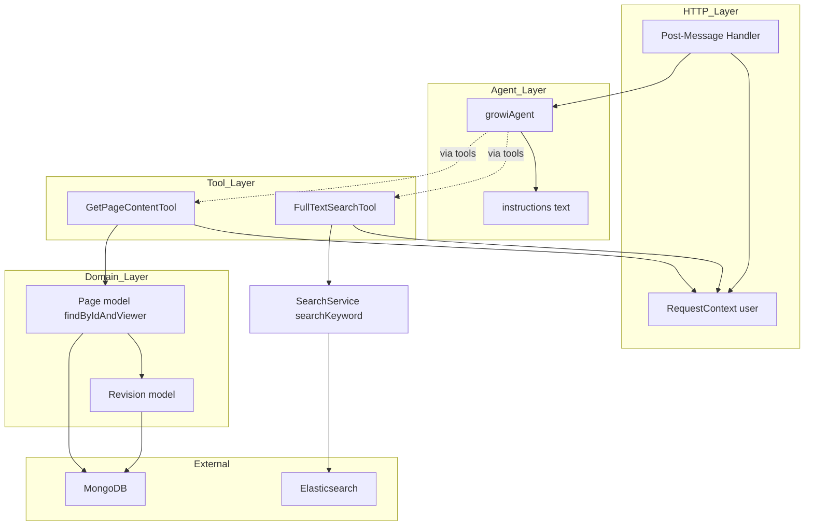
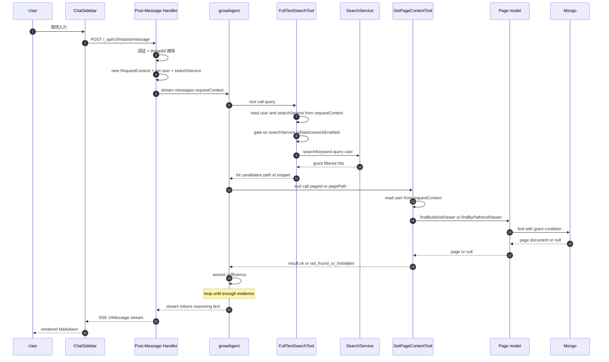
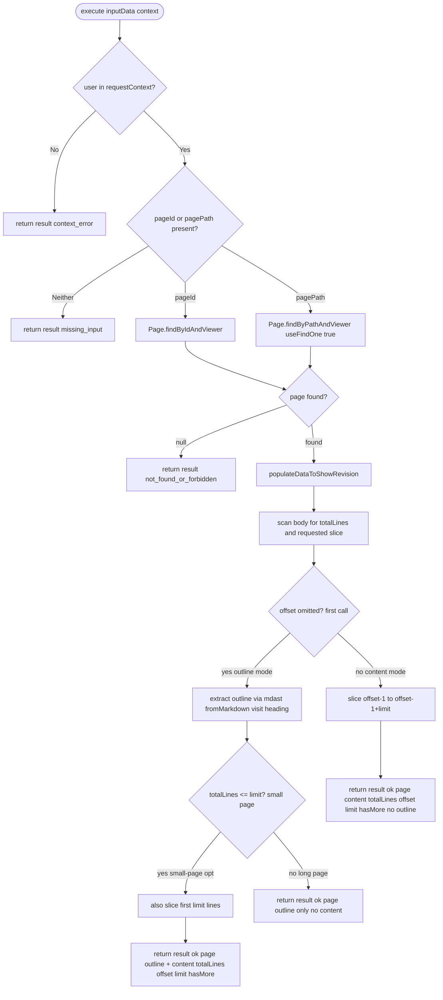
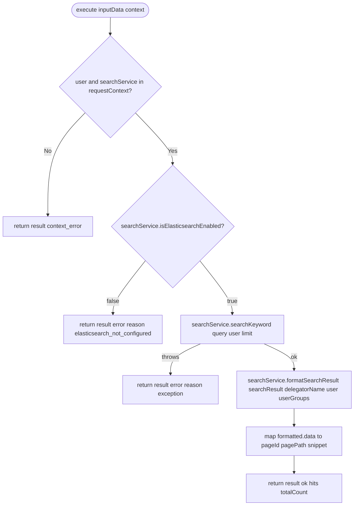

# Design Document: ai-agentic-search

## Write / Don't-Write Test

**この文書の役割**: 本 spec の設計上の判断を保つ場所であり、実装の記録ではない。この機能を将来変更する人が、コードとテストファイルだけでは分からない「なぜ今の形なのか」を確認するために読む。

**判定基準**: 各項目について「コードとテストファイルを読めば読み手が再構築できる内容か」を自問する。再構築できるなら、この文書には書かない。

| 書く | 書かない |
|---|---|
| 調べるのに時間がかかった事実（`@mastra/core` の `RequestContext` が自動隔離を持たない単純な `Map` ラッパーである、ES のハイライトが `body` ではなく `body.ja`/`body.en` に載るなど、コードをさらっと読んでも分からない外部ライブラリ / 既存サービスの挙動） | 関数のシグネチャ、ファイル構成、どのファイルに何があるか |
| 変わった設計を選んだ理由 — 特に**検討して却下した案とその理由**（tool 共通基盤の抽出案、合成 user オブジェクトの組み立て案など） | 素直な実装の説明 |
| 自動テストで**捕まえられない**残存ギャップ（GRANT_RESTRICTED ページの混入許容など、意図的に受け入れたリスク） | どのテストが何を検証しているかの一覧（spec ファイルを読むほうが確実） |
| コードから再現できない手動検証の手順 | 差分の有無や実装時期などの経緯 |

**迷ったら書かない。** コードを読めば分かることをここに置くと、コードが変わったときに黙って古くなり、この文書全体の信頼を落とす。

## Overview

**Purpose**: 既存 Mastra `growiAgent` に「ES 全文検索 tool」と「ページ本文取得 tool」の 2 本を新設し、両者を組み合わせた RAG 的反復ループを成立させる。これにより、GROWI ユーザーが自然言語の問い合わせから根拠つき Markdown 回答を得られるようにする。

**Users**: GROWI の認証済みユーザー（既存 ChatSidebar / `useChat` 経由のすべての利用者）。

**Impact**: 本 spec は `growiAgent` の `tools` に `fullTextSearchTool` / `getPageContentTool` を新設し、既存の OpenAI Files ベクトル検索 tool（`fileSearchTool`）は一旦コメントアウトで無効化した。`RequestContext` 型には `user: IUserHasId` と `searchService` を追加した。既存ストリーミング応答層・メモリ・スレッド管理には手を入れていない。なお `fileSearchTool` とその依存（`vectorStoreId` を含む OpenAI ベクトルストア関連コード）は、本 spec 完了後の別変更で完全に削除されている。現在の `growiAgent.tools` は `fullTextSearchTool` と `getPageContentTool` の 2 本のみである。

### Goals
- `growiAgent` が「全文検索 → 本文取得 → 必要に応じて再検索 → 合成」を自律的に反復する agentic ループを成立させる
- ページ本文取得経路がページ閲覧権限（grant）を完全に既存メソッドへ委譲する
- 新規 tool 2 本（`fullTextSearchTool` + `getPageContentTool`）+ 既存ファイルの軽微修正で実装を完結させる

### Non-Goals
- タグを主軸とした専用 tool（`fullTextSearchTool` とは独立した、タグ一覧・ファセット・関連ページ提示等の新規 tool）の新設（別 spec）
- 関連ページ / 最近更新ページ / クエリ再構成等の新規 tool（別 spec）
- ベクトル検索・埋め込み統合（別 spec）
- ChatSidebar / Chat UI 改修（別 spec）
- アクセスログ・検索品質評価基盤（別 spec）
- 書き込み系プロンプト・wiki 外知識への明示対応

> **タグによる絞り込み自体は本 spec の対象**: `fullTextSearchTool.query` の演算子として `tag:foo` / `-tag:foo` を agent に開示し、`SearchService.parseQueryString` 経由で利用可能にする（後述「サポートするクエリ構文」）。Non-Goals に含まれるのは「タグ専用の新規 tool」「タグ一覧 / ファセット UX」のみで、タグを使った検索の **能力** そのものは in scope。

> **`sort` / `order` 入力パラメータも本 spec の対象**: `fullTextSearchTool` の zod `inputSchema` に `sort`（`relationScore` / `createdAt` / `updatedAt`）と `order`（`desc` / `asc`）を追加し、agent が「最新ページ」「古いページ」要求に応じて並び替えを指定できるようにする（後述「並び替えの開示」）。

## Boundary Commitments

### This Spec Owns
- `fullTextSearchTool`（新規 Mastra tool）の入出力契約、execute 実装、テスト
- `getPageContentTool`（新規 Mastra tool）の入出力契約、execute 実装、テスト
- `growiAgent.tools` の構成変更（新 tool 2 つ登録 + `fileSearchTool` のコメントアウト）と `growiAgent.instructions` の文言調整（旧 `fileSearch` 行のコメントアウトを含む）
- `RequestContext` の型シェイプ拡張（`user: IUserHasId` + `searchService` を追加）。`user` は `IUserHasId` 全体（`_id` 単独ではなく）を載せ、ES delegator や `findByIdAndViewer` が必要とする可能性のあるフィールドにそのまま委譲できる形にする
- `post-message.ts` における `user`（= 認証ミドルウェア通過後の `req.user: IUserHasId`）および `searchService` の `requestContext` セット
- **`RequestContext` のリクエストスコープ化**: 既存のモジュールスコープ singleton をハンドラ関数内で `new RequestContext(...)` する構造に変更し、並列リクエスト下での `user` 漏洩を防止する

### Out of Boundary
- `SearchService.searchKeyword()` / `ElasticsearchDelegator` 内部実装の変更（既存メソッドを呼ぶだけで、内部の検索アルゴリズムや grant ロジックは触らない）
- `Page` モデル / `Revision` モデル / `populateDataToShowRevision()` 等の挙動変更
- ページ閲覧権限（grant）判定ロジック自体の修正・新規実装
- ChatSidebar / `useChat` / AI SDK ストリーミング層の修正
- `fileSearchTool` 本体ファイルの削除や API 変更（本 spec のスコープでは無効化のみ。ソース自体の削除は後続の別変更で行われた）
- メモリ・スレッド永続化（`getOrCreateThread` / Mastra Memory）の挙動変更

### Allowed Dependencies
- `@mastra/core/tools` の `createTool`
- `@mastra/core/agent` の `Agent`（既存 instance を再利用、再構築しない）
- `@mastra/core/request-context` の `RequestContext` 型
- `zod` による入出力 schema 定義
- `SearchService.searchKeyword()`（既存 ES 検索経路、grant 委譲先）
- `Page.findByIdAndViewer` / `Page.findByPathAndViewer`（grant 委譲経路）
- `populateDataToShowRevision()`（revision 取得）
- `Revision` モデル（`body` 参照のみ）
- `mdast-util-from-markdown` / `unist-util-visit` / `mdast-util-to-string`（outline 抽出。前2つは既存 direct dep、`mdast-util-to-string` は本 spec で新規追加）
- `~/utils/logger`（pino 経由のロガー）

依存方向は **HTTP Layer → Agent Layer → Tool Layer → Page / Revision Model → Mongoose**。tool 層から HTTP 層を逆参照しない。

### Revalidation Triggers
- `Page.findByIdAndViewer` または `Page.findByPathAndViewer` のシグネチャ・戻り値仕様変更
- `RequestContext` ジェネリクスを共有する他コンポーネントの追加 / 型変更（key 衝突発生時）
- `@mastra/core` の `createTool` / `Agent.stream()` API の破壊的変更
- `SearchService.searchKeyword()` / `SearchService.formatSearchResult()` のシグネチャ・戻り値スキーマ変更（特に `IFormattedSearchResult.data[i].data._id` / `.data.path` / `.meta.elasticSearchResult.snippet` の整合。tool は生の `_highlight` ではなく `formatSearchResult` の出力を消費する）
- 既存 `growiAgent.instructions` の英語ベース構造を逸脱する変更（多言語応答ルールの再検証要）
- `@mastra/core` の `RequestContext` 実装が AsyncLocalStorage 等のリクエスト隔離機構に変わった場合（本 spec のリクエストスコープ化が冗長になる）

## Architecture

### Existing Architecture Analysis

| 既存要素 | 役割 | 本 spec での扱い |
|---|---|---|
| `post-message.ts` Express route | 認証・スレッド確保・`agent.stream()` の呼び出し・SSE 中継 | 軽微修正（user セット + リクエストスコープ化） |
| `growiAgent` (Agent) | tools / memory / instructions を保持 | 構成差分のみ修正 |
| `RequestContext<{ vectorStoreId }>` | tool 実行時の文脈伝搬 | 型に `user` (IUserHasId) と `searchService` を追加 |
| `Page.findByIdAndViewer` / `findByPathAndViewer` | grant 込みでページ取得 | 委譲先として利用 |

既存パターンの維持事項:
- tool は `tools/*.ts` 1 ファイル 1 export
- 入出力 schema は `zod`
- agent instructions は英語短文ベース
- Express route は `accessTokenParser` → `loginRequiredStrictly` → `validator` → handler の順を維持

### Architecture Pattern & Boundary Map

採用パターン: **Mastra agent + tools (Adapter pattern)**。tool は既存ドメインメソッド（Page モデル / SearchService）への薄い adapter として実装し、grant 判定を自前実装しない。

Key 決定:
- tool 層は agent / HTTP 層を逆参照しない（依存方向は片方向）
- `GetPageContentTool` は `Page.findByIdAndViewer` のみを呼ぶ adapter であり、grant の自前判定をしない
- `RequestContext` 経由で渡る `user: IUserHasId` は HTTP 層の信頼境界を通過済み（認証ミドルウェア後）。tool 側で `User.findById` 等の再解決は不要

## File Structure Plan

tool は既存 `fileSearchTool` と同じ配置規約（`services/mastra-modules/tools/` に 1 ファイル 1 export、`zod` で入出力、co-located `.spec.ts` / `.integ.ts`）に従い、`fullTextSearchTool` と `getPageContentTool` をそれぞれ 1 ファイルとして新設した。

`RequestContext` の key 契約（`MastraRequestContextShape`）は `services/mastra-modules/types/` に単一情報源として切り出し、post-message handler と両 tool の 3 箇所が同じ型を import する構造にした。これにより、将来 tool や key を追加する際は 1 ファイルの型変更が全参照箇所に型エラーとして伝播する。

tool 数が 2 個の時点では、tool 共通基盤（factory 関数や抽象基底クラス）を抽出する費用対効果は薄いと判断し、抽象化は導入しなかった（tool が増えた時点で再検討）。

## System Flows

### 反復ループ全体（Sequence）

主な決定: agent のループ判断はモデル任せ（明示の Workflow を組まない）。`GetPageContentTool` は `RequestContext` から `user: IUserHasId` を取り出してそのまま `findByIdAndViewer(id, user)` に渡す（`_id` 抽出や `User.findById` 再解決は不要）。grant 条件は Mongo 側クエリで AND されるため、tool 層で追加フィルタは掛けない。

### GetPageContentTool のモード選択（outline / content）

`getPageContentTool` は `offset` の有無だけで応答モードを切り替える設計にした。これは PR #11204 のレビューで発覚した非効率（初回呼び出しで outline と本文 200 行を同時返却すると、長いページのドリルダウン読み出し時に最初の 200 行分の token が無駄になる）を解消するための再設計であり、`includeOutline` のような制御フラグは意図的に導入していない（「outline が欲しければ `offset` を省略する」という単一の自然な呼び出し規約に統一し、agent が覚えるパラメータを減らすため）。

### FullTextSearchTool の失敗系分岐

Key 決定: `execute` は throw しない（discriminated union を必ず返し、agent の反復を継続させる）。`not_found` と `forbidden` は既存メソッドが区別不可なので 1 つのケース（`not_found_or_forbidden`）に統合した。

## Components and Interfaces

### Shared Types — MastraRequestContextShape

post-message handler が `set` し、各 Mastra tool の execute が `get` する `RequestContext` の key 群を、1 つの型ファイル（`services/mastra-modules/types/request-context.ts`）に集約した。追加・リネームはこの 1 ファイルの変更だけで handler / 全 tool 側に型エラーとして伝播する。

設計判断として、`user` は `_id` だけを取り出さず `IUserHasId` を全体で保持する。理由は、`findByIdAndViewer` や `SearchService.searchKeyword`（ES delegator 経由）が内部でどのフィールドを参照するかの確証が設計時点で取れなかったため、安全側に倒して認証ミドルウェア通過後の `req.user` をそのまま tool まで持ち回る方針にしたこと（後述「検討したが採らなかった案」）。

### Summary

| Component | Layer | Intent | Key Dependencies |
|---|---|---|---|
| `MastraRequestContextShape`（共有型） | Types | post-message handler と全 tool 間で `RequestContext` の key 契約を共有 | `IUserHasId`, `SearchService`（型のみ） |
| `FullTextSearchTool` | Tool | 自然言語クエリで wiki 検索ヒット（pagePath / pageId / snippet）を grant 委譲取得。ES 未設定環境では execute 内で早期 `result: 'error'` を返す | `MastraRequestContextShape`, `SearchService.searchKeyword` / `isElasticsearchEnabled`（`requestContext` 経由） |
| `GetPageContentTool` | Tool | `pageId` / `pagePath` で本文を grant 委譲取得 | `MastraRequestContextShape`, `Page.findByIdAndViewer`, `populateDataToShowRevision` |
| `growiAgent`（拡張） | Agent | RAG ループの自律実行 + tools 構成 + instructions | `fullTextSearchTool`, `getPageContentTool`, Memory |
| Post-Message Handler（拡張） | HTTP | `user` (IUserHasId) / `searchService` の `requestContext` 付与 + リクエストスコープ化 | `MastraRequestContextShape`, `loginRequiredStrictly` |

### Tool Layer

#### FullTextSearchTool

**Intent**: 自然言語クエリを受け取り、既存 `SearchService.searchKeyword()` 経由で grant 反映済みヒット候補（path / id / snippet）を返す Mastra tool。対応要件: 6.1–6.8, 3.2。

**設計上の決定と根拠**
- `requestContext` からは `searchService` インスタンスそのものを取得し、`crowi` 全体は tool 層に渡さない。`crowi` を渡すと DB / メール / 設定など全機能に tool からアクセス可能になり、レイヤリングが崩れるため（tool 層が触れる surface を意図的に最小化）
- `searchService.isElasticsearchEnabled === false` の場合は `searchKeyword` を呼ばずに `result: 'error', reason: 'elasticsearch_not_configured'` を早期返却する。ES 未設定の OSS デプロイでも `fullTextSearchTool` を無条件で agent に登録できるようにするための分岐であり、agent 側（`growi-agent.ts`）は ES 有効/無効を判定しない
- 取得した `user: IUserHasId` は合成せずそのまま `searchService.searchKeyword()` に渡す。`userGroups` は `SearchService` 自身が user から自動解決しないため、tool 内で `UserGroupRelation.findAllUserGroupIdsRelatedToUser` + `ExternalUserGroupRelation.findAllUserGroupIdsRelatedToUser` を呼んで解決する（既存 `server/routes/search.ts` と同じパターン）。この自動解決の欠如は integration test 実装中に実際に発覚したバグで、当初の想定（`SearchService` が内部で解決する）が誤っていた
- `query` 文字列はサニタイズ・演算子除去をせず `SearchService.parseQueryString` にそのまま委譲する（後述「サポートするクエリ構文」）。一部だけ開示しようとすると tool 層に `parseQueryString` の二重実装が必要になり、保守コストが増える
- `sort` / `order` は zod の `SORT_AXIS` / `SORT_ORDER` 定数をそのまま受理し、フィールド名変換は `ElasticsearchDelegator.appendSortOrder` に委ねる（tool 層で別名やマッピングを持たない）
- execute からは例外を throw しない。ページ本文（`body`）は返さない（責務は `getPageContentTool` に閉じる）

##### サポートするクエリ構文（LLM への開示範囲）

`SearchService.parseQueryString` が現に解釈する全構文を agent に開示する方針（Plan A）を採用した。

| 構文 | 意味 |
|---|---|
| `word` / `-word` | 単語 AND マッチ / 除外 |
| `"exact phrase"` / `-"exact phrase"` | フレーズ完全一致 / 除外 |
| `prefix:/path` / `-prefix:/path` | path subtree 絞り込み / 除外 |
| `tag:foo` / `-tag:foo` | タグ絞り込み / 除外 |

根拠: (a) `prefix:` の subtree 絞り込みと `-` 除外は「手順抽出」「曖昧クエリの段階的洗練」のようなプロンプト類型でループ短縮効果が大きい。(b) `tag:` を含めることで「タグ絞り込み前提クエリ」を専用 tool を新設せずに `fullTextSearchTool` 内で完結させられる。(c) 演算子の一部だけを開示しようとすると、tool 層に `parseQueryString`相当のサニタイザを実装する必要が生じ、二重実装になる。grant フィルタは既存経路（`filterPagesByViewer`）が一括で担保するため、演算子をどれだけ開示しても権限漏洩は発生しない。

タグ絞り込みの**能力**（`tag:foo` を `query` 演算子として使うこと）は本 spec の対象だが、タグ一覧・ファセット UI・関連ページ提示のような「タグを主軸とした専用 tool / UX」は対象外（別 spec）。

##### 並び替えの開示（`sort` / `order`）

`query` 文字列の演算子とは別に、`sort`（`relationScore` / `createdAt` / `updatedAt`、デフォルト `relationScore`）と `order`（`desc` / `asc`、デフォルト `desc`）を独立した zod 入力パラメータとして開示する。受理値は既存 `~/interfaces/search` の `SORT_AXIS` / `SORT_ORDER` 定数からそのまま借用し、tool 層で別名を定義しない。agent instructions には「ユーザーが『最新』『古い』を明示的に求めたときのみ指定する」旨を追記し、デフォルトの relevance ソートを保つよう促した。

**入出力契約（概要）**: 入力は `query`（非空文字列、演算子込みの自然言語）、`limit`（最大 20、デフォルト 10）、`sort` / `order`（上記）。出力は discriminated union（`result: 'ok' | 'error' | 'context_error'`）で、`'ok'` は `hits: { pageId, pagePath, snippet? }[]` と `totalCount` を返す。正確な zod スキーマは `tools/full-text-search-tool.ts` を参照。

**Invariant**: 閲覧権限のないページは `hits` に決して現れない（`filterPagesByViewer` に委譲、tool 内で二重実装しない）。`snippet` は `SearchService.formatSearchResult` 経由でのみ生成され、その内部 `canShowSnippet` ゲートにより「ヒットには出るが本文を閲覧できないページ」（他ユーザー所有の `GRANT_OWNER`、非メンバーの `GRANT_USER_GROUP` など）の `snippet` は落ちる。

**調べて分かった非自明な事実（ES ハイライトのフィールド名）**: `searchKeyword` の生結果を直接マップせず、必ず `searchService.formatSearchResult(searchResult, delegatorName, user, userGroups)` を経由する（`/_api/search` ルートと同一経路）。理由は 2 点。(1) 通常のキーワード（`match`）検索での ES ハイライトは `body` ではなく `body.ja` / `body.en`（および `comments.*`）に載る。無サフィックスの `body` はフレーズ（`"..."`）マッチ時のみ載る。`formatSearchResult` はこの全バリアントを `body || body.en || body.ja || comments...` のフォールバックで拾う。tool 側で生の `_highlight.body` だけを読むと、大半のキーワード検索で snippet が欠落する（本 spec 実装当初に実際に発生した不具合）。(2) `formatSearchResult` 内の `canShowSnippet` ゲートが上記の可視性制御を行う。tool が生結果を読むとこのゲートを迂回して本文断片が漏れる。マッピングは `pageId ← formatted.data[i].data._id` / `pagePath ← formatted.data[i].data.path` / `snippet ← formatted.data[i].meta?.elasticSearchResult?.snippet`（`null` / 空文字は省略）/ `totalCount ← formatted.meta.total`。`formatted.data[i].data`（`IPageHasId` 一式）は spread せず、`pageId` / `pagePath` のみを明示的に取り出す（要件 6.5 と `getPageContentTool` との責務分離を守るため）。

#### GetPageContentTool

**Intent**: `pageId` / `pagePath` で grant 込みのページ本文を取得する Mastra tool（既存メソッドへの薄い adapter）。対応要件: 2.1–2.7, 3.2, 3.3, 5.3。

**設計上の決定と根拠**
- grant 判定は自前実装せず、必ず `Page.findByIdAndViewer` / `findByPathAndViewer` 経由（tool 内で MongoDB クエリを直書きしない）
- 応答モードは `offset` の有無だけで切り替える（上記「GetPageContentTool のモード選択」参照）。長いページ（`totalLines > limit`）の初回呼び出しは `outline` のみ返し、`content` は返さない（1 回の呼び出しで LLM のコンテキストを消費し尽くさないため）。ページ全体が 1 ページに収まる場合（小ページ最適化）は初回呼び出しで `outline` + `content` の両方を返す
- `content` を返す場合は「取得した範囲の Markdown 本文を改変せず結合したもの」であることを保証する（要約・除去なし）
- execute からは例外を throw しない。存在しない場合と閲覧不可の場合は `not_found_or_forbidden` として統合する（既存メソッドが両者を `null` 一本で表現するため区別できない。区別しないことで「非公開ページの存在」自体が回答経由で漏れることも防げる）

**入出力契約（概要）**: 入力は `pageId` / `pagePath`（少なくとも一方が必須、zod `refine` で表現）、`offset`（1-indexed、省略可）、`limit`（最大 500、デフォルト 200）。出力は discriminated union（`result: 'ok' | 'not_found_or_forbidden' | 'missing_input' | 'context_error'`）。`'ok'` の `page` は `path` / `updatedAt?` / `totalLines` を常に含み、`content` / `offset` / `limit` / `hasMore` はモードに応じて省略される。`outline`（`{ line, level, heading }[]`）は初回呼び出し時のみ付与される。正確な zod スキーマは `tools/get-page-content-tool.ts` を参照。

**調べて分かった非自明な事実 / 実装上の工夫**
- **outline 抽出**: `mdast-util-from-markdown` で本文を MDAST に変換し `unist-util-visit` で `'heading'` ノードを訪問する。CommonMark 準拠のパーサーを使うことで ATX (`# heading`) と Setext (`heading\n===`) の両方を正しく抽出し、fenced/indented code block や HTML block 内の `#` 行を heading と誤認しない。heading text は `mdast-util-to-string` でプレーン化する（Markdown 装飾を除去）。既知の限界: front matter (`---`) 用の extension は導入していないため、front matter 内に偶発的に `#` 始まりの行があると heading として抽出される可能性がある（GROWI の wiki ページでは現実的に起こりにくいため許容）
- **本文の走査は 1 パスの scanner**: `String.split('\n')` で全行を配列化すると長いページで `O(totalLines)` のアロケーションが発生する。これは「outline → 該当セクションへ `offset` ドリルダウン」という主要な利用パターンでは無駄が大きいため、`indexOf('\n')` で行境界を探して必要な範囲だけ substring する 1 パス scanner に置き換えた。CRLF 改行は `split(/\r?\n/).join('\n')` と等価な見え方になるよう正規化する
- **`hasMore` の境界**: `(offset - 1) + 返却行数 < totalLines` として計算する。`offset` が `totalLines` を超える場合はエラーではなく `result: 'ok'` + `content: ''` + `hasMore: false` を返す。agent が `hasMore` だけを見て読了判断できるようにするための意図的な設計
- **per-request キャッシュは導入しない**: 同一リクエスト内で同じページに複数回 `findByIdAndViewer` が呼ばれても、DB クエリのオーバーヘッドは許容範囲と判断し、stateless さを優先した
- **残存する既知のギャップ**: `requestContext.get('user')` の型は `as` キャストで narrow しており、`isIUserHasId` のような type guard 化は行っていない（後続の改善余地として残る）

### Agent Layer — growiAgent（拡張）

**Intent**: 既存 `growiAgent` インスタンスの `tools` 構成と `instructions` を本機能向けに更新する。対応要件: 1.1–1.6, 4.1–4.3, 5.1–5.3。

**設計上の決定と根拠**
- `fullTextSearchTool` と `getPageContentTool` を常に登録する（ES が無効な環境かどうかで tools 登録を条件分岐しない）。ES の有効/無効判定は `fullTextSearchTool.execute` 側に委譲することで、`growi-agent.ts` が `crowi` を import せず module-level export を保てるようにした
- 既存の `fileSearchTool` は import と `tools` 登録の両方をコメントアウトし、ソースファイル自体は削除しない方針にした。理由は Agentic Search の動作確認中に旧フローとの混在を避けつつ、ロールバックコストを下げるため。（この方針は本 spec の実装時点のものであり、`fileSearchTool` のソースは本 spec 完了後の別変更で完全に削除されている）
- `instructions` には「wiki 内容の質問はまず `fullTextSearch` で候補ページを集める」「`getPageContent` は最初は `offset` 省略で呼び、outline を得てから該当セクションへドリルダウンする」「`fullTextSearch` の `query` 演算子（`"phrase"` / `-term` / `prefix:/path` / `tag:foo` 等）を必要に応じて使ってよい」という短い英語の追記を行った。文言そのものは反復的な調整対象であり、この文書では逐語的なプロンプト文字列を保持しない（`growi-agent.ts` を参照）

### HTTP Layer — Post-Message Handler（拡張）

**Intent**: `RequestContext` 型を拡張し、認証済みユーザー `req.user: IUserHasId` と `searchService` を tool 実行コンテキストにセットする。対応要件: 3.1, 3.4, 5.4。

**設計上の決定と根拠**
- `RequestContext` インスタンスをハンドラ関数内で `new` する構造に変更し、モジュールスコープの singleton を廃止した。**調べて分かった非自明な事実**: `@mastra/core` の `RequestContext` はソースを読むと単純な `Map` ラッパーであり、AsyncLocalStorage のようなリクエスト隔離機構を持たない。モジュールスコープで singleton 化されていた既存実装は、並列リクエスト下で他リクエストの `user` / `searchService` が `get()` で読まれるレースを起こし得る状態だった。本 spec ではこれをハンドラ関数内 `new RequestContext()` に変更して解消した
- 既存の `accessTokenParser` → `loginRequiredStrictly` → `validator` ミドルウェアチェーンおよびストリーミング応答層（`toAISdkStream` / `pipeUIMessageStreamToResponse`）は変更していない
- API エンドポイント自体（`POST /_api/v3/mastra/message`、リクエスト/レスポンス形式）は不変。内部の `requestContext` 構築方法が変わるのみ

## Data Models

本機能は新規 DB スキーマを追加しない。`Page` / `Revision` の既存スキーマ・既存取得経路（`findByIdAndViewer` 等の戻り値）に依存するのみ。

## Error Handling

両 tool（`FullTextSearchTool` / `GetPageContentTool`）とも例外を throw しない方針を採用した。すべての異常系を discriminated union の戻り値で表現することで、agent のループが中断されず次の判断（再検索・別ページ取得・回答合成の断念）に進める。HTTP 層の `try/catch` に握り潰される懸念もない。各 tool が返す `result` の値と発生条件は前掲の「入出力契約」を参照。失敗時も `logger.error` / `logger.warn` で記録し、grant 起因か ES 設定起因か例外起因かを切り分けられるようにしている。

## Testing Strategy

両 tool とも unit test（`.spec.ts`）で Page モデル / SearchService をモックし、discriminated union の各分岐（成功・入力エラー・context エラー・取得失敗・例外）とガード条件（`user` 参照同一性、クエリ構文の素通し、`sort`/`order` の forward）を検証する。integration test（`.integ.ts`）は実 MongoDB（`getPageContentTool`）および実 Elasticsearch（`fullTextSearchTool`、`describe.skipIf(!ELASTICSEARCH_URI)` で未設定環境は skip）を使い、GRANT_PUBLIC / GRANT_OWNER / GRANT_USER_GROUP / GRANT_RESTRICTED の各パターンで grant が実際に反映されることを確認する。

**調べて分かった、テスト方針上の教訓**: `fullTextSearchTool` の integration test は実装途中で一度「dummy `SearchDelegator`」に切り替えたが、これは `_highlight.body` のみを読む場合の snippet 欠落バグ（`body.ja`/`body.en` の実際のフィールド名や `canShowSnippet` ゲートの実挙動）を一切検証できていなかったため、実 Elasticsearch 接続に戻した。`ci-app-test-integration` job は ES 8/9 を起動するため、実 ES を使う integration test は CI でも問題なく実行される。引数フォワーディング・出力マッピング・例外処理・`userGroups` 解決・`sort`/`order` の forward のような tool 層のロジックは unit test の責務とし、実 ES 側では重複検証しない。

Agent 層の統合テストは `growiAgent.tools` に両 tool が存在し `fileSearchTool` が存在しないことのみを assert し、`instructions` の文言・順序に対する substring 一致の assertion は設けない（プロンプト文言は反復改善が前提で、文字列一致は改訂ごとの保守コストが高い割に実際のプロンプト挙動を保証しないため）。

## Security Considerations

- **`searchService` を渡す根拠**: `crowi` 全体を tool に渡すと DB / メール / 設定など無関係な機能にまでアクセス可能になる。本 spec では `fullTextSearchTool` が必要とする最小 surface（`searchService` インスタンスのみ）を `RequestContext` に格納し、tool 層が触れる API を意図的に絞った
- **既知の限界として受け入れた点（GRANT_RESTRICTED）**: `Page.findByIdAndViewer` / `findByPathAndViewer` は `includeAnyoneWithTheLink: true` を内部で固定しているため、リンクを知っている人には閲覧可能な `GRANT_RESTRICTED` ページが RAG のコンテキストに混入し得る。本 spec ではこれを既存 `Page` モデルの仕様として受け入れ、integration test で挙動を明文化した（tool 側で追加のフィルタは行っていない）
- **失敗戻り値の統合**: `not_found_or_forbidden` を 1 つの戻り値に統合することで、「ページが存在するが閲覧不可」と「そもそも存在しない」を agent に区別させず、回答経由で非公開ページの存在自体が推測されることを防いでいる

## 検討したが採らなかった案

- **tool 共通基盤（factory 関数 / 抽象基底クラス）の抽出**: tool 数が 2 個の時点では抽象化の費用対効果が薄く、本 spec のスコープ（agentic ループの確立）から外れると判断し見送った。tool 数が増えた時点で再検討する
- **合成 user オブジェクト（`{ _id: ObjectId }` のみ）の組み立て**: `findByIdAndViewer` は `user._id` のみ参照することがコード上確認できたが、ES delegator 経路（`searchKeyword` → 内部 delegator）が同じ前提で成立するかの確証が設計時点で取れなかったため、安全側に倒して認証ミドルウェア通過後の `req.user: IUserHasId` を丸ごと `RequestContext` 経由で持ち回る方針に変更した
- **`includeOutline` のような明示的な制御フラグ**: outline 付与を独立パラメータにすると、agent が「いつ立てるべきか」を覚える必要が生じる。「`offset` を省略すれば outline が返る」という単一の自然な呼び出し規約に統一し、制御フラグそのものを廃止した
