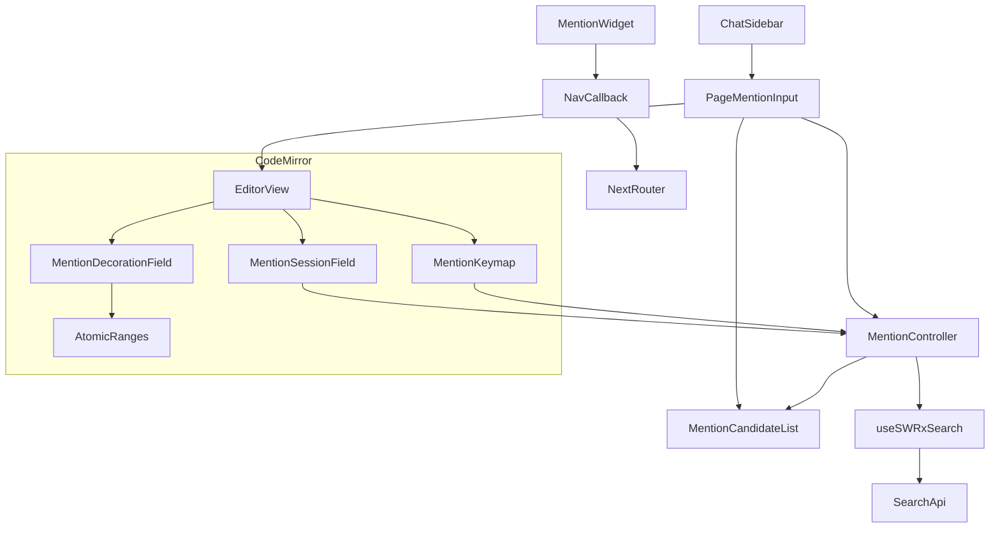
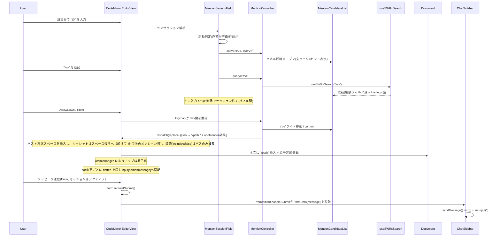

# Technical Design: ai-chat-page-mention

## Write / Don't-Write Test

**この文書の役割**: 本 spec の設計上の判断を保つ場所であり、実装の記録ではない。この機能を将来変更する人が、コードとテストファイルだけでは分からない「なぜ今の形なのか」を確認するために読む。

**判定基準**: 各項目について「コードとテストファイルを読めば読み手が再構築できる内容か」を自問する。再構築できるなら、この文書には書かない。

| 書く | 書かない |
|---|---|
| 調べるのに時間がかかった事実（コードをさらっと読んでも分からない挙動、CodeMirror や `PromptInput` など外部/共有コンポーネントの隠れた振る舞い） | 関数のシグネチャ、ファイル構成、どのファイルに何があるか |
| 変わった設計を選んだ理由 — 特に**検討して却下した案とその理由**（textarea 温存案、Lexical/ProseMirror 導入案、`coordsAtPos` 追従案など） | 素直な実装の説明 |
| 自動テストで**捕まえられない**残存ギャップ（ピクセル単位のキャレット表示など） | どのテストが何を検証しているかの一覧（spec ファイルを読むほうが確実） |
| コードから再現できない手動検証の手順（devcontainer での確認観点） | 差分の有無や実装時期などの経緯 |

**迷ったら書かない。** コードを読めば分かることをここに置くと、コードが変わったときに黙って古くなり、この文書全体の信頼を落とす。

## Overview

**Purpose**: AI チャット利用者が、入力欄で `@` に続けて文字列を入力するとページパスをインクリメンタル検索し、候補から選択したページを「原子的な rich text トークン（メンションチップ）」として挿入できる機能を提供する。チップはクリックで対象ページへ遷移でき、送信時には対象ページの**パス文字列**として AI に渡る。

**Users**: GROWI の AI チャット（mastra ChatSidebar）利用者。会話の中で特定ページを参照先として素早く指定するワークフローで使用する。

**Impact**: 現状プレーン `<textarea>`（フラットな string state）であるチャット入力欄を、CodeMirror 6 ベースの入力に置換する。shadcn の `PromptInput` 合成シェル（フォーム・送信ボタン・添付機能）は温存し、入力リーフのみを差し替える。サーバ（mastra ルート）の変更は行わない。

### Goals
- `@` 起動のインクリメンタル検索と候補リスト表示（キーボード/マウス操作・loading・該当なし表示）
- ページメンションを視覚的に区別された原子トークンとして挿入し、文字単位編集不可・キャレット境界・単位削除を保証する
- メンションのクリックで対象ページへ遷移する
- 送信メッセージにメンションを**パス文字列としてのみ**反映する（本文は付与しない）
- 既存 shadcn `PromptInput` シェルと mastra 送信フローを壊さない

### Non-Goals
- 参照先ページの**本文（コンテンツ）取得・AI コンテキストへの注入**（送信はパス文字列のみ）
- ユーザー/タグ等、ページ以外のメンション
- mastra サーバ側ルート・エージェント推論ロジックの変更
- 新規の検索 API・新規の権限フィルタの実装（既存 `/search` の権限挙動に依拠）
- 新規リッチテキストエディタライブラリ（Lexical / ProseMirror 等）の導入

## Boundary Commitments

### This Spec Owns
- `features/mastra/client/components/PageMentionInput/` 配下の新規入力コンポーネント一式（CodeMirror エディタ adapter、メンション装飾拡張、メンションセッション拡張、ナビゲーションキーマップ、候補リスト UI、メンションチップ表示）
- ChatSidebar 入力リーフの差し替え（`PromptInputTextarea` → `PageMentionInput`）と、それに伴う `onChange` シグネチャ・Enter 送信配線の変更
- ドキュメント文字列 ↔ メンション装飾の相互規約（doc 本文にパス文字列を保持し、装飾で原子チップ表示する方式）
- メンション関連の新規 i18n キー

### Out of Boundary
- 共有 shadcn コンポーネント `~/components/ai-elements/prompt-input.tsx` の内部実装（無改修・温存）
- 検索バックエンド（Elasticsearch delegator）と `/search` エンドポイント、その権限フィルタ
- mastra サーバルート `post-message.ts` と `UIMessage` スキーマ
- ChatSidebar の送信処理 `handleSubmit` / `sendMessage` の本体ロジック（入力値の供給形式のみ整合させる）

### Allowed Dependencies
- 既存検索フック `useSWRxSearch`（`~/stores/search`）と検索結果型 `IPageWithSearchMeta`
- 既存 CodeMirror 6 直接依存（`@codemirror/state` `^6.6`, `@codemirror/view` `^6.42`, `@codemirror/commands` `^6.8`（`defaultKeymap` を含む））
- ページ遷移ヘルパ `LinkedPagePath`（`~/models/linked-page-path`）+ `next/router`
- shadcn UI プリミティブ（`~/components/ui/*`）と `cn`（`~/utils/shadcn-ui`）、Tailwind（`tw:` 接頭辞）
- `react-i18next` の `useTranslation`
- `downshift`（既存依存）— 候補リストの **controlled な描画ヘルパ**（ARIA 配線・マウスホバー同期。状態所有は `MentionController` のまま。キーボード操作は CM キーマップが担当）
- `simplebar-react`（既存依存）— 候補リストのスクロールコンテナ
- `@growi/ui` の `UserPicture` — 候補行の作成者アバター表示
- `usehooks-ts` の `useDebounceValue` — 検索クエリの debounce（`useDebounce` は deprecated のため後継 API を使用）

### Revalidation Triggers
- `PromptInput` の合成 API（children 受け渡し・`onSubmit` 契約・`InputGroup` ラップ）が変更された場合
- `useSWRxSearch` の戻り値型・`/search` のレスポンス構造（`data[].data.path` / `._id`）が変更された場合
- `UIMessage` 送信形式（`message.text`）が変更された場合
- ページ URL の組み立て規約（`LinkedPagePath.href`）が変更された場合

## Architecture

### Existing Architecture Analysis
- 入力欄は shadcn コンパウンドコンポーネント `PromptInput`（`<InputGroup>{children}</InputGroup>` を描画、`prompt-input.tsx:776`）の子として `PromptInputTextarea`（素の `<textarea>`）を配置する構成。ChatSidebar は controller context を使わず `value`/`onChange` で制御している（`ChatSidebar.tsx:255-271`）。
- 送信は `PromptInput` の `<form onSubmit>` → `handleSubmit(message)` → `sendMessage({ text })`。入力値はフラット string。
- AI チャット UI は **shadcn + Tailwind 4**（`components.json`, `tw:` 接頭辞）。Bootstrap/reactstrap はレガシ領域用で本機能では不使用。
- 検索は `useSWRxSearch` → `apiGet('/search', { q, limit, ... })`。権限フィルタは Elasticsearch delegator（`elasticsearch.ts:995-1039`）で適用済みで、ログインユーザーが閲覧可能なページのみ返る。

### Architecture Pattern & Boundary Map

CodeMirror が「編集・原子トークン・メンションセッション検出」を担い、React/shadcn が「候補リスト UI・検索（SWR）」を担うハイブリッド構成。両者は **MentionController**（共有コントローラ）を介して疎結合に連携する。



**Architecture Integration**:
- **Selected pattern**: Thin React adapter + pure CodeMirror extensions + shared controller bridge。フレームワーク adapter（React/CM）から純粋ロジックを分離する coding-style 原則に準拠。
- **Boundaries**: 検索＝既存 `useSWRxSearch`／編集・原子化＝CM 拡張／候補表示＝shadcn UI／遷移＝`LinkedPagePath`+router。共有所有なし。
- **Preserved patterns**: shadcn `PromptInput` 合成シェル、`useSWRxSearch`、`LinkedPagePath`、feature-based 配置。
- **New components rationale**: textarea ではメンションの「視覚区別・原子性・clickable」を満たせないため、CM ベースの入力リーフと装飾拡張が必須。候補 UI は loading/該当なし（2.5/2.6）と shadcn スタイル要件を満たすため React 側で持つ。

## File Structure Plan

CodeMirror 拡張群（`editor-state/`）は React/SWR に依存しない純粋なレイヤとして分離し、`use-mention-controller` がその状態を React の候補 UI へ橋渡しする唯一の窓口になる。ChatSidebar 側は入力リーフの差し替えのみを担い、送信・添付処理などの既存ロジックには手を入れない。

> 依存方向: `types` → `editor-state/*`(純CM) → `use-mention-controller` → `PageMentionInput`/`MentionCandidateList`(React) → `ChatSidebar`。左方向のみ import。`editor-state/*` は React/SWR に依存しない。

**オープン時のフォーカス付与（8.x）の設計判断**: フォーカス付与のトリガは `useChatSidebarStatus().openSeq` の変化のみであり、マウントを契機にしない。表示中スレッドを Recent Items から再選択した場合は `dynamic.tsx` の remount key（`threadId`）が変わらず再マウントが起きないため、マウント契機では取り逃す（8.2）。逆にトリガを `openSeq` に限定することで、ストリーミング中の毎チャンク再描画や SWR 解決時にはキャレットを奪わない（8.3）。`openSeq` は本 effect と `dynamic.tsx` の remount key の 2 か所から参照されるため、すべての `openChat()` で確実に bump されることが前提となる。

## System Flows

### メンション挿入フロー（@入力 → 選択 → チップ化 → 送信）



**主要な決定**:
- メンションは **doc 本文にパス文字列そのものを保持**し、その範囲に `Decoration.replace({ widget })` を重ねてチップ表示する。これにより flatten 用テキストは `doc.toString()` で得られ、パス文字列のみが自然に反映される（6.1/6.2）。
- 送信テキストは **隠し `input[name=message]`** を介して既存フォーム経路に渡す。CodeMirror はネイティブフォーム要素でないため、flatten 結果をこの隠し input に同期させて `formData.get('message')` で読めるようにする（Issue 1 対応）。
- セッション中の Nav 鍵（↑↓/Enter/Tab/Esc）は高優先度キーマップが横取りして候補リスト操作へ委譲し、非セッション時の Enter は `requestSubmit()` で送信に割り当てる。
- **ARIA 同期（a11y）**: **listbox とその option が実際に DOM に存在する間だけ**、`PageMentionInput` がエディタの `contentDOM` に `aria-controls`（listbox）と `aria-activedescendant`（ハイライト中の option）を `EditorView.contentAttributes` の Compartment で同期する。「listbox が描画されている」条件（open + 非空クエリ + 検索完了 + 候補 ≥1）は共有述語 `isListboxRendered`（`mention-aria.ts`）に単一定義し、`MentionCandidateList` の listbox 描画分岐と同じ述語を使うことで、ヒント/検索中/該当なし状態で存在しない id を参照（dangling）しないことを保証する。ハイライト移動のたびに再構成し、条件を外れたら除去。これによりキーボードで候補を辿る際に SR がアクティブ候補を読み上げる。

## Components and Interfaces

| Component | Domain/Layer | Intent | Req Coverage | Key Dependencies | Contracts |
|-----------|--------------|--------|--------------|------------------|-----------|
| PageMentionInput | UI adapter | CM 入力リーフ・value 同期・Enter送信・候補配置 | 1.x–6.x | EditorView (P0), useMentionController (P0) | State |
| MentionCandidateList | UI | 候補表示・loading/該当なし・ハイライト（純表示） | 1.2,2.1,2.4–2.6 | useMentionController (P0) | — |
| useMentionController | Logic hook | セッション↔候補の橋渡し・検索・確定 | 1.3,1.4,2.2,2.3,2.7,7.x | useSWRxSearch (P0), MentionSessionState (P0) | State |
| mention-decoration | CM extension | 原子チップ装飾・atomicRanges・クリック遷移 | 3.x,4.x,5.x | @codemirror/view (P0), LinkedPagePath (P1) | State |
| mention-session | CM extension | `@`起動規則・セッション追跡 | 1.1,1.5,1.6,1.7,5.5 | @codemirror/state (P0) | State |
| mention-keymap | CM extension | Nav鍵委譲・Enter送信 | 2.2,2.3,2.4 | @codemirror/view (P0), MentionController (P0) | — |
| flatten | Pure util | doc→送信パス文字列 | 6.1–6.3 | @codemirror/state (P0) | Service |

### UI Layer

#### PageMentionInput

| Field | Detail |
|-------|--------|
| Intent | CodeMirror エディタを React に橋渡しする薄い adapter。エディタが入力の source of truth |
| Requirements | 1.1–6.3（統合点） |

**Responsibilities & Constraints**
- EditorView の生成・破棄、拡張の組み立て（`createPageMentionExtensions`）。
- エディタ変更を購読し、`onChange(getMentionFlattenedText(state))` を発火（フラットなパス文字列を親へ）。
- **隠しフォーム値の同期（Issue 1 対応）**: ネイティブな `<input type="hidden" name="message">` を描画し、その `value` を flatten 済みパス文字列に同期する。`PromptInput.handleSubmit` は非provider経路で `formData.get('message')` から送信テキストを読み、`form.reset()` で消す（[prompt-input.tsx:704-715](apps/app/src/components/ai-elements/prompt-input.tsx#L704-L715)）。CodeMirror はネイティブフォーム要素ではないため、この隠し input が無いと送信テキストが空になる。
- **Enter 送信は既存 textarea と同じ機構を踏襲**: セッション非アクティブ時の Enter で、ホストフォームの `requestSubmit()` を呼ぶ（[prompt-input.tsx:819](apps/app/src/components/ai-elements/prompt-input.tsx#L819) の `form?.requestSubmit()` と同一）。これにより blob 変換・添付処理・clear を含む既存送信パイプラインをそのまま再利用する。`onSubmit` コールバック prop は持たない。
- 親 `value` は **外部リセット（空文字化＝送信後 clear）にのみ追従**し、文字列からメンションを再構築しない（widget の正本はエディタ doc）。
- `value` が空でエディタが空でない場合に doc をリセット。それ以外は一方向（editor→parent）。
- 候補リスト（`MentionCandidateList`）を入力欄の真上に配置（CSS アンカー、上記参照）。
- **標準カーソル移動キーマップ（`@codemirror/commands` の `defaultKeymap`）を mention キーマップ（`Prec.highest`）と併せて組み込む**。これにより非セッション時の矢印/編集キーがドキュメントモデル基準でカーソルを動かす: 空 doc での右矢印が placeholder ウィジェットを跨がず、横移動が `atomicRanges` を参照してメンションチップを 1 単位として扱う（5.x）。
- **プレースホルダ/フォーカス/キャレット**: `placeholder` 拡張で空時の案内（**Compartment 経由で装着し、prop 変更時に reconfigure** — i18n リソースの非同期ロードや言語切替に追従するため、生成時固定にしない）、`EditorView.contentAttributes` で `.cm-content` に `data-slot="input-group-control"` を付与し host `InputGroup` のフォーカスリングを発火、テーマで `min-height`・`caret-color: currentColor`（テーマ追従）を設定。
- **imperative focus ハンドル（`forwardRef`）**: 編集要素は本コンポーネントが内部で生成・所有する CodeMirror の `contentDOM` なので、ホストは通常の DOM ref で掴めない。`useImperativeHandle` で `focus()` のみを公開し、ホストが任意のタイミング（チャットサイドバーのオープン時）でキャレットを渡せるようにする。`view` 本体は internal のまま（公開面を最小に保つ）。ハンドルは `viewRef` を**呼び出し時に**読むため、view 再生成後も正しく追従する。

**Dependencies**
- Inbound: ChatSidebar — value/onChange/placeholder (P0)、および `ref`（`PageMentionInputHandle`、オープン時のフォーカス付与用）
- Outbound: useMentionController (P0), createPageMentionExtensions (P0)
- External: ホスト `<form>`（`PromptInput` が描画）— `requestSubmit()` と `name="message"` 経由の送信（P0）

**Contracts**: State [x]

```typescript
export interface PageMentionInputProps {
  value: string;                       // フラット済みパス文字列(送信/空判定用)
  onChange: (value: string) => void;   // doc変更ごとにflatten結果を返す
  placeholder?: string;
}

// forwardRef で公開する imperative ハンドル
export interface PageMentionInputHandle {
  focus(): void;                       // エディタにキャレットを移す（view 未マウント時は no-op）
}
```
- Preconditions: `~/components/ai-elements/prompt-input` の `PromptInputBody` 子（=ホスト `<form>` の内側）として配置される。
- Postconditions: `value` および隠し `input[name=message]` は常に doc のフラット表現と一致（既存フォーム送信経路で送出可能）。
- Invariants: メンション widget はエディタ doc に対応するパス文字列範囲が正本。`value` 経由で widget を再構築しない。送信テキストの単一の出所は隠し `input[name=message]`（= flatten 結果）。

#### MentionCandidateList

| Field | Detail |
|-------|--------|
| Intent | アクティブセッションの query に対する候補ドロップダウン（shadcn/Tailwind） |
| Requirements | 1.2, 2.1, 2.4, 2.5, 2.6, 2.8 |

**Implementation Notes**
- Integration: **純表示コンポーネント**。検索は行わず、`useMentionController` から `isOpen`・`query`・`candidates`・`isLoading`・`highlightedIndex` を読むだけ。各候補（既に `PagePathCandidate` にマップ済み）の**作成者アバター（`@growi/ui` の `UserPicture`、`noLink`/`noTooltip`）+ パス**を表示。確定/閉じる/ハイライト移動は controller のメソッド（`commit`/`close`/`setHighlightedIndex`）を呼ぶ。`useSWRxSearch` は直接呼ばない（検索の所有者は controller・単一所有）。
- **downshift（controlled 描画ヘルパ）**: `<Downshift>` を controlled モードで使用（`isOpen`/`highlightedIndex`/`selectedItem` は controller から供給）。`getRootProps`/`getMenuProps`/`getItemProps` で ARIA 配線・行クリック・**マウスホバー**（→ `onStateChange` → `controller.setHighlightedIndex`）を得る。状態所有は持たず、キーボード操作は CM キーマップが担う。downshift 内蔵の scroll-into-view は無効化（`scrollIntoView={()=>{}}`）。
- **スクロール**: `simplebar-react` をスクロールコンテナに使用（`maxHeight`）。ハイライト追従は、ハイライト行 ref への `scrollIntoView({ block: 'nearest' })`（最近接スクロール祖先＝SimpleBar のラッパーをスクロール）で実現。
- **位置決め**: キャレット座標ではなく、`PageMentionInput` の `relative` ラッパー内で **CSS アンカー（`bottom-full`/`left-0`）により入力欄の真上に配置**する（チャットの定石）。`coordsAtPos` ベースの追従は不採用（`coords` は controller から提供しない）。
- **アクセシビリティ（ARIA combobox パターン）**: キーボードフォーカスは CM エディタ（textbox）に留まるため、**エディタ側に `aria-controls`／`aria-activedescendant`** を付与してリストボックスと連携する。
  - listbox（getMenuProps の要素）: `id={MENTION_LISTBOX_ID}`・`role="listbox"`・`aria-label={t('pageMention.candidatesLabel')}`
  - 各 option: `id={mentionOptionId(index)}`・`role="option"`・`aria-selected={highlighted}`
  - ステータス行（hint/searching/no-results）: `role="status" aria-live="polite"` で状態変化を SR に通知
  - 共有 id は `mention-aria.ts`（`MENTION_LISTBOX_ID`／`mentionOptionId`）が提供し、エディタ側（`PageMentionInput`）と listbox 側（本コンポーネント）で同一 id を参照する
- Validation（表示状態の出し分け。各ステータス行は `role="status" aria-live="polite"`）:
  - `query` 空（`@` 直後）→ **ヒント行**（例「ページ名を入力して検索」）を表示し検索は実行しない（1.2）。`@` 起動と同時にパネルは開く（1.1）。
  - `query` 1文字以上 + `isLoading` 中 → loading 行（2.5）。
  - `query` 1文字以上 + 結果空 → 該当なし行（2.6）。
  - `query` 1文字以上 + 結果あり → 候補リスト（1.4/2.1）。

#### useMentionController

| Field | Detail |
|-------|--------|
| Intent | CodeMirror（命令的）と React 候補 UI（宣言的）を繋ぐ双方向ブリッジ。検索・ハイライト・確定の単一の窓口 |
| Requirements | 1.3, 1.4, 2.2, 2.3, 2.7, 7.1, 7.2 |

**Responsibilities & Constraints**
- セッション state（query/範囲）を React 側に取り込み、`useSWRxSearch(query)`（debounce・クエリ1文字以上で実行、`includeUserPages: true` で /user 配下も対象）で候補を取得（1.3/1.4/2.7/7.x）。
- `highlightedIndex` を保持し `moveUp`/`moveDown` で移動（2.2）、`commit` で選択候補を `addMention` として dispatch（2.3）、`close` でセッションを閉じる（2.4 の一部）。**`commit` の置換範囲（from/to）は React ミラーの session ではなく `view.state.field(mentionSessionField)` からライブに読み直す** — 最終レンダ以降にトランザクションが入っていてもズレない。
- **このフックがブリッジの所有者**であり、CM↔React 間の状態同期と呼び出し方向を一手に引き受ける。keymap・候補リスト・PageMentionInput は本フックの契約のみに依存する。

**Dependencies**
- Inbound: PageMentionInput（EditorView を注入）、MentionCandidateList（state 購読）、mention-keymap（メソッド呼び出し）
- Outbound: useSWRxSearch (P0), addMention 効果（mention-decoration, P0）, mentionSessionField（mention-session, P0）

**Contracts**: State [x]

```typescript
export interface MentionController {
  // --- 状態（候補リストが購読） ---
  readonly isOpen: boolean;
  readonly query: string;
  readonly highlightedIndex: number;
  readonly candidates: readonly PagePathCandidate[];
  readonly isLoading: boolean;
  // --- 操作（keymap / 候補リスト行クリックが呼ぶ） ---
  moveUp(): void;   // 端で循環（wrap）
  moveDown(): void; // 端で循環（wrap）
  setHighlightedIndex(index: number): void; // マウスホバー等から直接指定。負値は無視
  commit(index?: number): void;  // 省略時は highlightedIndex。確定時はパス + 末尾スペースを挿入
  close(): void;
}
export const useMentionController: (
  view: EditorView | null,
  session: MentionSessionState,
) => MentionController;
```

##### State Management（双方向ブリッジ機構）
- **CM → React（状態の取り込み）**: `PageMentionInput` が `createPageMentionExtensions` に `EditorView.updateListener` を組み込み、各トランザクションで `mentionSessionField` の値（active/from/to/query）を React state へ push する。`PageMentionInput` は **`view` と `session`（その React state）の両方を `useMentionController(view, session)` に渡し**、フックはこの session を入力に `query` を `useSWRxSearch` へ渡す。CM の doc/selection が**正本**、React state は派生。
- **React → CM（操作の呼び出し）**: `commit`/`moveUp` 等は最新の controller を参照する必要があるため、controller のメソッドを **stable ref**（`useRef` で保持し毎レンダー更新）に格納する。`mention-keymap` は値ではなく **ref を保持する Facet** 経由で呼び出すことで、エディタ生成時に固定された stale クロージャを避ける（Issue 1）。
- **位置決め（Issue 2 の決着）**: 候補パネルの配置は **CSS アンカー（`bottom-full`/`left-0` で入力欄の真上）** で行う。当初検討した `coordsAtPos` ベースのキャレット追従は不採用とし、`MentionController` から `coords` は提供しない（デッドコード化を避けるため削除済み）。
- Concurrency: 検索は SWR がキャッシュ/重複排除。`highlightedIndex` は候補数変化時に範囲内へクランプ。

**Implementation Notes**
- Integration: `useSWRxSearch` は React フック内でのみ呼べるため、検索は本フック（React 側）に集約し、CM 拡張からは呼ばない。
- Risks: stale ref/Facet の取り回しが本機能最大の実装リスク。タスク着手初期に CM↔React 往復のプロトタイプ検証を先行する（research.md のリスク項に合致）。

### CodeMirror Extension Layer

#### mention-session

| Field | Detail |
|-------|--------|
| Intent | `@` トリガの検出とメンションセッション状態の追跡 |
| Requirements | 1.1, 1.5, 1.6, 1.7, 5.5 |

**Responsibilities & Constraints**
- 各トランザクションで、キャレット直前のテキストを走査し `@` + 後続クエリ範囲を判定。
- **起動規則（1.1/1.5）**: `@` の直前が行頭または空白文字のときのみセッション開始（`active=true`）。直前が非空白文字（メールアドレス様）では開始しない。起動と同時に候補パネルを開く（クエリ空でも `active=true`）。
- **クエリ規約**: `query = doc.sliceString(from+1, to)`。クエリは空白を含まない連続文字列。**空白文字の入力でセッション終了**（`active=false`、入力テキストは通常テキストとして残置、1.6）。
- セッション状態 `{ active, from, to, query }` を `StateField` で保持。`@`〜クエリの削除（1.7）、空白入力（1.6）、確定/Esc/範囲外移動で `active=false`。
- 確定済みメンション内には新規セッションを張らない（5.5 の一貫性）。

**Contracts**: State [x]

```typescript
export interface MentionSessionState {
  readonly active: boolean;
  readonly from: number;   // "@" の位置
  readonly to: number;     // クエリ末尾(=キャレット)
  readonly query: string;  // "@" 直後の検索文字列(空文字可)
}
export const mentionSessionField: StateField<MentionSessionState>;
export const isMentionTriggerBoundary: (textBefore: string) => boolean; // 1.5 の純判定
```
- Invariants: `active` のとき `from < to` または `from+1 === to`（クエリ空）。`query === doc.sliceString(from+1, to)` かつ `query` は空白を含まない。

#### mention-decoration

| Field | Detail |
|-------|--------|
| Intent | 確定メンションを原子的・clickable・視覚区別されたチップとして描画 |
| Requirements | 3.1–3.4, 4.1, 4.2, 5.1–5.4 |

**Responsibilities & Constraints**
- `addMention` 効果でパス範囲に `Decoration.replace({ widget: new MentionWidget(data), inclusive: false })` を登録。`inclusive:false` により隣接入力は装飾外＝通常テキスト（5.4）。
- 装飾 `StateField<DecorationSet>` は変更を `map` して位置追従（5.2）。装飾範囲が編集で破壊された場合は装飾を破棄（チップ→消滅）。
- `EditorView.atomicRanges` を装飾範囲から提供し、キャレットは境界のみ・文字単位編集不可・削除は単位（3.3/5.1/5.3）。
- `MentionWidget.toDOM` は `tw:` クラスのチップ DOM を生成し、クリックで NavCallback（Facet 経由）を呼ぶ。`mousedown` の `preventDefault` で編集キャレット移動と区別（4.2）。

**Contracts**: State [x]

```typescript
export interface MentionData {
  readonly path: string;     // 送信・表示・遷移に使用
  readonly pageId?: string;  // 任意(遷移はpathから導出可能)
}
export const addMention: StateEffectType<{ from: number; to: number; data: MentionData }>;
export const mentionDecorationField: StateField<DecorationSet>;
export const mentionNavCallback: Facet<(data: MentionData) => void>;  // クリック遷移(4.1)
```
- Preconditions: `addMention` の `from..to` は挿入直後のパス文字列範囲。
- Invariants: 各装飾範囲は doc 上のパス文字列と一致し、atomicRanges に含まれる。

#### mention-keymap

| Field | Detail |
|-------|--------|
| Intent | セッション中のナビゲーション鍵委譲と Enter 送信制御（IME 合成安全） |
| Requirements | 2.2, 2.3, 2.4, 6.1 |

**Implementation Notes**
- Integration: `Prec.highest` で `ArrowUp/ArrowDown/Enter/Tab/Escape` を bind。`mentionSessionField.active` のときは `MentionController` の `moveUp/moveDown/commit/close` を呼んで `true`（消費）を返す。非アクティブ時の `Enter` はホストフォームの `requestSubmit()` を呼んで `true`、`Shift-Enter` は改行（既定）。
- **IME 合成ガード（Issue 2 対応・必須）**: `Enter` ハンドラは **候補確定（commit）・メッセージ送信（requestSubmit）の両方**で、まず CodeMirror の合成状態 `view.composing`（IME 変換中）を確認し、合成中は何も処理せず鍵を素通しする（`return false`）。これは既存 textarea の `isComposing`/`nativeEvent.isComposing` ガード（[prompt-input.tsx:813-815](apps/app/src/components/ai-elements/prompt-input.tsx#L813-L815)）と等価で、日本語変換確定の Enter が誤って候補確定/送信を誘発するのを防ぐ。GROWI は日本語第一のため必須。
- Risks: CM 既定キーマップ・autocomplete との競合。`Prec.highest` と早期 return で回避。`view.composing` は CodeMirror が IME 合成を追跡するため、`compositionstart`/`compositionend` の自前管理は不要。

#### flatten

| Field | Detail |
|-------|--------|
| Intent | エディタ doc から送信用テキストを生成 |
| Requirements | 6.1, 6.2, 6.3 |

**Contracts**: Service [x]
```typescript
export const getMentionFlattenedText: (state: EditorState) => string; // = doc.toString()
```
- Postconditions: 出力は doc 中のメンション（パス文字列）を**該当位置・順序どおり**に含み、ページ本文は一切含まない（6.1–6.3）。doc 本文がパス文字列正本のため実装は `state.doc.toString()`。将来チップ表現を変える場合もこの関数を単一の変換点とする。

## Data Models

### Domain Model
- **PagePathCandidate**（検索候補の表示用 VO）: `{ pageId: string; path: string; creator?: Ref<IUser> | null }`。`IPageWithSearchMeta` から `data._id`/`data.path`/`data.creator` をマップ。`creator` は `/search` が populate + `serializeUserSecurely` 済みの user で、候補行のアバター（`UserPicture`）に使用（無い場合は既定アバター）。
- **MentionData**（確定メンションの値オブジェクト）: `{ path: string; pageId?: string }`。エディタ装飾と送信テキストの双方の正本はエディタ doc 上のパス文字列。
- **MentionSessionState**（過渡状態）: アクティブな `@` クエリの範囲・文字列。永続化しない。

### Data Contracts & Integration
- **検索（入力）**: `useSWRxSearch(query, ...)` → `IFormattedSearchResult.data: IPageWithSearchMeta[]`。`query` は `@` 直後の文字列。権限フィルタは `/search` 側で適用済み（7.x）。
- **送信（出力）**: ChatSidebar の `input`(string) = `getMentionFlattenedText(state)`。`handleSubmit` → `sendMessage({ text: input })`。新規スキーマなし。

## Error Handling

### Error Strategy
- **検索失敗/タイムアウト**: `useSWRxSearch` の `error` 時は候補リストに「該当なし」相当（または静かに閉じる）でデグレード。入力は継続可能。送信機能には影響させない。
- **遷移失敗（4.1）**: `LinkedPagePath` から無効 href の場合はクリックを無効化（チップ表示は維持）。
- **装飾整合崩れ**: 編集で装飾範囲が破壊された場合はチップを破棄し通常テキスト化（フェイルセーフ、5.2 の境界）。

## Testing Strategy

**テスト層の方針（Issue 3 対応）**: CodeMirror のキャレット挙動は `EditorView` の DOM レイアウト計測（`coordsAtPos`・縦方向移動）に依存し、jsdom では信頼性が低い。本機能では **Playwright E2E を採用しない**ため、検証は以下の原則で層別する:
- **state / command レベルに寄せて jsdom（Vitest）で検証する** — 我々が**著述するロジック**（session field、decoration field の内容、`atomicRanges` facet の出力、flatten、コマンド実行後の doc/selection）はレイアウト非依存で安定して検証できる。
- **ピクセル単位のキャレット表示そのものは検証しない** — 「キャレットが境界のみで内部に入らない」(3.3/5.3) は CodeMirror が `atomicRanges` 設定から保証する**ライブラリ挙動**であり、我々は *atomicRanges に当該範囲が登録されていること*（facet 出力＝state レベル）を代理検証する。レンダリング後の実挙動は devcontainer 手動スモークで確認（自動ゲートにはしない）。

### 手動スモーク（devcontainer, 自動ゲート外）
- `@`入力 → 候補選択 → チップ表示 → 送信、の一連フロー（1.1→3.1→6.1）と、キャレットがチップ内部に入らない・IME 変換確定 Enter で誤送信しない（Issue 2）ことを実機確認。手順は `apps/app/.claude/skills/app-commands/SKILL.md` の Smoke Testing に従う。

> 権限スコープ（7.x）は既存 `/search` の権限フィルタに委譲。本機能では候補取得が当該エンドポイント経由であることを確認するのみで、権限フィルタ自体の再テストは行わない。

## Open Questions / Risks
- **候補 UI のキー委譲（決定済み）**: キーボードは CM キーマップ（`Prec.highest`）が所有し、`controller.moveUp/moveDown/commit/close` へ委譲（downshift にはキーが届かない）。候補リストは **downshift を controlled な描画ヘルパ**として採用し、ARIA・マウスホバー（`setHighlightedIndex` で同期）・クリックのみを担当。状態の所有は `MentionController` のまま。`@codemirror/autocomplete` 単独案は不採用。
- **遷移方式（4.1）: 決定済み — Next.js ルーティング（SPA 同タブ遷移）**。`PageMentionInput` の `onNavigate` は `LinkedPagePath` の href を `useRouter().push(href)` で遷移する（`window.open`/新規タブは不採用）。要件 4.1 は「遷移する手段の提供」までを要求しており、SPA 同タブ遷移を採用。下書き保全は本機能では非対象（必要なら別途）。
- **パスの区切り**: 空白を含むページパスを送信テキストに含めた際の AI 側可読性。要件 6 は「パス文字列」を要求するため本設計では区切り装飾を付けない（将来拡張余地）。
