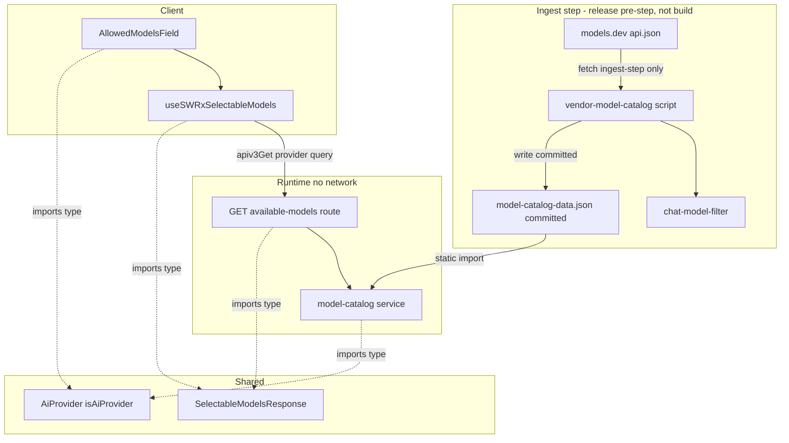
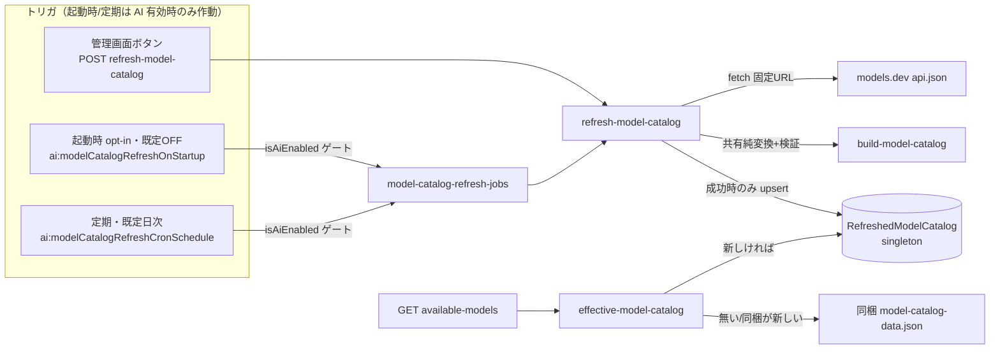

# Technical Design: ai-provider-model-picker

## この文書に書くこと・書かないこと（Write / Don't-Write test）

本 spec は実装完了済み（PR #11383、および追補 R のフォローアップコミット）。このセクション以下は「将来この機能を改修するときに、コードとテストを読むだけでは分からないことだけを残す」という基準で整理されている。今後この設計書を編集するときも同じ基準を使うこと。

判定は一貫して次の問いに従う: **「コードとテストファイルを読めば再現できる内容か?」** 再現できるなら書かない。

| 書く | 書かない |
|---|---|
| 調査して初めて分かった事実（コードをさっと読むだけでは分からない挙動、外部ライブラリ・内部ヘルパーの隠れた仕様） | 関数シグネチャ、ファイル配置図、「どのファイルに何があるか」 |
| 変わった設計を選んだ理由 — **特に、検討して却下した別案とその理由** | ごく普通の実装のごく普通の説明 |
| 自動テストで**検知できない**残課題 | どのテストが何をカバーしているかの一覧（spec/テストファイルを直接読めばよく、書いても陳腐化する） |
| コードから再現できない手動確認手順（再現環境の作り方・見るべき箇所・合格/不合格の基準値） | 差分の有無やいつ実装されたかといった、時点情報の記録 |

迷ったら書かない。コードから読み取れる内容を spec に置くと、コードが変わった瞬間に静かに古くなり、その一箇所の陳腐化が文書全体の信頼性を損なう。

## Overview

**Purpose**: 管理画面「AI Settings」で許可モデル（`ai:allowedModels`）を登録する際の modelId 入力を、静的カタログを持つプロバイダでは **一覧からの選択のみ** に変更し、綴り間違い・存在しないモデルの登録を防ぐ。選択肢は **models.dev から取り込んだ（vendored）コミット済みモデルカタログ**を源とし、実行時は **外部通信ゼロ** で読む。

**Users**: GROWI 管理者（admin AI Settings で LLM を設定する運用者）。

**Impact**: 現行の自由入力（[AllowedModelsField.tsx](../../../apps/app/src/features/mastra/client/admin/AllowedModelsField.tsx)）を、カタログのあるプロバイダでは `<select>` に置き換える。カタログは models.dev を**取り込みステップ（リリース前段の独立ステップ。ビルド工程では実行しない）**で取り込み、`tool_call` かつ text 出力のモデルだけに **生成時フィルタ**して**コミット済み JSON アセット**にする。実行時はそのアセットを read するだけで、`@mastra/core` への値 import も不要。許可リストの認可・既定モデル・推論の native `@ai-sdk/*`・チャット側 UI は不変。

> **用語（取り込みステップ / ingest step）**: 本設計で「取り込みステップ」とは models.dev の api.json を fetch → フィルタ → コミット成果物を生成する処理を指し、**リリース前段の独立ステップ**（手動 `pnpm vendor:models` も可）で実行する。**毎ビルドでも実行時でも fetch は行わない**——ビルド工程・実行時はコミット済み成果物を read するのみ（requirements「外部通信に関する前提」準拠）。以降、本文の「取り込みステップ」／図表の "ingest step" はすべてこの意味で用い、"build time" とは区別する。

### Goals
- カタログを持つプロバイダ（openai / anthropic / google）で選択のみの登録を提供（1.x）。
- モデル一覧の**提供（read パス）を外部通信ゼロ**にする（2.x）。一覧提供はローカル保存済みカタログ（同梱、または更新済み）の read のみで、リクエスト都度の外部取得は行わない。
- **カタログのリフレッシュ手段を提供**（9.x）: 管理画面からの手動更新／起動時更新オプション／定期自動更新。起動時・定期の更新は **AI 機能が有効（`app:aiEnabled`）な場合に限り**作動する。AI 機能は既定 OFF のため既定構成は外部通信ゼロ。起動時更新は既定 OFF（opt-in）、定期自動更新は既定で日次スケジュール（AI 有効化時に自動最新化。空文字で無効化可）。更新は同梱カタログと**同一のフィルタ・検証**を経て永続化され、以後の一覧提供に反映される（解決: 更新済み／同梱の**新しい方**。更新済みが無ければ同梱）。
- カタログを持たないプロバイダ（azure-openai）・一覧が空の場合は自由入力を維持（3.x）。
- **`tool_call` かつ text 出力のモデルだけ**を選択肢にする（生成時フィルタ、6.x）。GROWI エージェントのツール呼び出し要件を担保。
- 既存の許可リスト挙動・認可・推論・チャット UI を不変に保つ（4.x）。
- 記述が矛盾する既存スペックを整合更新（8.x）。

### Non-Goals
- チャット画面側 UI・推論実行方式の変更（4.3）。
- **一覧提供（read パス）でのリクエスト都度の外部取得**／モデルルーター採用（外部通信は Req 9 のリフレッシュ操作に限る）。
- models.dev 以外のソース（各ベンダー API 等）からのモデル一覧取得。
- Azure デプロイ名の自動列挙。
- PUT 側でのカタログ membership 検証（D2、下記 Out of Boundary 参照）。
- カタログの config-manager への主保管、および `ai:modelsCatalogOverride` 等のオーバーライド（今回は入れない。更新済みカタログの保管は config ではなく専用 collection）。

## Boundary Commitments

### This Spec Owns
- **models.dev → コミット済みモデルカタログの vendoring**（取り込みステップ＝リリース前段の取り込みスクリプト、生成時フィルタ、コミット成果物）。
- provider スコープの「選択可能モデル一覧」を返す admin 読み取り経路（サーバ read サービス + エンドポイント + client フック）。
- **カタログのリフレッシュ経路（Req 9・追補 R）**: 共有純変換（`build-model-catalog`）、runtime refresh サービス、更新済みカタログの永続化（`RefreshedModelCatalog` singleton collection）、`POST /ai-settings/refresh-model-catalog`、管理画面の更新ボタン、設定キー（`ai:modelCatalogRefreshOnStartup`＝既定 OFF / `ai:modelCatalogRefreshCronSchedule`＝既定日次）と起動時/cron 配線（起動時・定期とも AI 有効時のみ作動）。
- `AllowedModelsField` の modelId 入力コントロールの出し分け（`<select>` ↔ 自由入力）。
- 新規 wire DTO `SelectableModelsResponse` / `RefreshModelCatalogResponse`。
- 既存スペック（`ai-provider-multi-model` / `ai-provider-selection`）のモデル入力方式に関する記述の整合更新。

### Out of Boundary
- `ai:allowedModels` の保存経路（[put-ai-settings.ts](../../../apps/app/src/features/mastra/server/routes/admin-ai-settings/put-ai-settings.ts)）と検証（単一 isDefault・providerOptions JSON）。**PUT はカタログ照合しない**（D2。理由: (a) 保存済み一覧外 modelId の保全＝1.5、(b) native `@ai-sdk` は任意の modelId を受理し将来リリースされるモデルも動く、(c) azure は自由入力のまま、(d) カタログはバージョンで drift する。カタログ制約は UI 側のアフォーダンスであり、server 側の不変条件ではない）。
- 推論のモデル生成（[resolve-mastra-model.ts](../../../apps/app/src/features/mastra/server/services/ai-sdk-modules/resolve-mastra-model.ts) / `llm-providers/*`）と allow-list 検証（`resolveEffectiveModelId`）。
- チャット側モデル一覧（[get-models.ts](../../../apps/app/src/features/mastra/server/routes/get-models.ts)）・`PromptInputModelSelect`・`UserUISettings.aiChatSelectedModelId`。
- `ai:provider` / `ai:apiKey` / `ai:azureOpenaiSettings` の意味。

### Allowed Dependencies
- **models.dev api.json**（`https://models.dev/api.json`, MIT）— fetch するのは **(a) 取り込みステップ（リリース前段）の取り込みスクリプト**と **(b) runtime refresh サービス（Req 9・AI 有効時のリフレッシュ時のみ: 手動/起動時/定期）** の 2 箇所に限る（ビルド工程・一覧提供 read パスは触れない）。URL はビルトイン定数（要求側から指定不可、9.7）。
- **コミット済み vendored 成果物**（`model-catalog-data.json`）— 実行時に静的 import して read（基線）。
- **更新済みカタログの永続化** — MongoDB の専用 singleton collection（`RefreshedModelCatalog`）。多インスタンス共有・再起動耐性のため（追補 R）。
- **zod `^4.1.9`**（既存 dep）— 共有純変換 `build-model-catalog` の**境界検証**（api.json の想定形チェック）。取り込みステップと refresh サービスの両方が同一検証を通る。
- **node-cron（既存 `CronService` 基盤）** — 定期リフレッシュ（AI 有効時・既定日次、Req 9.3）。
- 既存 admin 認可チェーン（`accessTokenParser([SCOPE.READ.ADMIN.AI])`／書き込みは `[SCOPE.WRITE.ADMIN.AI]` → `loginRequiredFactory` → `adminRequiredFactory`）。
- 既存 client 資産（`apiv3-client`、`useSWRImmutable`、reactstrap `Input`/`Button`、react-hook-form `register`、`toastr`）。
- `interfaces/ai-provider` — サーバ（route）は runtime の `isAiProvider` で query を検証し、**client は型のみ `import type { AiProvider }`** を参照する（ビルド時に erase されるため server-only モジュールへの実行時結合は生じない。同モジュール冒頭の「Do NOT add client imports here」は"モジュール内へ client 依存を持ち込むな"の意で、型の被参照は禁じていない）。`interfaces/allowed-model`。
- **制約**: カタログ（同梱 JSON・更新済み collection）はサーバ側のみで read し、client には `SelectableModel[]`（`{id,name}`）（と refresh メタデータ）のみ返す。**一覧提供（read パス）のネットワーク I/O は禁止**（外部通信は Req 9 のリフレッシュ操作に限る）。

### Revalidation Triggers
- `SelectableModelsResponse` の形状変更 → client フック／UI の再検証。
- vendored 成果物のスキーマ（`provider → {id,name}[]`）変更 → model-catalog／取り込みスクリプトの再確認。
- 生成時フィルタ条件（`tool_call && text 出力`）変更 → 提示一覧が変わるため UX/テスト再確認。
- models.dev api.json のスキーマ変更（`tool_call`/`modalities` フィールド） → 取り込みスクリプトの再確認。
- リリースパイプラインへの vendoring ステップ配置変更 → 鮮度運用の再確認。

## Architecture

### Existing Architecture Analysis

**vendoring の前例**: marpit（[extract-marpit-css.ts](../../../packages/presentation/scripts/extract-marpit-css.ts) → コミット `*.prebuilt.ts`、「ランタイム依存なしで使うため生成」）と emoji（`@growi/emoji-mart-data` の `build: node bin/extract.ts`）は、いずれも GROWI の既存の定石「抽出→コミット→実行時は依存なし」である。本設計はこれに倣うが、emoji/marpit は**ローカル devDep から決定的に抽出**するため build 時再生成が安全なのに対し、本カタログの源は**ネットワーク（models.dev）**である。そのため取り込みは**毎ビルドではなくリリース前段の取り込みステップで実行**し（生成のみ／コミットは別ステップ）、ビルドはコミット済みを消費する（詳細は下記「データ源選定の根拠」）。

### Architecture Pattern & Boundary Map



- **Selected pattern**: 「取り込みステップ（リリース前段）に models.dev から vendoring → コミット成果物 → 実行時は成果物を read」の二段構え（marpit/emoji の vendoring 定石に準拠）。実行時は一方向 read で通信ゼロ。
- **Dependency direction**: `interfaces`（DTO/AiProvider）← `chat-model-filter` ← `vendor-model-catalog`(script, 取り込みステップ) → コミット `model-catalog-data.json` ← `model-catalog`(runtime) ← `route` / `use-selectable-models`(client) ← `AllowedModelsField`。models.dev は取り込みステップのスクリプトからのみ到達。
- **Steering compliance**: server-client 境界（vendored JSON を client に持ち込まない）、cross-platform（Node の fetch/fs、curl/rm 不使用）、data-driven（provider 選択・フィルタ条件を宣言）、pure function 抽出（chat-model-filter）。

### データ源選定の根拠（Build-vs-Adopt）

モデル一覧の源を **models.dev の vendored 成果物**とし、**Mastra 経由（model router / 同梱 registry read）は採らない**。理由（詳細な比較は research.md）:

- **Mastra の model router（runtime で models.dev を fetch）不採用**: 実行時に外部通信が走り Req 2・自己ホスト/エアギャップに反する。OpenAI 互換層経由の忠実度ドリフト懸念（`ai-provider-selection` D-2/D-3）。→ 推論は native `@ai-sdk/*` のまま。
- **`@mastra/core/llm` `getProviderConfig`（オフライン registry read）不採用**: オフラインで読める点は候補だったが、**同梱データが stripped**（`provider→素id` ＋ `attachment` のみで **`tool_call`・modality を持たない**）。そのため chat＋ツール対応の**権威的フィルタが不可能**で名前 heuristic 頼みになり、選択のみ UI では誤除外の逃げ場が無い（旧 Issue 1）。加えて `@mastra/core` を値 import する必要が生じ Turbopack externalization 懸念（旧 D4）。
- **採用: models.dev api.json を vendoring**: 上流はリッチな `tool_call`/modality を持ち（Mastra はそれを削って同梱しているだけ）、**authoritative な chat＋tool フィルタ**が可能。実行時は成果物を read するのみで通信ゼロ、`@mastra/core` を実行時に触れない。取り込み頻度も GROWI が制御できる。第三者 npm ラッパー（tokenlens 等）は単独メンテ・鮮度不安のためランタイム依存にしない（調査の詳細は research.md）。

## System Flows

```mermaid
sequenceDiagram
    participant Rel as リリース前段refresh step
    participant MD as models.dev api.json
    participant Repo as committed JSON
    Rel->>MD: fetch リリース前段stepのみ
    Rel->>Rel: 3provider選択 + isSelectableModel(tool_call && text) で生成時フィルタ
    Rel->>Repo: model-catalog-data.json を書き出しコミット（差分は PR レビュー）
    Note over Repo: 以降ビルドはこの成果物を read（live fetch しない）

    participant Admin
    participant Field as AllowedModelsField
    participant Hook as useSWRxSelectableModels
    participant API as GET available-models
    participant Cat as model-catalog
    Admin->>Field: provider を選択 / 変更
    Field->>Hook: provider (form watch 値)
    alt provider が空
        Hook-->>Field: fetch しない → 自由入力 (5.2)
    else provider あり
        Hook->>API: apiv3Get(?provider=...)
        API->>API: isAiProvider 検証（不正=400）
        API->>Cat: getSelectableModels(provider)
        Cat->>Repo: 成果物を static read（通信なし）
        Cat-->>API: {id,name}[]（azure 等は []）
        API-->>Hook: { models }
        alt models 非空
            Hook-->>Field: <select> で選択のみ (1.4)
        else 空 or error
            Hook-->>Field: 自由入力にフォールバック (3.1/3.2)
        end
    end
```



- **鮮度運用の不変条件**: リフレッシュ（fetch＋フィルタ＋コミット）は**本番リリースの前段の独立 step**で実行し成果物をリリース commit に同梱する。**リリースビルド（prod・無人 RC とも）はコミット済み成果物を read するのみ**で、build 工程に fetch/commit を融合しない。タイミングは本番リリース時（`release.yml` の pre-release step）＋必要に応じ手動 `pnpm vendor:models` → PR（将来 cron も可）。無人 RC はコミット済みカタログから build する。
- **生成時フィルタ**: 成果物には chat＋tool 対応の id だけが載る（`tool_call:false` や非 text 出力は書き出さない）。実行時フィルタは不要。

## Components and Interfaces

### Build / Release

#### chat-model-filter（純関数）
- 対象プロバイダ（openai/anthropic/google）は `AI_PROVIDER_DEFS`（[ai-provider.ts](../../../apps/app/src/features/mastra/interfaces/ai-provider.ts)）の `enumerable: true` フラグから導出する（`CATALOG_PROVIDERS`）。フラグを単一ソースにすることで、プロバイダ追加時に別リストと二重管理・ドリフトしない。azure-openai は `enumerable: false`（models.dev 非収録＝デプロイ名で列挙不可）で対象外。
- `isSelectableModel(entry) = entry.tool_call === true && entry.modalities.output に text を含む`。models.dev の**権威的フィールド**で判定するため、名前 heuristic は不要（旧 Issue 1 解消）。
- **欠落フィールドの扱い**: `tool_call`・`modalities.output` は models.dev の全エントリに**必須**（非chat エントリ＝embedding/TTS 等でも `tool_call:false`・非 text modality として埋まる）。したがって欠落は「データ形」ではなく**スキーマドリフトのシグナル**と解釈し、境界スキーマが fail-loud で reject する。

#### vendor-model-catalog（Batch script, 取り込みステップ／リリース前段）
- `fetch('https://models.dev/api.json')` するのは**取り込みステップ（リリース前段）でのみ**。ビルド工程・実行時では fetch しない。
- 取得した api.json を境界で zod 検証し（対象プロバイダの全エントリで `tool_call`・`modalities.output` の存在と型を検証。他フィールド/他プロバイダは passthrough）、**各対象プロバイダで `isSelectableModel` 通過が1件以上**であることを assert する。スキーマドリフト（`models` が map でない／必須フィールドの欠落・型不正）または空結果のときは**非ゼロ終了して既存のコミット成果物を保持**し上書きしない。
- **fail-loud を選ぶ理由**: 欠落を許容すると、上流が一部エントリだけ再構造化した場合に正当な chat モデルが無言で選択肢から消え、選択のみ UI がシグナルなく劣化する。失敗時は last-good（コミット成果物）が維持されるため、fail-loud のコストは鮮度であって可用性ではない（Req 9.4 とも整合する設計判断）。
- スクリプトは**生成（fetch＋フィルタ＋ファイル write）のみで git 操作はしない**（純ジェネレータ）。**コミットは別ステップの責務**（手動＝開発者が diff 確認して PR ／ 本番リリース＝`release.yml` の pre-release step が差分時にリリース commit へ同梱）。リリースビルド（prod・無人 RC とも）はコミット済み成果物を read するのみ。
- Idempotency: 同一上流なら同一出力（決定的、id でソート）。

### Server (runtime)

#### model-catalog
- コミット成果物 `model-catalog-data.json` を `import catalog from '^/resource/model-catalog-data.json' with { type: 'json' }`（**ネイティブ ESM 必須**、`growi-version.ts` の前例に準拠）で静的 read する。`resolveJsonModule: true` により import 時に自動で型が付き、アサーションが不要になる。
- フィルタは生成時に完了済みのため、実行時ロジックは `catalog.models[provider] ?? []` の read のみ（**ネットワーク I/O なし**）。

#### get-available-models（API）
- 認可チェーン: `accessTokenParser([SCOPE.READ.ADMIN.AI], { acceptLegacy: true })` → `loginRequiredFactory(crowi)` → `adminRequiredFactory(crowi)` → handler（[get-ai-settings.ts:169-179](../../../apps/app/src/features/mastra/server/routes/admin-ai-settings/get-ai-settings.ts#L169-L179) と同型）。**aiReadyGuard は意図的に付けない**（AI 未設定でもモデル一覧の取得自体は可能であるべきため）。

| Method | Endpoint | Request | Response | Errors |
|--------|----------|---------|----------|--------|
| GET | `/_api/v3/ai-settings/available-models` | query `provider: AiProvider` | `SelectableModelsResponse` | 400 (invalid provider), 401/403 (auth), 500 |

- provider が有効だがカタログ非対応（azure-openai）の場合はエラーではなく `200 { models: [] }`。

### Client

#### useSWRxSelectableModels（フック）
- **未選択時の fetch 抑止は `''` と `undefined` の両方をガードする**: 設定データ解決前は `useForm` に defaultValues が無く `watch('provider')` が（型に反して）`undefined` を返すため、`=== ''` だけのガードだと `[ENDPOINT, undefined]` キーで fetch が走り、`provider` クエリ無しのリクエスト → 400 になる。nullish もガードして「provider 無し ⇒ リクエストしない」を初期ロード中も守る（5.2）。
- **`apiv3Get` の内部挙動に注意**: `apiv3Get(path, params)` は第2引数を内部で `{ params }` に包んで axios へ渡す（[apiv3-client.ts](../../../apps/app/src/client/util/apiv3-client.ts)）ため、クエリ値のオブジェクトを**そのまま**第2引数に渡す（`{ provider }`）。`{ params: { provider } }` と書くと二重ラップされ `?params[provider]=...` となり `req.query.provider` が undefined になり 400 になるので不可。
- `useSWRImmutable`（静的データ）。provider 変更で自動再取得（5.1）。

#### AllowedModelsField（UI）
- `provider = watch('provider')` で `useSWRxSelectableModels(provider)` を1回呼び、`mode`（`'select'` / `'freetext'`）を導出する。`mode==='select'`（provider にカタログがあり一覧が非空）のときのみ modelId は一覧からの選択に限定され、自由入力を受け付けない（1.4）。ロード中・provider 未選択・取得失敗・一覧空はいずれも自由入力にフォールバックする（3.1/3.2/5.2）。
- 保存済みだが一覧外の modelId は補完 option として保持し、管理者の操作なしに変更・削除しない（1.5）。選択時に行の表示専用 `displayName` を選んだ option の `name` に同期する。
- 既存の `disabled`（env-only, 7.3）・行ラベル分岐・isDefault ラジオ・providerOptions・削除・追加ボタンは不変（4.2）。

## Data Models

### Data Contracts

```typescript
// interfaces/selectable-models-response.ts
// GET /_api/v3/ai-settings/available-models の応答。server/client 共有。
// models は生成時に chat＋tool へ絞られた {id,name} 配列（azure 等は空）。秘匿情報は含めない（7.1）。
export interface SelectableModel {
  id: string;
  name: string;
}
export interface SelectableModelsResponse {
  models: SelectableModel[];
}
```

- 実行時の read 元 `model-catalog-data.json`（コミット済み）は `provider → {id,name}[]` の shape（`{ _source, _generatedAt, models }`）。`id` と `name` は models.dev の**同一スナップショットから同時に取り込む**ため相互に drift しない（`name` 欠落時は `id` をフォールバック）。同梱 JSON と永続スナップショット（`RefreshedModelCatalog.models`）の双方に同じ shape を適用する。
- 許可リスト（config, `ai:allowedModels`）は modelId のみを保持する（不変）。表示名は**保存しない**——読み取り時に共有ヘルパー `buildModelDisplayNameResolver`（[resolve-model-display-name.ts](../../../apps/app/src/features/mastra/server/services/ai-sdk-modules/resolve-model-display-name.ts)）が (provider, modelId) を実効カタログと join して解決する（id フォールバック）。保存しない理由: カタログ側の `name` が将来変わっても許可リストのリライトが要らないようにするため。
- 既存 `AllowedModel` / `AiSettingsResponse` / `AiSettingsUpdateRequest` の形は変更しない（4.x）。

## Error Handling

- **取り込みステップ（リリース前段）の fetch 失敗／スキーマドリフト・空結果**: `vendor-model-catalog` は非ゼロ終了し、**既存のコミット成果物を保持**する（無言の空カタログ出荷を防止。リリースは前回カタログで継続可能）。何が欠けたか（プロバイダ名・件数）をログに出し、PR/CI で検知させる。
- **400 invalid provider**: `isAiProvider` 不合格 query → `ErrorV3` で 400。
- **実行時のサーバ 5xx／取得失敗**: フックの `error` → UI は自由入力にフォールバックし保存をブロックしない（3.2）。秘匿を応答に載せない。
- **空一覧（azure 等）**: エラーではなく `{ models: [] }`。UI は自由入力（3.1）。
- **成果物欠損/破損**: `model-catalog` は `catalog[provider] ?? []` でフェイルソフト（例外を投げない）。

## 追補 R: カタログのリフレッシュ（Req 9 — PR #11383 レビューFB 対応）

同梱カタログは公式イメージに焼き込まれた後は変化しないため、イメージ更新なしにカタログを最新化するリフレッシュ経路を追加する。起動時・定期のリフレッシュは **AI 機能が有効（`app:aiEnabled`）な場合に限り**作動し（AI 既定 OFF のため既定構成は外部通信ゼロ）。**一覧提供（read パス）の通信ゼロは不変**であり、外部通信は AI 有効時のリフレッシュ操作（手動/起動時/定期）に限る（9.6）。

### アーキテクチャ



### コンポーネント（追加分）

| Component | Layer | Intent |
|-----------|-------|--------|
| build-model-catalog | 共有 (pure) | api.json → zod 境界検証 → chat＋tool フィルタ → `ModelCatalog`。ingest script と refresh サービスの**単一ソース**（同一フィルタ・同一サニティチェック） |
| refresh-model-catalog | Server (runtime) | 固定 URL fetch（30s timeout）→ 共有変換 → `RefreshedModelCatalog.upsertSingleton`。**失敗時は永続化前に throw**（last-good 維持） |
| RefreshedModelCatalog | Server (model) | `{ _id:'singleton', models, fetchedAt, supersededBundledGeneratedAt, source }` の専用 collection（`mastra_refreshed_model_catalog`）。**Prisma-first**（schema.prisma の `mastrarefreshedmodelcatalogs` + `@@map`、`getSingleton`/`upsertSingleton` は Prisma extension。新規 collection のため Mongoose schema は持たない）。多インスタンス共有・再起動耐性。config-manager には置かない（設定ではなくキャッシュ） |
| effective-model-catalog | Server (runtime) | `getEffectiveSelectableModels(provider)` = 更新済み／同梱の**新しい方**（比較は**同梱 `_generatedAt` 同士**: refresh 時点で同梱されていた世代 `supersededBundledGeneratedAt` vs 現在の同梱 `_generatedAt`。両辺とも vendoring 実行機のクロック由来なので、サーバ時計の遅れが成功した refresh を同梱で覆い隠すことがない。同梱世代が**厳密に**新しい場合のみ同梱＝イメージ更新後の古いスナップショットの覆い隠しを防止。tie（同一イメージ上での refresh）・タイムスタンプ不正・ロールバックは更新済み優先。無ければ同梱。`?? []` フェイルソフトは従来どおり）。get-available-models はこれを await する |
| post-refresh-model-catalog | Server (route) | `POST /_api/v3/ai-settings/refresh-model-catalog`。`[accessTokenParser([SCOPE.WRITE.ADMIN.AI]) → login → admin]`。成功 200 `{ fetchedAt, counts }`／失敗は generic 500（内部情報を漏らさない） |
| model-catalog-refresh-jobs | Server (boot) | `startModelCatalogRefreshCronIfEnabled()`（**AI 無効なら no-op**、schedule 未設定/空でも no-op、invalid でも boot を壊さない）＋ `triggerModelCatalogRefreshOnStartupIfEnabled()`（**AI 無効なら no-op**、fire-and-forget）。両者とも先頭で `isAiEnabled()` をチェック（Req 9.6）。crowi の `setupCron()` / `asyncAfterExpressServerReady()` から呼ぶ |
| AllowedModelsField 更新ボタン | Client (UI) | Models セクション見出しの「カタログを更新」→ **確認モーダル（ConfirmModal 再利用。外部サービス models.dev への通信が発生する旨を明示し、確認後にのみ実行 — 9.6）** → apiv3Post → 成功で全 provider キャッシュ invalidate＋toast。**env-only モードでも有効**（カタログは設定ではなく公開メタデータのサーバ側キャッシュであり、env-only 運用の GROWI.cloud がこの機能の主対象のため） |

### 設定キー（デプロイオプション。作動はいずれも AI 有効時のみ）

| Key | env | 型/既定 | 意味 |
|-----|-----|---------|------|
| `ai:modelCatalogRefreshOnStartup` | `AI_MODEL_CATALOG_REFRESH_ON_STARTUP` | boolean / `false` | サーバ起動後に一度リフレッシュを試行（growi-docker-compose 等の焼き込みイメージ向け）。既定 OFF。AI 有効時のみ作動 |
| `ai:modelCatalogRefreshCronSchedule` | `AI_MODEL_CATALOG_REFRESH_CRON_SCHEDULE` | string / **`'0 4 * * *'`** | node-cron 式。**既定は日次**（AI 有効化で自動最新化）。空文字 = 無効。AI 有効時のみ作動 |

env-only（`env:useOnlyEnvVars:ai`）の targetKeys には**含めない**: これらは設定フォーム項目ではなく env 駆動のデプロイオプションであり、PUT 経路にも現れない。

### Error Handling（追加分）
- **リフレッシュ失敗（fetch 不達 / HTTP エラー / スキーマドリフト / 空プロバイダ）**: `refreshModelCatalog` は**永続化の前に throw** → last-good（更新済み or 同梱）が有効なまま（9.4）。エンドポイントは generic 500、起動時/cron は warn ログのみで稼働継続。
- **起動時/cron の boot 安全性**: invalid cron 式は捕捉してログ（boot を壊さない）。起動時リフレッシュは fire-and-forget（await しない）。
- **AI-有効ゲート（9.6）**: 起動時・定期の両トリガは先頭で `isAiEnabled()` を評価し、AI 無効なら即 no-op（cron も登録しない）。定期スケジュールは既定で日次のため、この AI-有効ゲートが「既定構成（AI 無効）＝外部通信ゼロ」を担保する。
