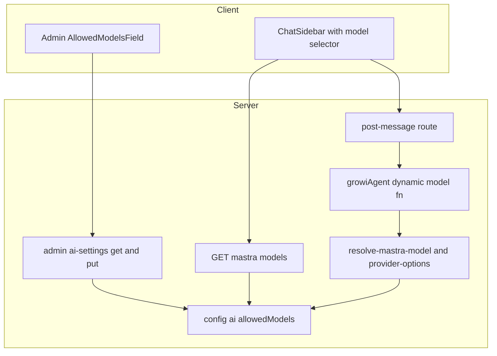
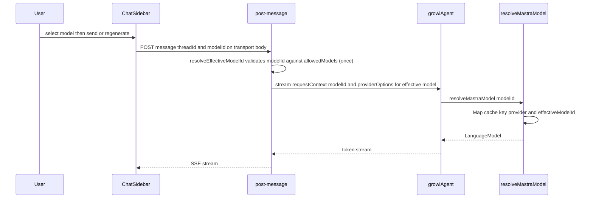
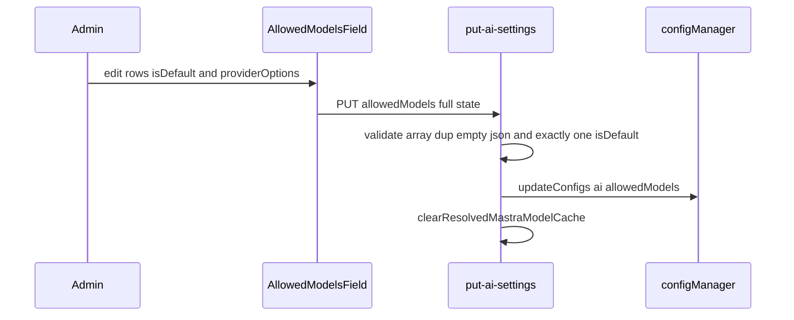

# Technical Design: ai-provider-multi-model

## この文書に書くこと・書かないこと（Write / Don't-Write テスト）

この文書は実装の記録ではなく、次にこの機能を変更する人のための出発点である。以下の問いを、書く・書かないの判断に使う。**読み手が実装コードとテストファイルを読めば分かることは、ここに書かない。**

| 書く | 書かない |
|---|---|
| なぜその設計を選んだか。とくに検討したうえで採らなかった別案とその理由 | 関数のシグネチャやファイル一覧など、コードを読めば分かること |
| システムの境界をまたぐ約束事（API の形、DB に保存する値の形） | どのテストがどの受け入れ基準をカバーしているかの対応表（テストファイルを読むほうが正確） |
| 自動テストでは確かめられない残りの部分（手動確認が必要な範囲） | 実装した時期や差分の有無など、時点だけの記録 |
| このspecが持つ責務・持たない責務・依存してよいもの・再検証が必要になる変更 | 技術スタックの一覧など、package.json を見れば分かること |

迷ったら書かない。コードを読めば分かることをここに置くと、コードが変わったときに黙って古くなり、文書全体の信頼を落とす。

## Overview

**Purpose**: Mastra AI チャットを「1 App = 1 モデル固定」から「管理者が許可した同一プロバイダ内の複数モデルを、エンドユーザーがチャットごとに選べる」形へ拡張する。

**Users**: 管理者は AI 設定画面で許可モデル集合（各モデルに任意の providerOptions、リスト内 1 つを既定に指定）を設定する。エンドユーザーはチャットのモデルセレクタからメッセージ単位でモデルを選ぶ。

**Impact**: 単一の `ai:model`（文字列）+ `ai:providerOptions`（単一 JSON、全 stream に一律適用）を、`ai:allowedModels`（モデル + providerOptions + 既定フラグを同梱した配列）+ リクエスト単位のモデル解決へ置き換える。既定モデルは別キーではなく**配列エントリの `isDefault` フラグ**で表す。**`ai:model` / `ai:providerOptions`（env `AI_MODEL` / `AI_PROVIDER_OPTIONS` 含む）は完全廃止**（自動移行なし。運用者は `ai:allowedModels` で再設定）。プロバイダ/API キー（単一）と AI 有効性ゲーティングは不変。

### Goals
- 管理者が複数の許可モデル、モデルごとの providerOptions、既定モデル（リスト内 1 つ）を設定できる。
- エンドユーザーがチャットで許可モデルから選択し、その応答に選択モデル（とそのモデルの providerOptions）が使われる。再生成（regenerate）でも選択モデルが保持される。
- ユーザーの選択モデルが個人設定として記憶され、次回の初期選択に使われる（許可外ならデフォルト）。
- 許可外モデルがサーバ側で使われない（クライアント値を信用しない）。

### Non-Goals
- 異なるプロバイダのモデルを 1 つの許可リストに混在させること。`ai:provider`/`ai:apiKey` は単一のまま。
- 実行時のベンダー API / レジストリからのモデル一覧自動取得（実行時ベンダー API 呼び出しは引き続き非対象）。カタログを持つプロバイダ（openai / anthropic / google）の管理者許可リストは、models.dev を取り込んだオフライン同梱カタログ（`model-catalog-data.json`）からの選択方式を採る。一覧提供自体（read パス）は成果物を読むだけで外部通信を伴わない。外部通信が発生するのはカタログの更新時（管理画面からの手動更新／起動時／定期実行。起動時と定期実行は AI 機能が有効なときだけ動き、定期実行の既定は日次）に限られる。azure-openai、またカタログ取得に失敗した場合は従来どおり自由入力のまま。詳細は `.kiro/specs/ai-provider-model-picker`。
- 会話（スレッド）ごとの選択モデルのサーバ永続化。
- 旧 `ai:model` / `ai:providerOptions` からの自動移行（完全廃止・運用者が再設定）。
- AI 有効性ゲーティング・スレッド永続化・ストリーミング・エラーサニタイズの挙動変更。

## Boundary Commitments

### This Spec Owns
- 設定キー `ai:allowedModels`（`AllowedModel[]`、`isDefault` 含む）の定義・読取・書込・検証。
- 既定モデルの決定（`isDefault` フラグ、無指定時は先頭）。
- ユーザー選択モデルの永続化（`UserUISettings.aiChatSelectedModelId`）。書込は共有 `scheduleToPut`、読取は `/mastra/models` がサーバ側で検証して返す（専用 atom・SSR ハイドレートは持たない）。
- 実効モデルと providerOptions の解決（`resolveEffectiveModelId` / `getDefaultModelId` / `getProviderOptionsForModel(effectiveModelId)` / `resolveMastraModel(modelId?)`）と、許可リストに対するサーバ側検証。
- AI 構成済み判定（`isAiConfigured`）を allowedModels ベースへ更新。
- `growiAgent` のリクエスト単位モデル解決（動的モデル関数 + RequestContext の `modelId`）。
- 管理 UI の許可モデルリストエディタ（`ProviderCommonSettings` 内に単一配置）と GET/PUT 契約の拡張。
- チャット用モデル一覧エンドポイント `GET /_api/v3/mastra/models` と、チャット UI のモデルセレクタ配線（transport への modelId 固定を含む）。

### Out of Boundary
- 複数プロバイダ混在（別 spec / 将来）。`ai-provider-selection` のベンダー切替は据え置き。
- 実行時のベンダー API からのモデル一覧取得は引き続き非対象。ただし ai-provider-model-picker はオフライン同梱（リリース前段で成果物へ commit 済み）カタログの read を採用する（一覧提供 read パスは外部通信ゼロ。カタログリフレッシュ〔管理画面手動／起動時／定期。起動時・定期は AI 機能有効時のみ作動し、定期は既定で日次〕時のみ models.dev へ fetch する別経路。詳細は `.kiro/specs/ai-provider-model-picker`）。会話固定モデルのサーバ永続化。
- 旧 `ai:model` / `ai:providerOptions` からの自動移行（完全廃止。運用者は `ai:allowedModels` で再設定）。
- 既存 spec（`ai-provider-settings` / `ai-provider-selection`）のドキュメント更新は本 spec の**タスク**として行うが、本設計の実装対象コードではない。
- スレッド永続化 / ストリーミング / エラーサニタイズ / AI 有効性ゲーティングの内部実装。

### Allowed Dependencies
- `~/server/service/config-manager`（`configManager`, `defineConfig`, config-loader のオブジェクト配列対応）。
- `@mastra/core`（Agent 動的モデル関数、`RequestContext`）、`@ai-sdk/*`（provider factory）。
- 既存 `provider-options-validation`（`isProviderNamespacedObject` / `isValidProviderOptionsJson`）。
- ベンダリング済み `~/components/ai-elements/prompt-input`（`PromptInputModelSelect*`）、`react-hook-form`（`useFieldArray`）、SWR。
- `~/interfaces/user-ui-settings`、`~/client/services/user-ui-settings`（`scheduleToPut`・共有サービス）、`UserUISettings` model（選択モデル永続化の読書き）。
- 依存方向（左→右、上位は下位を import しない）: `interfaces` → `config-definition` → `ai-sdk-modules`（resolvers）→ `mastra-modules`（agent）→ `routes` → `client`。

### Revalidation Triggers
- `AllowedModel` / `AiSettingsResponse` / `AiSettingsUpdateRequest` の形変更 → 管理 UI・`ai-provider-settings` spec 再確認。
- `ai:allowedModels` の意味・`isDefault` 規約の変更、または旧 `ai:model`/`ai:providerOptions` 廃止に伴う設定方針の変更 → `ai-provider-settings`・`ai-provider-selection` spec 再確認。
- `GET /_api/v3/mastra/models` のレスポンス形（`ChatModelsResponse`）変更、または post-message の `modelId` 受理契約変更 → チャットクライアント再確認。
- `resolveMastraModel` / `isAiConfigured` の意味変更 → `ai-provider-selection` の解決設計・AI 有効性ゲートと整合確認。
- Mastra のバージョンを下げる変更 → リクエスト単位の動的モデル関数（`({ requestContext }) => model`）の対応可否を再確認。`package.json` の floor は `^1.32.1` だが caret 解決で実際にインストールされるのは 1.41 系であり、この機能はその実体（1.41 以降）に依存している。floor を厳密に 1.32 系まで戻す変更は本機能の前提を壊す。

## Architecture

### Architecture Pattern & Boundary Map



**Architecture Integration**:
- Selected pattern: 既存のデータ駆動ディスパッチ（`modelResolvers`）+ レイヤード解決を踏襲し、解決ロジックに `modelId` を一引数として通す Extension。
- 責務分離: 「解決の中核」(`ai-sdk-modules`) / 「リクエスト供給」(`routes`) / 「設定・表示」(`client`)。検証と既定解決は `ai-sdk-modules` に集約。
- 既存パターン維持: data-driven resolver マップ、RequestContext プラミング、FULL-STATE-REPLACE PUT、`clearResolvedMastraModelCache` 無効化。
- 新コンポーネント根拠: 許可リスト型（複数モデル + 既定 + options）、リストエディタ UI、chat models エンドポイント（クライアントは現状 AI 設定を取得しない）。
- Steering 整合: feature ベース構成 / named export / co-located tests / `mock<T>` / immutable。

新規依存なし。逸脱: 既定を別キーから `isDefault` フラグへ移行、`ai:model`/`ai:providerOptions` を完全廃止、モデル欄を Azure 専用セクション → 共通設定へ移設。

## File Structure Plan

新規に必要だったのは、実効モデル解決の中核（`ai-sdk-modules`）とは別に、(1) 許可モデル・providerOptions・既定フラグを1エントリに同梱する型（`interfaces/`）、(2) チャットクライアント向けにこれまで存在しなかった許可リスト供給経路（`GET /_api/v3/mastra/models` と、それを消費する client store）、(3) 複数行編集に対応した管理 UI リストエディタ（旧 `ModelField` の置き換え）の 3 つだけである。それ以外は既存ファイルの拡張で足りる。

管理 UI 側の決定として、モデル（Azure OpenAI ではデプロイ名）の入力欄は従来 Azure 専用セクションにあったが、共通設定 (`ProviderCommonSettings`) へ一本化した。デプロイ名も他プロバイダのモデルと同じ `ai:allowedModels` に格納する以上、UI の配置もデータモデルに合わせるほうが自然なため。Azure 専用セクションは接続設定（resourceName/baseURL/apiVersion/useEntraId）のみに縮小されている。

依存方向: `interfaces` → `config-definition` → `ai-sdk-modules`（resolvers）→ `mastra-modules`（agent）→ `routes` → `client`。上位は下位を import しない。

## System Flows

### チャット送信時のモデル解決

ゲート: `modelId` 未指定/許可外 → `resolveEffectiveModelId` が既定（`isDefault` ?? 先頭）に丸める。実効モデルは post-message が `resolveEffectiveModelId` で**1 回だけ**解決し、その id を RequestContext と `getProviderOptionsForModel` の双方へ渡す（二重解決しない）。**`modelId` は transport body に固定する**ため `sendMessage` でも `regenerate()` でも常に送られる。providerOptions は実効モデルのエントリから解決。

### 管理保存

env-only 有効時は PUT を 422（1.6）。保存後キャッシュ全消去で再起動なし反映（1.2）。既定はリストの `isDefault` 要素（1.3/1.5）。

## Components and Interfaces

| Component | Domain/Layer | Intent | Key Dependencies | Contracts |
|-----------|--------------|--------|------------------|-----------|
| AllowedModel 型 | interfaces | 許可モデル1件の型（既定フラグ含む） | `ai`(JSONValue, type-only) (P0) | State |
| config `ai:allowedModels` | config | 許可リスト永続化 | config-loader (P0) | State |
| model 解決サービス | server/ai-sdk-modules | 実効モデル+既定+options 解決・検証 | config (P0), modelResolvers (P0) | Service |
| growiAgent 動的モデル | server/mastra-modules | per-request モデル適用 | resolve-mastra-model (P0), RequestContext (P0) | Service |
| post-message 拡張 | server/routes | modelId 受理・適用 | 解決サービス (P0), validator (P0) | API |
| admin ai-settings 拡張 | server/routes | 許可リスト read/write/検証 | config (P0), validators (P0) | API |
| GET mastra models | server/routes | チャットへ許可リスト供給 | config (P0), ai-ready-guard (P1) | API |
| AllowedModelsField | client/admin | 許可リストエディタ UI | useFieldArray (P0), 既存バリデータ (P1) | State |
| ChatSidebar 拡張 | client/chat | モデルセレクタ+送信 | PromptInputModelSelect (P0), models store (P0) | State |

### interfaces / config

#### AllowedModel（型）
**Contracts**: State

```typescript
import type { JSONValue } from 'ai';

/** AI SDK providerOptions 形（provider 名前空間 -> オプション）。フィーチャ全体の単一 providerOptions 型（クロスレイヤ DTO とサーバ resolver の双方が参照）。 */
export type ModelProviderOptions = Record<string, Record<string, JSONValue>>;

/** 許可モデル1件。modelId はモデル ID（Azure OpenAI ではデプロイ名）。isDefault はリスト内ちょうど1つ。 */
export interface AllowedModel {
  readonly modelId: string;
  readonly providerOptions?: ModelProviderOptions;
  readonly isDefault?: boolean;
}
```
- 許可リストへの所属判定（`modelId` が `allowedModels` に含まれるか）は単一の共有 pure 述語に集約し、`resolveEffectiveModelId`（サーバ側の実効モデル解決）と `GET /_api/v3/mastra/models`（クライアントへの選択値検証）の両方がこれだけを参照する。判定ルールを2箇所に別々に実装しない、という決定そのものが要点であり、関数自体は config を読まない純粋関数。

#### config `ai:allowedModels`
- 環境変数 `AI_ALLOWED_MODELS`（JSON 配列文字列）、既定値は空配列。`ai:model` / `ai:providerOptions` は config 定義・env 変数ともに完全廃止し、自動移行は提供しない（運用者は `ai:allowedModels` で再設定する）。env-only `targetKeys` にも `ai:allowedModels` を追加し、旧2キーは除去済み。

### server / ai-sdk-modules（model 解決サービス）

**Responsibilities & Constraints**: 実効モデルの決定・許可検証・既定解決・providerOptions 解決・LanguageModel 構築を担う唯一の場所。クライアント値（`modelId`）は信用せず必ず許可リストで検証（Security）。

**Contracts**: Service — `resolveEffectiveModelId(modelId?)` が許可検証の唯一の丸め点（許可内ならそのまま、無ければ既定、リストが空なら throw）。`getProviderOptionsForModel(effectiveModelId)` は解決済みの実効モデル ID を受け取る純粋ルックアップで、自前の丸め・検証は行わない。

**Implementation Notes**
- モデル構築のキャッシュは provider 単位ではなく `${provider}:${effectiveModelId}` をキーにした Map で、in-flight の Promise を保持する single-flight。これは、(a) 同時に複数リクエストが同じ未キャッシュモデルを要求したときに構築を1回だけ行う、(b) 構築の途中で設定保存によりキャッシュがクリアされても、その構築が完了した時点で古い設定のモデルが再び収載されない、という2つの競合状態を避けるための設計。Azure+Entra ID のトークンキャッシュはキャッシュ済みモデルオブジェクトの中に保持されるため、単一スロットの memo から Map 化しても失われない。
- 各 provider の resolver は自分が使う `@ai-sdk/*`（Azure は `@azure/identity` も）を関数内で遅延 import する。これにより、実際に選ばれた 1 provider の SDK だけがロードされ、未使用 provider の SDK 分のメモリコストを避けられる。API キー/エンドポイントの検証は import より前に行い、未設定なら SDK をロードせず fail-fast する。
- `isAiConfigured()` は「provider が有効 + プロバイダ必須の接続設定 + 非空 allowedModels」で判定するが、azure-openai は例外があり、認証方式に関わらずエンドポイント（`resourceName` または `baseURL`）を必須とし、apiKey は Entra ID 認証（`ai:azureOpenaiSettings.useEntraId === true`）のときのみ免除する。これは「エンドポイントなしでは throw する」という `resolveAzureOpenaiModel` の実際の分岐と一致させるためで、無条件に apiKey を必須にすると Entra 専用デプロイが「設定済み→未設定」に後退してしまう（要件 6.1 のゲーティング維持に反する）。

### server / routes

#### post-message 拡張
**Contracts**: API

##### API Contract
| Method | Endpoint | Request | Response | Errors |
|--------|----------|---------|----------|--------|
| POST | `/_api/v3/mastra/message` | `{ threadId?, modelId?: string, messages }` | SSE UI message stream | 400(validation), 500 |

- route は実効モデルを `resolveEffectiveModelId(modelId)` で**1 回だけ**解決し、その ID を RequestContext と `getProviderOptionsForModel` の両方へ渡す（実効モデルをリクエスト内で二重に解決しない）。許可外/未指定はこの 1 回の解決で既定に丸める。provider エラーは既存 `resolveChatErrorMessage` で安全表示（無改変）。

#### GET mastra models（新規）
**Contracts**: API

##### API Contract
| Method | Endpoint | Request | Response | Errors |
|--------|----------|---------|----------|--------|
| GET | `/_api/v3/mastra/models` | — | `ChatModelsResponse`（`{ modelIds: string[]; selectedModelId: string }`） | 401, 403, 500 |

- レスポンス形は共有インターフェース `ChatModelsResponse`（`interfaces/chat-models-response.ts`、ルートとクライアント SWR フックが共用）。`{ id, name }[]` のような表示名付きオブジェクトは持たない（セレクタは id をそのまま表示する）。`defaultModelId` も含めない（クライアントは消費しない）。
- 認証は既存 get-threads / get-messages と同じ scope（login + `READ.FEATURES.AI`）を再利用し、`aiReadyGuard` による一括ゲートに乗る。
- `selectedModelId` は非オプショナル（常に存在）。保存済みのユーザー選択値を許可リストで検証し、許可外なら既定へフォールバックする判断をこのルートに一元化した（クライアント側に「保存値が許可外だったらどうするか」の分岐を持たせない）。ルートは AI 構成済み（非空 allow-list）のときのみ動くため既定は必ず解決できるが、許可リストがゲートとハンドラの間で空になった稀なケースのみエラー（500）を返す。
- providerOptions はクライアントへ返さない（サーバ専用の情報）。

#### admin ai-settings 拡張（get/put）
**Contracts**: API

##### API Contract
| Method | Endpoint | Request | Response | Errors |
|--------|----------|---------|----------|--------|
| GET | `/_api/v3/ai-settings` | — | `AiSettingsResponse`（`allowedModels` 追加, `model`/`providerOptions` 削除） | 401,403 |
| PUT | `/_api/v3/ai-settings` | `AiSettingsUpdateRequest`（`allowedModels?` 追加, `model`/`providerOptions` 削除） | 204 | 400(validation), 422(env-only) |

```typescript
export interface AiSettingsResponse {
  aiEnabled: boolean;
  provider?: AiProvider;
  allowedModels: AllowedModel[];  // isDefault 込み。getAllowedModels() が `Array.isArray ? 値 : []` するため常に配列（合成はしない）
  azureOpenaiSettings: AzureOpenaiConfig;
  isApiKeySet: boolean;
  useOnlyEnvVars: boolean;
  isConfigured: boolean;
}
export interface AiSettingsUpdateRequest {
  aiEnabled?: boolean;
  provider?: AiProvider;
  apiKey?: string;
  allowedModels?: AllowedModel[];  // FULL-STATE-REPLACE（isDefault 込み）
  azureOpenaiSettings?: AzureOpenaiConfig;
}
```
- PUT バリデーション（`allowedModels` が**非空**のとき）: 各エントリの modelId 非空・重複禁止、providerOptions の JSON/名前空間形式、`isDefault: true` が**ちょうど 1 つ**（0 個・複数はいずれも拒否し、許可集合内から既定を 1 つ選ぶよう促す）。これらの配列不変条件の検証失敗はすべて **400**、env-only 中の PUT のみ 422。保存後は `clearResolvedMastraModelCache()` を呼び、再起動なしで反映する。
- **空配列 `[]` / 未指定は「許可モデルなし（＝AI 未構成）」を表す正当なクリア経路であり、422 にはしない。** `isDefault` の単一性検証も非空リストのときにのみ適用する（0 件の配列を「isDefault が 0 個」として拒否しない）。空配列/未指定の PUT は `ai:allowedModels` を DB から削除し、`getConfig` は既定値 `[]` を返す状態に戻す（`azureOpenaiSettings` の「全フィールド未設定→キー削除」と同型のパターン）。

### client / admin（AllowedModelsField）
**Contracts**: State（presentational + RHF）

`useFieldArray` ベースのリストエディタで、各行にモデル ID・既定ラジオ（単一選択）・折りたたみ providerOptions JSON 入力を持つ。旧 `ModelField` を置き換え、`ProviderCommonSettings` に単一配置する（ラベルは provider に応じて「デプロイ名」/「モデル」を切替）。既定行を削除した場合は先頭の行へ既定を再付与する。フォームの作業コピーは providerOptions を JSON 文字列として保持し、保存/読込時に parse/stringify する（textarea 編集のため）。

### client / chat（ChatSidebar 拡張）
**Contracts**: State

`GET /_api/v3/mastra/models` を取得する SWR フックを追加し、返ってきた `selectedModelId` で feature ローカルな `useState` を初期化する。選択変更時は state を更新し、あわせて既存の共有永続化サービスで `aiChatSelectedModelId` を保存する。

選択中の `modelId` は、transport の送信直前に**ライブ getter**から読んで body へ動的に注入する（固定値を transport に埋め込まない）。これは `useChat` の実装がトランスポートのインスタンス差し替えを無視し、内部の `Chat` オブジェクトを `id` 変更時にしか再生成しないという、外部ライブラリの非自明な挙動に対応するための設計である。もし選択変更のたびに transport を作り直す実装にしていたら、`useChat` 内部にその新しい transport は反映されず、選択したモデルが `sendMessage` や `regenerate()` に載らないままになる。ライブ getter方式であれば、transport 自体は再生成せずに常に最新の `modelId` を供給できるため、通常送信と再生成の両方で選択モデルが確実に使われる。

## Data Models

### config（保存値）
- `ai:allowedModels: AllowedModel[]`（DB は JSON 配列、env `AI_ALLOWED_MODELS` は JSON 文字列）。`isDefault` を含む。
- **空 vs 未設定**: DB に非空配列が保存されている場合のみ「許可モデルあり」。PUT のクリア経路（空配列/未指定）ではキーが削除され、`getConfig` は既定 `[]` を返す（env 設定時はそれ）。`[]` は env にフォールバックする一方、DB に明示保存された非空配列は env を上書きする。したがって「許可モデルなし」状態は常に `getConfig() === []`（DB 不在 or 既定）として観測され、`isAiConfigured()` の判定基準（非空 allowedModels）と一致する。
- 旧 `ai:model` / `ai:providerOptions` は廃止（定義削除・自動移行なし）。

### ユーザー個人設定（DB）
- `IUserUISettings.aiChatSelectedModelId?: string`（`UserUISettings` コレクション、user 単位 unique）。未設定 = 未選択。**読取は `/mastra/models`（サーバが検証して `selectedModelId` を返す）、書込は共有 `scheduleToPut`**。グローバル config ではなくユーザー単位。

### API DTO
- GET/PUT は上記 `AiSettingsResponse`/`AiSettingsUpdateRequest`。`allowedModels` は providerOptions をネストオブジェクト、`isDefault` を真偽値で授受。
- `GET /_api/v3/mastra/models` は providerOptions を含まない `ChatModelsResponse`（`{ modelIds: string[]; selectedModelId: string }`。`defaultModelId` は含めない）。

## Error Handling

入力検証は早期・フィールド単位（fail fast）。各エンドポイントの HTTP ステータスコードは上記の API Contract 表を参照（ここでは重複させない）。

チャットの `modelId` が許可外だった場合は、エラーにせず既定モデルへ黙って丸めた上で `logger.warn`（モデル名のみ、秘匿情報なし）で記録する。改ざんや古いクライアントからの入力をエラーで止めずに安全側へ丸めて処理を継続する方針。provider 呼出自体の失敗は既存の `resolveChatErrorMessage` を通じて機密を含まない安全なメッセージに変換する（無改変）。

## Testing Strategy

ユニットテストは解決系（`resolveEffectiveModelId` / `getDefaultModelId` / `getAllowedModels` / `getProviderOptionsForModel` / `isModelInAllowList` と、`resolveMastraModel` の Map キャッシュ・single-flight の並行契約）と `isAiConfigured`（Azure のエンドポイント必須・Entra ID 免除を含む）を対象にする。結合テストは PUT→GET のラウンドトリップ、post-message のモデル選択とフォールバック、`GET /_api/v3/mastra/models` のレスポンス検証を対象にする。コンポーネントテストは `AllowedModelsField` と `ChatSidebar` のセレクタ配線を対象にする。

一点だけ、テストの存在意義がコードから読み取りにくいため明記する: `no-eager-provider-imports.spec.ts` は barrel・dispatcher・Mastra インスタンスの静的 import グラフに `@ai-sdk/*`/`@azure/identity` が混入しないことを検証する回帰ガードである。provider SDK の遅延ロード（未使用 provider のメモリコストを避ける最適化）は、誰かが何気なく static import を書き足すだけで静かに無効化されてしまうため、このテストがそれを検出する。

## Security Considerations
- チャットの `modelId` はクライアント由来のため信用しない。`resolveEffectiveModelId` が必ず `ai:allowedModels` に対して検証し、許可外は使用しない（既定に丸める）。この検証を経路の途中でスキップしたり、クライアント値をそのまま provider へ渡す最適化をしないこと。
- `ai:apiKey` は GET で返さない。providerOptions とモデルの表示名はチャットクライアントへ送らない（`GET /_api/v3/mastra/models` が返すのはモデル ID の配列のみ）。

## Migration Strategy

自動移行は提供しない（破壊的変更）。旧 `ai:model` / `ai:providerOptions`（env `AI_MODEL` / `AI_PROVIDER_OPTIONS`）は config 定義ごと削除した。検討した代替案は「読取時フォールバック」（`ai:allowedModels` が空で `ai:model` があれば1エントリとして合成する）だったが、採用しなかった。本機能は Mastra AI チャット自体が未リリースの段階で導入されたため、旧キーを本番で使っている既存ユーザーが存在せず、移行ロジックを持つコストに見合う対象がなかったため。運用者は `ai:allowedModels`（env `AI_ALLOWED_MODELS`）で再設定する。
