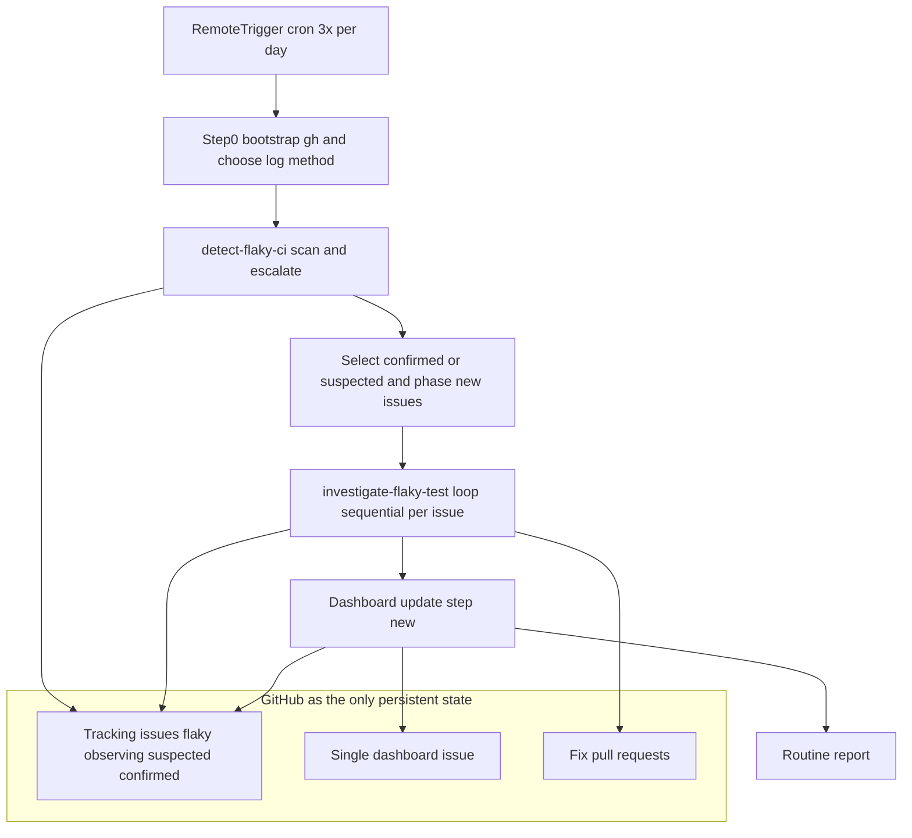
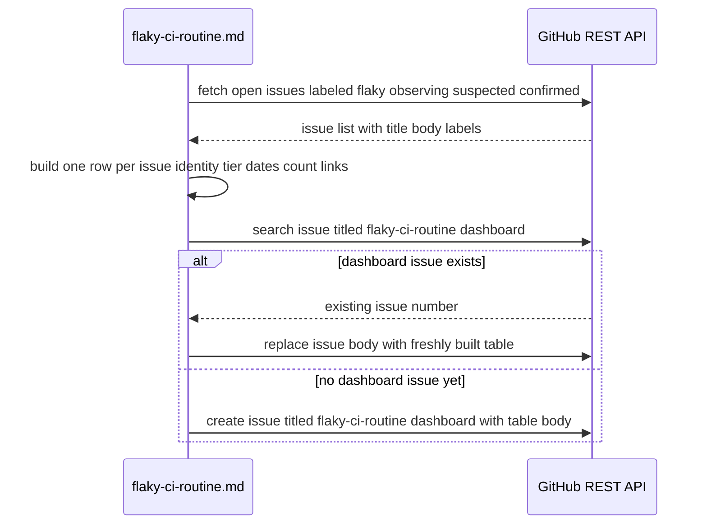

# Design Document

## このドキュメントに何を書くか（Write / Don't-Write test）

このspecは「実装の記録」ではなく「次にこの機能へ手を入れる人の出発点」である。
各セクションを書く・残すときは、次の問いを当てる:
**その内容は、コードとテストファイルを読めば再現できるか？** 再現できるなら
書かない。

| 書く | 書かない |
|---|---|
| 実際に調査・検証して分かった事実（コードをさっと読んだだけでは分からない挙動、外部ライブラリの隠れた挙動） | 関数シグネチャ、ファイル構成図、「どのファイルに何があるか」 |
| なぜその設計にしたか（特に、検討した末に**却下した案とその理由**） | 素直な実装のありのままの説明 |
| 自動テストで**担保できていない**残課題 | どのテストが何をカバーしているかの一覧（試験ファイルを読めば分かる・すぐ陳腐化する） |
| コードから再現できない手動検証手順（再現環境の作り方、何を見るか、合否のしきい値） | 差分の有無・実装時期などの時点情報 |

迷ったら書かない。コードから読み取れる内容をspecに書くと、コードが変わった
瞬間に気づかれずに陳腐化し、それがドキュメント全体の信頼を落とす。

（この原則は`requirements.md`のAcceptance Criteriaには適用しない。ACは
「実装の説明」ではなく「実装が満たすべき契約」であり、番号は`tasks.md`の
`_Requirements:_`やコード・テストのコメントから参照される生きた識別子
なので、要約への統合や採番変更の対象にはしない）

## Overview

**Purpose**: `flaky-ci-routine` は GROWI の CI（`ci-app.yml` / `ci-app-prod.yml`）
で発生する非決定的なテスト失敗（flaky test）を無人で検出・追跡・調査・修正
し、常設ダッシュボードでチーム全体に可視化する。

**Users**: GROWI のコミッター・メンテナーが利用者。直接操作するのではなく、
生成される GitHub issue・PR・ダッシュボードissueを通じて成果物を受け取る。

**Impact**: Requirement 1〜4 が対象とする検出・エスカレーション・自律調査・
環境耐性の挙動は、本spec化の時点で既に `.claude/skills/detect-flaky-ci/`、
`.claude/skills/investigate-flaky-test/`、`.claude/commands/flaky-ci-routine.md`
として実装・運用済みであり、本設計はそれを形式化する（コード変更は伴わない）。
唯一の新規実装は Requirement 5（常設ダッシュボード）で、これは
`flaky-ci-routine.md` に新しいステップを1つ追加し、`investigate-flaky-test`
に既存issueへの1行のマーカー追記を1箇所追加するだけで実現する。

### Goals
- Requirement 1〜4 の既存挙動を、検証可能な形でrequirements.mdの要件IDに
  対応付ける
- Requirement 5（常設ダッシュボード）を、既存の「状態はGitHub issue/label
  のみ」という原則を破らずに追加する
- ダッシュボード追加のために新しい永続状態・新しい外部サービス依存を持ち込
  まない

### Non-Goals
- 新しい外部サービス・SaaSの導入（`research.md` で対象外と明記済み）
- 日次/週次のアーティファクト定期出力（`research.md` で不採用と明記済み）
- 検出ロジックの完全なスクリプト化（`research.md` に将来案として記録のみ）

## Boundary Commitments

### This Spec Owns
- `ci-app.yml` / `ci-app-prod.yml` 上のvitest/playwrightテストに対する、
  非決定的失敗の検出・確信度別ラベリング・GitHub issue追跡
- confirmed/suspected issueの自律調査・原因分類・修正PR作成
- 単一の常設ダッシュボードissueのcreate-or-update

### Out of Boundary
- CIインフラ自体の信頼性（ネットワーク・OOM等）向上
- `ci-app.yml` / `ci-app-prod.yml` 以外のワークフローで発生する失敗
- 生成されたPRのレビュー・マージ判断（通常の開発ワークフローに委譲）
- 商用SaaSの導入・比較検討

### Allowed Dependencies
- GitHub REST API（`gh api` 経由）— issue/label/PR/Actions runの読み書き全般
- GitHub MCPサーバー（`mcp__github__get_job_logs`）— クラウド実行環境での
  ジョブログ取得。利用可否は実行環境依存で、利用不可なら `gh run view --log*`
  にフォールバックする
- RemoteTrigger cron（`0 0,8,16 * * *`）— 1日3回の起動契機

### Revalidation Triggers
- `ci-app.yml` / `ci-app-prod.yml` のファイル名変更、またはジョブ名の構造変更
  （identity key抽出ロジックが依存している）
- `flaky/observing` / `flaky/suspected` / `flaky/confirmed` / `phase/*` ラベル名
  の変更
- cron頻度の変更（`--window-hours` の既定値がcron間隔の2倍という前提に依存）
- `gh` CLIのメジャーバージョン更新によるREST応答フィールドの変化
- `detect-flaky-ci/SKILL.md` が書き込むコメント見出し文言
  （`### Additional observation` / `### Backfilled observation`）の変更
  （Dashboard UpdaterのOccurrences算出がこの文言に一致することへ依存して
  いるため、両ファイルを同時に直す）

## Architecture

### Existing Architecture Analysis

既存実装（Requirement 1〜4に対応、変更なし）:

- `detect-flaky-ci`: Step0でログ取得手段（gh / MCP）を一度だけ決定 → Step1で
  時間窓ベースにrun一覧を取得 → Step1.5で既存flaky issueのrun URLを集約し
  スキップリストを構築 → Step2でジョブログを取得しinfra noiseを除外 → Step3
  でテスト識別子を抽出 → Step4で①〜④の安価な判定を経てissueを作成/更新/
  エスカレーション
- `investigate-flaky-test`: `flaky/confirmed` または `flaky/suspected` の
  issueを受け取り、静的ログ解析・実CIでのrerunを並行実行し、原因分類→
  修正実装→PR作成→PRの繰り返しCI検証、まで自律的に進める
- `flaky-ci-routine.md`: 上記2スキルを順に呼ぶオーケストレーション。Step0で
  `gh` CLIの存在確認とREST書き込み権限確認、およびJOB_LOG_METHODの決定を
  1回だけ行う

### Architecture Pattern & Boundary Map

**Architecture Integration**:
- Selected pattern: 既存の「スキル2つ＋薄いオーケストレーションコマンド」構成
  を維持。ダッシュボード更新は新しいスキルを追加せず、オーケストレーション
  コマンド（`flaky-ci-routine.md`）に1ステップ追加するだけに留める。理由:
  ダッシュボード更新は「detectとinvestigate両方の結果が確定した後」にしか
  正しい状態を作れないため、どちらか一方のスキルに置くと片方の変更を反映
  できない
- Domain/feature boundaries: 検出（detect-flaky-ci）・調査修正
  （investigate-flaky-test）・可視化（flaky-ci-routine.mdの新ステップ）の
  3責務を維持
- Existing patterns preserved: 状態を持たない設計、exact-title-matchによる
  重複防止、`-X GET`必須のgh api呼び出し規約
- New components rationale: ダッシュボード更新ステップは、既存のexact-title
  -matchパターンをそのまま流用できるため新しい仕組みは持ち込まない
- Steering compliance: 該当なし（このspecはapps/appのコード規約の対象外。
  tech.mdの内容はNode/Turbopack/Prisma等アプリ本体のスタックであり、本spec
  はClaude Codeスキル/コマンドのMarkdownとgh CLI呼び出しのみで構成される）

## File Structure Plan

このspecはアプリケーションコードを持たず、Claude Codeのスキル/コマンド
定義（Markdown）のみで構成される。新規ファイルは作らず、既存ファイルに
変更を加える。

### Modified Files
- `.claude/commands/flaky-ci-routine.md` — 現行の Step3（investigate-flaky-test
  ループ）と Step4（Report）の間に、新しい **Step4: Update Dashboard**
  を挿入し、既存のReportをStep5に繰り下げる。ダッシュボード更新ロジック
  （Dashboard Updaterコンポーネント、後述）をここに記述する
- `.claude/skills/investigate-flaky-test/SKILL.md` — Step 6-A（draft PR
  オープン）の直後に、追跡issueへ固定書式のコメント
  `**Fix PR**: {PR_HTML_URL}` を追記する手順を1つ追加する（Fix-PR Marker
  Conventionコンポーネント、後述）
- `.claude/skills/detect-flaky-ci/SKILL.md` — 当初は「Requirement 1〜4の
  既存実装のまま、変更なし」の想定だったが、実装フェーズで2箇所の修正が
  発生した（いずれもRequirement 5のダッシュボード新設とは別件）:
  (1) タスク1.2のトレーサビリティ確認でAC 2.6が未実装と判明し、「Existing
  CLOSED issue found」に証拠コミット日時と解決コミット日時を比較する手順
  を追加（タスク1.3）。(2) タスク3の本番run now検証で、④backfillが使う
  `-f status=completed -f conclusion=failure`がGitHub Actions APIの仕様上
  無効（`conclusion`という独立パラメータが存在しない）と判明し、
  `-f status=failure`に修正（タスク3.4）。どちらも「事後spec化」対象の
  Requirement 1・2の既存実装に対する修正であり、Requirement 5の設計判断
  ではないため、上記のUnmodified節を維持したまま別枠に記録するのではなく、
  ここに実際の変更として記載する

### Unmodified
- なし（上記3ファイル全てに変更が入った）

### Prerequisite (not a file change)
- GitHubラベル `flaky/dashboard` を実装前に作成する（`flaky/suspected` を
  本spec化以前に手動作成したのと同じ手順。説明文は100文字制限に注意）

## System Flows

**Key Decisions**:
- ダッシュボード更新は investigate-flaky-test ループが完了した**後**に行う
  （Requirement 5.4: 調査中に解決されたissueを即座に一覧から外すため）。
  ここでの「解決された」はissueが**クローズされたこと**を指す。
  `investigate-flaky-test`が付与する`phase/resolved`ラベルは「調査は完了
  した」という意味であり、issue自体はopenのままのことが多い（例: 修正PR
  がまだレビュー待ちの間）。そのためダッシュボードの「アクティブ」判定は
  `phase/*`ラベルを見ず、issueのopen/closedのみで行う（
  `flaky-ci-routine.md` Step4参照）
- issue本文は毎回**全置換**する（追記しない）。これにより、途中でissueが
  解決・再オープンされても次回更新時に必ず正しい状態に収束する
  （Requirement 5.5の「アクティブなflakyが0件でも更新する」も自然に満たす）
- 「ループが完了した後」は、**この1回のルーティン実行のinvestigate-flaky-test
  ループが最後まで回った後**を指し、個々の調査が最後まで終わっている必要は
  ない。investigate-flaky-testはMEDIUM/LOW確信度のときに人間の判断待ちで
  停止することがある（`flaky-ci-routine.md` Step3参照）が、その場合も
  ダッシュボード更新は**必ず実行する**。停止中のissueはその時点のtier
  （observing/suspected/confirmed）のまま一覧に含める。Requirement 5.1の
  「ルーティンの実行が完了した場合」は、個々の調査の完了ではなく、この
  ルーティン1サイクルの完了を指す、と読む

## Components and Interfaces

| Component | Domain/Layer | Intent | Req Coverage | Key Dependencies (P0/P1) | Contracts |
|---|---|---|---|---|---|
| Detection Scan | detect-flaky-ci（既存） | CI runをスキャンし非決定的失敗を検出 | 1.1–1.6 | GitHub Actions API (P0) | Batch |
| Escalation Tiering | detect-flaky-ci + investigate-flaky-test（既存） | 3層の確信度に応じたラベル遷移 | 2.1–2.6 | GitHub Issues/Labels API (P0) | Batch, State |
| Investigation and Fix | investigate-flaky-test（既存） | 原因調査・修正・PR作成 | 3.1–3.5 | GitHub Actions rerun API (P0), git (P0) | Batch |
| Environment Adaptation | flaky-ci-routine.md Step0（既存） | 実行環境差異の吸収 | 4.1–4.3 | gh CLI (P0), GitHub MCP server (P1) | — |
| Dashboard Updater | flaky-ci-routine.md 新Step（新規） | 常設ダッシュボードissueの一括更新 | 5.1, 5.2, 5.3, 5.4, 5.5 | GitHub Issues API (P0), Fix-PR Marker Convention (P1) | Batch, State |
| Fix-PR Marker Convention | investigate-flaky-test Step6-A（新規追記1箇所） | 修正PRリンクを追跡issue上に機械可読な形で残す | 5.3 | GitHub Issues API (P0) | State |

既存3コンポーネント（Detection Scan、Escalation Tiering、Investigation and
Fix、Environment Adaptation）は本spec化時点で実装済みのため詳細ブロックは
省略し、`.claude/skills/detect-flaky-ci/SKILL.md` および
`.claude/skills/investigate-flaky-test/SKILL.md` 本文を正とする。以下は
新規2コンポーネントの詳細。

### 可視化（新規）

#### Dashboard Updater

| Field | Detail |
|-------|--------|
| Intent | 全てのアクティブなflaky追跡issueを俯瞰できる単一issueを毎回のroutine実行時に最新化する |
| Requirements | 5.1, 5.2, 5.3, 5.4, 5.5 |

**Responsibilities & Constraints**
- `flaky-ci-routine.md` のinvestigate-flaky-testループ完了後、`open`状態で
  `flaky/observing` / `flaky/suspected` / `flaky/confirmed` のいずれかを持つ
  issueを再取得する（Step3実行中のラベル変更を反映するため、Step1.5の結果
  を使い回さず新規に取得する）
- issueのタイトルが完全一致で `flaky-ci-routine: dashboard` であるissueを
  1件のみ探索する（既存の exact-title-match パターンを流用）。無ければ
  作成、あれば本文を全置換する
- 本文は毎回全置換する（追記しない）。これにより解決済みissueが自然に
  一覧から消え（Requirement 5.4）、アクティブなissueが0件でも古い内容が
  残らない（Requirement 5.5）

**Dependencies**
- Inbound: なし（`flaky-ci-routine.md` のオーケストレーションから直接呼ばれる）
- Outbound: GitHub Issues API — issue検索・作成・本文更新 (P0)
- Outbound: Fix-PR Marker Convention — 各追跡issueから修正PRリンクを読み取る (P1、無くても動作するが5.3の完全性が下がる)

**Contracts**: Service [ ] / API [ ] / Event [ ] / Batch [x] / State [x]

##### Batch / Job Contract
- Trigger: `flaky-ci-routine.md` の investigate-flaky-test ループ完了直後、
  ルーティン実行ごとに1回
- Input / validation: `open`状態かつ `flaky/observing|suspected|confirmed`
  いずれかのラベルを持つ全issue
- Output / destination: タイトル `flaky-ci-routine: dashboard` の単一
  GitHub issue（ラベル `flaky/dashboard` を付与し、他の検索と衝突させない）
- Idempotency & recovery: 本文全置換のため何度実行しても同じ入力からは
  同じ出力になる（追記型ではないため二重実行による重複が発生しない）

##### State Management
- State model: ダッシュボードissueの本文＝以下の1行1テストのMarkdown表
  （ヘッダ行に更新日時を含む）

  | Identity | Tier | First seen | Last seen | Occurrences | Tracking issue | Fix PR |
  |---|---|---|---|---|---|---|

- Persistence & consistency: GitHub issue本文自体が唯一の永続化先。Identity
  はissueタイトルから `flaky: ` prefixを除いた文字列。First seen / Last
  seenは、issue本文の`### First observation`が持つ`Date:`と、Occurrences
  にカウントされる全コメントの`Date:`を1つの集合にまとめ、その最小値を
  First seen・最大値をLast seenとする。issueの`created_at`/`updated_at`
  はどちらの列にも使わない（`created_at`は本文の`Date:`より後になるのが
  通常であり、④backfillが本文の`Date:`より前の証拠を見つけた場合や、単に
  issue作成がCI失敗の発生より遅れる場合に、代理指標としては不正確になる。
  `updated_at`はラベル変更等でも進むため、そもそも観測日時を表さない）
- **Occurrencesの定義（コメント総数ではない）**: 追跡issueの本文（初回観測、
  1件とカウント）に加えて、コメントのうち見出しが次のいずれかの正規表現に
  一致するものだけを1件ずつカウントする: `^### Additional observation` /
  `^### Backfilled observation`。それ以外のコメント（識別キー訂正・
  Fix-PRマーカー・人間からのメモ等）はカウントに含めない。この2つの見出し
  文言は `detect-flaky-ci/SKILL.md` が実際に書き込むコメント見出しと一致
  させる必要があり、今後どちらかの文言を変更する場合は両ファイルを同時に
  直す（Revalidation Triggersに追記）
- Fix PRは、Fix-PR Marker Convention（`**Fix PR**: {URL}`）の記載がある
  場合のみ転記する（**forward-only**）。マーカーが無い場合（本spec化以前
  に作成された追跡issue、例: #11711）はFix PR欄を`—`にする。issue本文・
  コメントからPR URLを自由形式で探索するフォールバックは採用しない —
  追跡issueの本文・コメントには調査中に言及される無関係なPR（証拠コミッ
  トの由来PR等）が混在するため、最初に見つかったURLを機械的に採用すると
  誤ったPRを表示しかねない。これは検索API方式を不採用にした理由（フリー
  テキスト一致の低信頼性、`research.md`参照）と同じ失敗パターンであり、
  空欄より誤情報の方が悪いと判断した
- Concurrency strategy: 該当なし（investigate-flaky-testは逐次実行前提
  であり、ダッシュボード更新もルーティン内で1回のみ実行される）

**Implementation Notes**
- Integration: `flaky-ci-routine.md` の新Stepとして実装。既存2スキルへの
  変更は不要（Fix-PR Marker Conventionのみ例外）
- Validation: issueタイトル検索が1件を超えて一致した場合（本来起こり得ない
  が）、最も古いissueを正としてログに異常を報告し、他は放置する（自動削除
  はしない）
- Risks: アクティブなflaky件数が多くGitHub issue本文の上限
  （65536文字）に近づいた場合、確信度の高い順・最終観測が新しい順に上位を
  残し、切り捨てたことを本文冒頭に明記する（無言で切り捨てない）

#### Fix-PR Marker Convention

| Field | Detail |
|-------|--------|
| Intent | 修正PRのURLを追跡issue上に機械可読な形で残し、Dashboard Updaterが検索なしで読み取れるようにする |
| Requirements | 5.3 |

**Responsibilities & Constraints**
- `investigate-flaky-test` のStep 6-A（draft PRオープン）の直後に、対象の
  追跡issueへ `**Fix PR**: {PR_HTML_URL}` という固定書式の1行を含むコメント
  を追加する
- 既存のPR作成フロー自体は変更しない。追記は1コメントのみで、Dashboard
  Updaterはこの正規表現に一致する最初の行を抽出するだけでよい

**Dependencies**
- Inbound: Investigation and Fix（investigate-flaky-test Step 6-A）
- Outbound: GitHub Issues API — コメント追加 (P0)

**Contracts**: Service [ ] / API [ ] / Event [ ] / Batch [ ] / State [x]

##### State Management
- State model: 追跡issueのコメント本文中の固定文字列 `**Fix PR**: {URL}`
- Persistence & consistency: 既存のissueコメント機構にそのまま乗るため、
  追加のストレージは不要

**Implementation Notes**
- Integration: `investigate-flaky-test/SKILL.md` のStep 6-Aブロックに1手順
  追加するのみ
- Validation: マーカーは本spec化（このダッシュボード機能の実装）以降に
  作成・更新される追跡issueにのみ付与される（forward-only）。それ以前
  からの追跡issue（例: #11711）にはマーカーが無いため、Dashboard Updater
  はFix PR欄を`—`にする。誤ったPRを表示するリスクを避けるため、本文・
  コメントからの自由形式URL探索は行わない（State Management参照）

## Data Models

### Logical Data Model

このspecはデータベースを持たない。永続データは全てGitHub Issues/Labels/
Comments/Pull Requestsであり、以下がその論理構造。

- **追跡issue**（既存、Requirement 1–4）: タイトル = `flaky: {IDENTITY_KEY}`、
  ラベル = `type/bug` + `phase/*` + `flaky/observing|suspected|confirmed`
  のいずれか1つ、本文 = 初回観測の証拠、コメント = 追加観測 / backfill観測 /
  Fix-PRマーカー
- **ダッシュボードissue**（新規、Requirement 5）: タイトル =
  `flaky-ci-routine: dashboard`（固定・単一）、ラベル = `flaky/dashboard`
  （新規ラベル）、本文 = 上記の1行1テスト表（全置換）

新規GitHubラベル: `flaky/dashboard`（既存の `flaky/observing` 等と同系統の
命名、ダッシュボードissue自体を他の検索から明確に区別するために必要）

## Error Handling

### Error Categories and Responses
- ダッシュボードissueのタイトル検索が0件 → 新規作成
- ダッシュボードissueのタイトル検索が2件以上（想定外） → 最も古いissueを
  正として使用し、本文冒頭に異常を明記して報告（自動マージ・自動削除はしない）
- issue本文が上限文字数に近い → 確信度・最終観測日時でソートし上位を残し、
  切り捨てた件数を本文に明記する

### Monitoring
- `flaky-ci-routine.md` のStep5（Report、旧Step4から繰り下げ）で、ダッシュ
  ボードの更新結果（新規作成/更新、掲載件数、切り捨ての有無）を毎回報告する

## Testing Strategy

このspecはアプリケーションコードを持たず、Claude Codeスキル/コマンドの
Markdown手順として実装されるため、従来の単体/結合テストは適用できない。
検証は実際の `gh` / GitHub API 呼び出しを伴うシナリオベースの手動・run now
検証で行う（既存のRequirement 1–4も同じ方法で2026-08-14に検証済み）。

- **シナリオ1（新規作成）**: `flaky-ci-routine: dashboard` issueが存在しない
  状態で `/flaky-ci-routine` を実行し、1件だけ作成されることを確認する
- **シナリオ2（更新・非重複）**: 同issueが存在する状態でもう一度実行し、
  issue番号が変わらず本文だけが更新されることを確認する
- **シナリオ3（ゼロ状態）**: 一時的に全ての `flaky/*` 追跡issueを解決済みに
  してから実行し、ダッシュボードが表を空のまま残さず、固定文言
  `No active flaky tests right now.` を表示することを確認する（この文言は
  `flaky-ci-routine.md` Step4で一語一句固定と定めている、実行のたびに文言
  が変わらないようにするため）
- **シナリオ4（Fix-PRマーカー）**: investigate-flaky-testが実際にPRを開いた
  後、追跡issueに `**Fix PR**: ...` コメントが付与され、次のダッシュボード
  更新でそのリンクが反映されることを確認する
