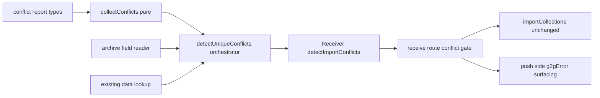
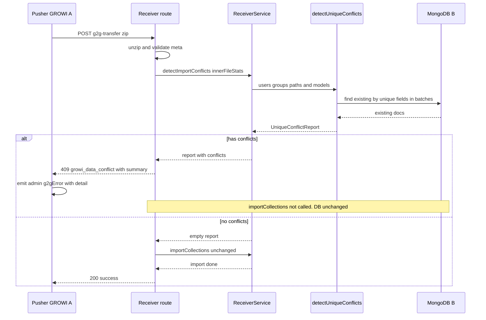
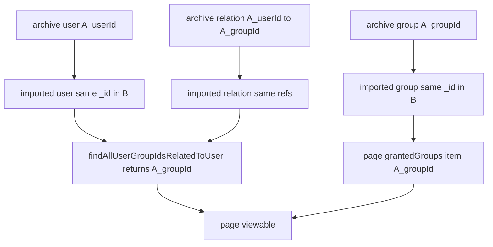

# Design Document

## Overview

**Purpose**: G2G（GROWI-to-GROWI）転送で、取り込むアーカイブと転送先 GROWI の既存データとの間に `users` / `usergroups` の一意制約衝突があるとき、それを**取り込み開始前に検知して転送を中断し、操作者へ具体的に通知**する。これにより、issue #10151 のサイレントなデータ破壊（insert 失敗をログに残しつつ続行し、グループ公開ページを閲覧不能にする）を止める。

**Users**: G2G 転送でデータ移行を行う GROWI 管理者。転送が「成功」表示なのにグループ公開ページが開けない、という原因不明の状態に陥らなくなる。

**Impact**: 現状、受信側は unzip・meta 検証の直後に無条件で `importCollections` を呼ぶ。本設計はこの間に**衝突検知ゲート**を1段挟む。衝突が無ければ従来どおり全コレクションを取り込む（挙動不変）。衝突があれば取り込みを一切開始せず、衝突情報を含むエラーを push 側へ返し、push 側が転送元管理者へ WebSocket で通知する。

本設計は research.md の Decision（near-term は Option A＝事前検知＋中断を採用。Option B は典型シナリオを直せず不採用、Option C＝ID 再マッピングは取り込みの直列化が前提で将来拡張）に基づく。

### Goals
- 取り込み開始前に `users`（`username` / `email` / `slackMemberId`）と `usergroups`（`name`）の一意制約衝突を検知する（要件 1）。
- 衝突時は書き込みを一切行わず、転送を成功扱いにせず、操作者へ実行可能な通知を返す（要件 2, 3）。
- 衝突が無い転送では従来の正常系（全コレクション取り込み・グループアクセス維持）を変えない（要件 4）。
- 検知とアクセス維持を実データベース上で検証可能にする（要件 5）。

### Non-Goals
- 一意制約衝突があっても転送を自動的に成功させる完全修復（ID 再マッピング＝Option C）。将来拡張として Migration Strategy 節に方針のみ残す。
- 管理画面からの手動 GROWI アーカイブ取り込み（zip アップロード）UI への検知組み込み。中核ロジックは経路非依存の純関数に保つが、手動 UI 対応は本 spec 対象外。
- 取り込みモード（`insert` / `upsert` / `flushAndInsert`）の意味変更、MongoDB 一意インデックス定義の変更。
- ExternalUserGroup 系コレクションの衝突検知。

## Boundary Commitments

### This Spec Owns
- **衝突検知ロジック**: アーカイブ側ドキュメントと転送先既存ドキュメントを突き合わせ、「一意フィールド値が一致し、かつ `_id` が異なる」ものを衝突として算出する純粋な判定と、それを駆動する I/O（アーカイブ JSON の読み取り・既存データ照会）。
- **衝突検知ゲート**: G2G 受信フローの「unzip・meta 検証済み」〜「`importCollections` 呼び出し」の間に挟む中断判定。
- **衝突の通知契約**: 受信側が返すエラー（コード `growi_data_conflict` と衝突サマリ）と、push 側がそれを転送元管理者へ届ける WebSocket メッセージの形。

### Out of Boundary
- ページ閲覧可否判定（`PageQueryBuilder` / `grantedGroups.item` 照合）。本設計は変更しない。「アクセス維持」は 3 者（users / usergroups / usergrouprelations）が整合取り込みされる結果として成立する。
- `ImportService.import` / `execUnorderedBulkOpSafely` の insert 挙動そのもの。これは変えず、その手前でゲートする。
- 手動取り込み経路の UI・ルート。
- Option C（ID 再マッピング）とその前提となる取り込みの直列化。

### Allowed Dependencies
- `ImportService`（`baseDir` / `getFile` によるアーカイブファイルパス解決のみ利用。取り込み挙動は変更しない）。
- Mongoose モデル `User` / `UserGroup`（既存データの一意フィールド照会）。
- G2G 既存の通知経路（`admin:g2gError` WebSocket、`ErrorV3` / `G2GTransferError`）。
- `growiBridgeService.parseZipFile` が返す `innerFileStats`（`{ fileName, collectionName }`）。

### Revalidation Triggers
- `users` / `usergroups` の一意インデックス定義が変わったとき（検知対象フィールドの見直しが必要）。
- G2G 受信フローの順序（unzip → validate → importCollections）が変わったとき（ゲートの差し込み位置が動く）。
- 取り込みが並行から直列に変わったとき（Option C の前提が満たされ、本 spec の中断方針を再検討できる）。
- push 側 `startTransfer` のエラーハンドリング・WebSocket メッセージ契約が変わったとき（通知の届け方に影響）。

## Architecture

### Existing Architecture Analysis
- **受信フロー**（`server/routes/apiv3/g2g-transfer.ts` `receiveRouter.post('/')`, L288-403）: body parse → `importService.unzip` + `growiBridgeService.parseZipFile`（`innerFileStats`）→ `importService.validate(meta)` → `g2gTransferReceiverService.getImportSettingMap` → `g2gTransferReceiverService.importCollections`。**この最後の呼び出しの直前が唯一の非破壊な差し込み点**（アーカイブは tmp 展開済み・DB 書き込みはまだ 0）。
- **取り込み**（`server/service/import/import.ts`）: `insert` 時 `bulk.insert()`（L371-373）、`execUnorderedBulkOpSafely`（L472-501）が一意違反をサイレントに続行。コレクション取り込みは**並行**（`import()` L152-171）。
- **一意制約**: `users` = `username` / `email`(sparse) / `slackMemberId`(sparse)（`models/user/index.js` L73-75）、`usergroups` = `name`（`models/user-group.ts` L26）。
- **通知**: push 側 `startTransfer`（`service/g2g-transfer.ts` L459-559）は fire-and-forget、失敗時に `admin:g2gError` を転送元 admin socket へ emit。現状は固定 key。受信側の応答本文を読んで具体化する余地がある。

### Architecture Pattern & Boundary Map

パターン: **既存パイプラインへの前段ゲート挿入（pure-core + thin-adapter）**。検知の中核は I/O を持たない純関数、その外周に「アーカイブ読み取り」「既存データ照会」の薄いアダプタ、さらに外周に受信サービスのメソッドとルートのゲートを置く。依存方向は左（型・純関数）→右（I/O・サービス・ルート）で、逆流させない。



**Architecture Integration**:
- Selected pattern: pure-core + thin-adapter（コーディング規約「framework wrapper から純関数を抽出」「executor は work-set を引数で受け取る」に沿う。純関数はアーカイブ/既存の配列を受け取り、データセットを import しない）。
- Domain/feature boundaries: 検知ロジックは import ドメイン（`server/service/import/`）に置く。G2G 固有の配線（ファイルパス解決・通知）は `g2g-transfer.ts` / ルート側に置く。
- Existing patterns preserved: `ImportService` の取り込み挙動、`ErrorV3` / `G2GTransferError`、`admin:g2gError` 通知経路。
- New components rationale: 検知は経路非依存で再利用可能・実 DB テスト可能にするため独立モジュールにする。
- Steering compliance: named export、`import type`、no-extension import、English comments、型アサーション回避（テストは `mock<T>()`）。

### Technology Stack

| Layer | Choice / Version | Role in Feature | Notes |
|-------|------------------|-----------------|-------|
| Backend / Services | TypeScript (native ESM, Node 24) | 衝突検知モジュール・受信サービス拡張 | 新規依存なし |
| Data / Storage | MongoDB via Mongoose ^6.13.6 | 既存 `users`/`usergroups` の一意フィールド照会 | `$in` バッチ照会 |
| Streaming | `JSONStream`（既存依存） | アーカイブ JSON から一意フィールドのみ抽出 | 既存 `import.ts` と同じ読み方 |
| Messaging / Events | socket.io `admin:g2gError`（既存） | 転送元管理者への衝突通知 | 契約に `message` 追加 |
| i18n | next-i18next（既存） | 通知の見出し文言 | 英語ファースト、他言語は後続 |

## File Structure Plan

### Directory Structure
```
apps/app/src/server/service/import/
├── detect-unique-conflicts.ts        # 新規: 型 + 純関数 collectConflicts + 読み取り/照会アダプタ + orchestrator
├── detect-unique-conflicts.spec.ts   # 新規: 純関数の unit（sparse null 非衝突・同一_id 非衝突・複数フィールド）
└── detect-unique-conflicts.integ.ts  # 新規: 実 DB 照会と関係解決の integ（要件 1/4/5）
```

### Modified Files
- `apps/app/src/server/service/g2g-transfer.ts` — `Receiver` インターフェースと `G2GTransferReceiverService` に `detectImportConflicts(innerFileStats)` を追加（`innerFileStats` から `users`/`usergroups` の JSON パスを解決し、`detectUniqueConflicts` を呼ぶ）。`G2GTransferPusherService.startTransfer` のアーカイブ POST の catch で、応答本文の衝突エラーを判別し具体的な `admin:g2gError` を emit。
- `apps/app/src/server/routes/apiv3/g2g-transfer.ts` — 受信ルートの `getImportSettingMap` と `importCollections` の間に衝突検知ゲートを追加。衝突ありなら `importCollections` を呼ばず `res.apiv3Err(new ErrorV3(summary, 'growi_data_conflict'), 409)` を返す（衝突サマリを本文に含める）。
- `apps/app/src/server/models/vo/g2g-transfer-error.ts` — `G2GTransferErrorCode` に `DATA_CONFLICT` を追加（型付きエラーで扱う場合の識別子）。
- `apps/app/src/client/components/Admin/G2GDataTransfer.tsx` — `socket.on('admin:g2gError', ({ key, message }) => ...)` を `message`（衝突詳細）も表示するよう更新。
- `apps/app/src/client/../locales`（`admin` 名前空間） — 衝突通知の見出しキー（例 `admin:g2g:error_data_conflict`）を英語で追加。翻訳は後続タスク。

> 各ファイルは単一責務: 検知の純ロジック/I-O は `detect-unique-conflicts.ts`、G2G 固有の配線は `g2g-transfer.ts` とルート、通知表示は client。

## System Flows

### 受信側の衝突検知ゲート（中断シーケンス）



ゲート判定は書き込み前に完結するため、中断時に転送先 DB は無変更（要件 2.1, 2.4）。衝突なしの分岐は現行と同一（要件 4.3）。

### グループアクセスが維持される条件（衝突なし時の ID の流れ）



衝突が無ければ 3 者が同一 `_id` で取り込まれ、`relatedUser = A_userId` の関係がそのまま生き、閲覧判定が成立する（要件 4.1, 4.2）。issue #10151 は「`ArchiveUser` の insert が失敗して `ImportUser` が欠落」する経路であり、ゲートがそれを事前に弾く。

## Requirements Traceability

| Requirement | Summary | Components | Interfaces | Flows |
|-------------|---------|------------|------------|-------|
| 1.1 | username 衝突検知 | detect-unique-conflicts | `collectConflicts` / `detectUniqueConflicts` | 検知ゲート |
| 1.2 | email 衝突検知 | detect-unique-conflicts | 同上 | 検知ゲート |
| 1.3 | slackMemberId 衝突検知 | detect-unique-conflicts | 同上 | 検知ゲート |
| 1.4 | usergroups name 衝突検知 | detect-unique-conflicts | 同上 | 検知ゲート |
| 1.5 | 同一 `_id` は非衝突 | detect-unique-conflicts (pure) | `collectConflicts` | — |
| 1.6 | 対象コレクション欠如時はスキップ | ReceiverService | `detectImportConflicts` | 検知ゲート |
| 2.1 | 衝突時は取り込みを開始しない | receive route gate | route conflict gate | 検知ゲート (中断) |
| 2.2 | 成功扱いにせず通知 | receive route + pusher | `ErrorV3 growi_data_conflict` / `admin:g2gError` | 検知ゲート (中断) |
| 2.3 | サイレント続行を起こさない | receive route gate | route conflict gate | 検知ゲート (中断) |
| 2.4 | 検知中に既存データ不変 | detect-unique-conflicts (read-only) | `detectUniqueConflicts` | 検知ゲート |
| 3.1 | 種別と件数を通知 | pusher + client | `UniqueConflictReport` / `admin:g2gError` | 中断 |
| 3.2 | 衝突フィールドと値を通知 | pusher + client | `UniqueFieldConflict` | 中断 |
| 3.3 | 解消指針を通知 | i18n message | `admin:g2g:error_data_conflict` | 中断 |
| 4.1 | 3 者の対応関係を維持取り込み | ImportService (unchanged) | — | ID の流れ |
| 4.2 | グループ公開ページ閲覧維持 | ImportService + PageQueryBuilder (unchanged) | — | ID の流れ |
| 4.3 | 正常系の非回帰 | receive route (no-conflict branch) | route conflict gate | 検知ゲート (成功) |
| 5.1 | 検知の実 DB 検証 | detect-unique-conflicts.integ | integ | — |
| 5.2 | アクセス維持の実 DB 検証 | detect-unique-conflicts.integ | integ | ID の流れ |

## Components and Interfaces

| Component | Domain/Layer | Intent | Req Coverage | Key Dependencies (P0/P1) | Contracts |
|-----------|--------------|--------|--------------|--------------------------|-----------|
| detect-unique-conflicts | import service | 衝突の純判定＋読み取り/照会 | 1, 2.4, 5 | User/UserGroup models (P0), JSONStream (P1) | Service |
| ReceiverService.detectImportConflicts | g2g service | ファイルパス解決＋検知駆動 | 1.6, 2 | detect-unique-conflicts (P0), ImportService.baseDir (P1) | Service |
| receive route conflict gate | apiv3 route | 中断判定＋エラー応答 | 2, 4.3 | ReceiverService (P0), ErrorV3 (P0) | API |
| pusher error surfacing | g2g service | 衝突詳細を転送元へ通知 | 2.2, 3 | admin socket (P0), axios error body (P0) | Event |
| g2g conflict i18n + client toast | client | 通知の表示 | 3 | next-i18next (P1) | State |

### Import service

#### detect-unique-conflicts

| Field | Detail |
|-------|--------|
| Intent | アーカイブと既存データの一意制約衝突を、純判定と薄い I/O アダプタで算出する |
| Requirements | 1.1, 1.2, 1.3, 1.4, 1.5, 2.4, 5.1 |

**Responsibilities & Constraints**
- 「一意フィールド値が一致し、かつ `_id` が異なる」ものだけを衝突とする（要件 1.5）。
- sparse フィールド（`email` / `slackMemberId`）は、**値が存在するドキュメントのみ**照合対象とする（null/未設定同士は一意違反にならないため衝突扱いしない）。
- 既存データは read-only 照会のみ。書き込み・更新を一切行わない（要件 2.4）。
- 純関数 `collectConflicts` はデータセットを import せず、比較対象を引数で受け取る（executor は work-set を引数で受け取る規約）。

**Dependencies**
- Outbound: Mongoose `User` / `UserGroup` モデル — 既存一意フィールドの `$in` 照会 (P0)
- External: `JSONStream`（既存依存）— アーカイブから一意フィールドのみ stream 抽出 (P1)

**Contracts**: Service [x]

##### Service Interface
```typescript
// 検知対象の一意フィールド（インデックス定義と一致させる単一の情報源）
export type UserUniqueField = 'username' | 'email' | 'slackMemberId';
export type GroupUniqueField = 'name';
export type UniqueField = UserUniqueField | GroupUniqueField;

// アーカイブ/既存から抽出する最小ドキュメント形
export interface UserUniqueFields {
  _id: string;
  username?: string | null;
  email?: string | null;
  slackMemberId?: string | null;
}
export interface GroupUniqueFields {
  _id: string;
  name?: string | null;
}

export interface UniqueFieldConflict {
  collection: 'users' | 'usergroups';
  field: UniqueField;
  value: string;
  archiveId: string;   // アーカイブ側ドキュメントの _id
  existingId: string;  // 転送先の既存ドキュメントの _id
}

export interface UniqueConflictReport {
  userConflicts: UniqueFieldConflict[];
  groupConflicts: UniqueFieldConflict[];
}

export const hasConflicts = (report: UniqueConflictReport): boolean =>
  report.userConflicts.length > 0 || report.groupConflicts.length > 0;

// 純関数: I/O を持たない。archive と existing の配列を突き合わせる。
export function collectConflicts<T extends { _id: string }>(
  collection: 'users' | 'usergroups',
  archiveDocs: readonly T[],
  existingDocs: readonly T[],
  fields: readonly (keyof T & string)[],
): UniqueFieldConflict[];

// orchestrator: アーカイブ JSON を stream 抽出し、既存を $in 照会し、collectConflicts を呼ぶ。
export function detectUniqueConflicts(input: {
  usersJsonPath: string | null;    // 対象に users が無ければ null（要件 1.6）
  groupsJsonPath: string | null;   // 対象に usergroups が無ければ null
  userModel: Model<UserDocument>;
  userGroupModel: Model<UserGroupDocument>;
}): Promise<UniqueConflictReport>;
```
- Preconditions: 渡す JSON パスは unzip 済みで読み取り可能。null は「そのコレクションは転送対象外」を意味する。
- Postconditions: 返り値は衝突の全列挙。既存データは無変更。
- Invariants: `archiveId !== existingId`（値一致かつ同一 `_id` は含めない）。空値は照合しない。

**Implementation Notes**
- Integration: `collectConflicts` は Map ベース（既存側を対象フィールドごとに `value -> {_id}` で索引）で N+1 を避ける。orchestrator は既存側を `find({ [field]: { $in: values } }).select('_id field...')` でバッチ取得。
- Validation: sparse フィールドの空値除外・同一 `_id` 除外を unit で固定（要件 1.5）。
- Risks: アーカイブが巨大な場合のメモリ/時間。まず正しさ優先、性能は Performance 節の方針で必要時に最適化。

### G2G service

#### ReceiverService.detectImportConflicts

| Field | Detail |
|-------|--------|
| Intent | `innerFileStats` から users/usergroups の JSON パスを解決し、検知を駆動する |
| Requirements | 1.6, 2.1, 2.4 |

**Responsibilities & Constraints**
- `innerFileStats`（`{ fileName, collectionName }[]`）から `users`/`usergroups` のファイル名を引き、`importService.getFile(fileName)` でパスを解決する。該当が無ければ `null` を渡す（要件 1.6）。
- 検知のみを行い、取り込みは行わない。返り値 `UniqueConflictReport` を呼び出し元（ルート）へ渡す。

**Dependencies**
- Outbound: `detectUniqueConflicts` (P0)、`getImportService().baseDir` / `getFile` (P1)、Mongoose `User` / `UserGroup` (P0)

**Contracts**: Service [x]

##### Service Interface
```typescript
// interface Receiver に追加
detectImportConflicts(
  innerFileStats: { fileName: string; collectionName: string }[],
): Promise<UniqueConflictReport>;
```
- Preconditions: `importService.unzip` 済み。
- Postconditions: DB 無変更。衝突の全列挙を返す。

#### PusherService.startTransfer (error surfacing)

| Field | Detail |
|-------|--------|
| Intent | 受信側の衝突エラーを転送元管理者へ具体的に通知する |
| Requirements | 2.2, 3.1, 3.2, 3.3 |

**Contracts**: Event [x]

##### Event Contract
- Published events: `admin:g2gError`（既存）に `message` を追加。
  - Payload: `{ key: 'admin:g2g:error_data_conflict', message: string }`。`message` は衝突サマリ（種別・件数・代表的な衝突フィールド/値）。
- Trigger: アーカイブ POST の catch で `err.response?.data` の code が `growi_data_conflict` の場合。
- Delivery: 転送元 admin socket（既存経路）。順序/再送保証は既存どおり。

**Implementation Notes**
- Integration: 現状 catch は固定 key を emit。code 判別を追加し、衝突時は専用 key + `message` を emit。それ以外は従来の汎用エラー。
- Risks: `err.response` の形（apiv3Err は `{ errors: [{ message, code }] }` を返す）に依存。実装時に応答本文の形を要確認（research.md リスク参照）。

### apiv3 route

#### receive route conflict gate

| Field | Detail |
|-------|--------|
| Intent | 検知結果で取り込みを中断し、衝突サマリ付きエラーを返す |
| Requirements | 2.1, 2.2, 2.3, 4.3 |

**Contracts**: API [x]

##### API Contract
| Method | Endpoint | Request | Response | Errors |
|--------|----------|---------|----------|--------|
| POST | /_api/v3/g2g-transfer/ | 既存（zip + collections + optionsMap + operatorUserId + uploadConfigs） | 既存 200 | 409 `growi_data_conflict`（衝突あり）／既存 500 系 |

- 配置: `getImportSettingMap` の後、`importCollections` の前。
- 衝突あり: `importCollections` を呼ばず `res.apiv3Err(new ErrorV3(summary, 'growi_data_conflict'), 409)`。`summary` に種別・件数・代表衝突を含める。
- 衝突なし: 従来どおり `importCollections`（挙動不変・要件 4.3）。

### Client

#### G2GDataTransfer toast + i18n

| Field | Detail |
|-------|--------|
| Intent | 衝突通知を転送元管理者に見せる |
| Requirements | 3.1, 3.2, 3.3 |

**Contracts**: State [x]

**Implementation Notes**
- `socket.on('admin:g2gError', ({ key, message }) => toastError(...))` に更新し、翻訳した見出し（key）に加えて `message`（衝突詳細）を表示する。
- i18n: `admin:g2g:error_data_conflict` を英語で追加（見出し＋解消指針の骨子。要件 3.3）。他言語は後続タスク（i18n はゲートにしない）。

## Data Models

### Logical Data Model（検知が読むフィールドのみ）
- `users`: `_id`, `username`(unique), `email`(unique, sparse), `slackMemberId`(unique, sparse)。検知はこの 4 フィールドのみ抽出（本文・パスワード等は読まない）。
- `usergroups`: `_id`, `name`(unique)。
- 参照整合の観点: 衝突なし取り込みでは `usergrouprelations.relatedUser`→`users._id`、`relatedGroup`→`usergroups._id`、`pages.grantedGroups[].item`→`usergroups._id` が同一 `_id` で保たれる（本設計は照会のみで、これらを変更しない）。

### Data Contracts & Integration
- `UniqueConflictReport` / `UniqueFieldConflict`（上記 Service Interface）。API 応答本文の衝突サマリはこの report から生成する文字列（値はそのまま露出せず、代表例＋件数に留めることを許容。プライバシー観点は Security 参照）。

## Error Handling

### Error Strategy
- **Fail fast, non-destructive**: 衝突は書き込み前に検知し中断する。中断時に DB は無変更。
- 検知処理自体の失敗（ファイル読み取り不能・DB 照会失敗）は、サイレントに取り込みへ進まず、受信側 500 系エラーとして扱う（＝安全側に倒す。壊れたデータを作るより中断する）。

### Error Categories and Responses
- **Business Logic (409) — 衝突検知**: `growi_data_conflict`。取り込み未実行。push 側が `admin:g2g:error_data_conflict` を emit。message に種別・件数・解消指針。
- **System (5xx) — 検知処理の失敗**: 既存の `mongo_collection_import_failure` 等と同様に 500 で返し、取り込みへ進めない。
- 既存の insert サイレント続行は G2G 経路では到達しない（ゲートが手前で弾く。要件 2.3）。

### Monitoring
- 衝突検知時は衝突件数・種別を logger に出す（値そのものは出さない）。

## Testing Strategy

### Unit Tests（`detect-unique-conflicts.spec.ts`）
- `collectConflicts`: 値一致かつ `_id` 相違 → 衝突（要件 1.1-1.4）。
- `collectConflicts`: 値一致かつ `_id` 同一 → 非衝突（要件 1.5）。
- `collectConflicts`: sparse フィールドの空値（null/undefined/空文字）同士 → 非衝突。
- `collectConflicts`: 同一ドキュメントが複数フィールドで衝突 → フィールドごとに列挙。
- `hasConflicts`: user/group いずれかに 1 件でもあれば true。

### Integration Tests（`detect-unique-conflicts.integ.ts`, 実 DB rs0 / `getInstance`）
- 転送先に admin（email X）を seed → アーカイブ相当の users（email X・別 `_id`）を一時 JSON に書いて `detectUniqueConflicts` → user 衝突検知（要件 1.2, 5.1）。
- 転送先に group「G」を seed → アーカイブに「G」別 `_id` → group 衝突検知（要件 1.4）。
- 同一 `_id` の再取り込み → 非衝突（要件 1.5）。
- 対象に users JSON 無し（null）→ users 検知をスキップし例外を出さない（要件 1.6）。
- 衝突なしで users/usergroups/usergrouprelations を取り込み後、`UserGroupRelation.findAllUserGroupIdsRelatedToUser(user)` が期待グループ `_id` を返す（＝グループ公開ページが当該ユーザーから到達可能）（要件 4.1, 4.2, 5.2）。

### E2E/UI Tests
- 本 spec では必須としない（G2G の 2 インスタンス E2E は重い）。通知表示は client の単体で担保。

## Security Considerations
- 検知は `username` / `email` / `slackMemberId` / `name` のみ読む。パスワードハッシュ等は読まない。
- 通知の `message` に衝突値（email 等）を大量露出しない。**件数＋種別＋代表例（先頭数件）**に留める。操作は admin 限定経路（既存 `adminRequired`）。

## Performance & Scalability
- 既存側照会は対象一意フィールドごとに `$in` バッチ（値集合はアーカイブから stream 抽出）。全ユーザーを丸ごとメモリに載せない。
- 計算量は「アーカイブ側ユニーク値数 × 定数（Map 索引）」。まず正しさ優先。数万ユーザー規模で問題が出た場合はバッチサイズ調整で対応（本 spec は目標値を課さない）。

## Migration Strategy
- スキーマ変更なし・データ移行なし。既存インデックス定義に依存するのみ。
- **将来拡張（Option C, 本 spec 対象外）**: 一意衝突があっても転送を成功させるには、(1) 取り込みを users/usergroups → usergrouprelations/pages の依存順に**直列化**し、(2) 衝突ユーザー/グループの `archiveId → existingId` 対応表を作り、(3) 後続コレクションの `relatedUser`/`relatedGroup`/`grantedGroups.item`/`grantedUsers` 等を貼り替える。本 spec の `collectConflicts` はこの対応表の素になり得る（`archiveId`/`existingId` を保持済み）。直列化は `ImportService.import` の並行実行（本設計 Existing Architecture Analysis 参照）を変える必要があり、別 spec とする。
