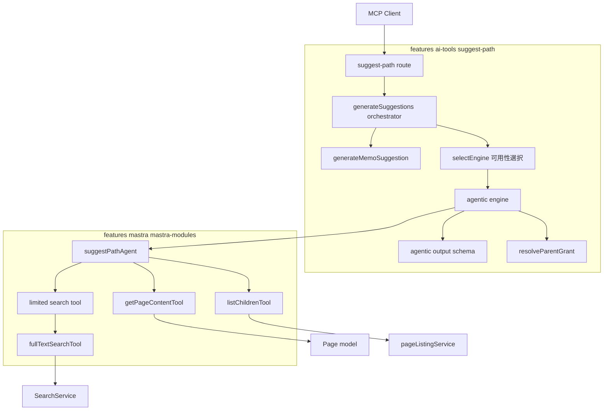

# Design Document

## Write / Don't-Write テスト

この spec の各節を「書くか書かないか」を判断する基準。将来ここを編集するときも、追記の前に同じ基準で判定すること。

**共通の問い**: コードとテストファイルを読めば再現できる内容か? YES なら書かない。

| 書く | 書かない |
|---|---|
| 相当な調査をして初めて分かった事実(コードをさっと読むだけでは分からない挙動、外部ライブラリの隠れた振る舞い) | 関数シグネチャ、ファイル配置図、「どのファイルに何があるか」の一覧 |
| 通常と異なる設計を選んだ理由 ― **特に、検討したが却下した案とその理由** | 素直な実装の素直な説明 |
| 自動テストで**検出できない**残存ギャップ | どのテストが何を検証しているかの列挙(spec/テストファイルを読めば分かり、書いても陳腐化するだけ) |
| コードからは再現できない手動確認手順(再現環境の作り方・何を確認すべきか・合格/不合格を分ける基準値) | 差分の有無やいつ実装したかといった時系列の記録 |

判断に迷ったら書かない。コードを読めば分かる内容を spec に書いても、コードが変わった瞬間に古い記述として残り、その1箇所のせいで文書全体が信用されなくなる。

## Overview

**Purpose**: suggest-path API のパス提案を、Mastra Agent による agentic search(検索結果を元文書と照らして検索語・条件を変えながら複数回探索する挙動)で生成する。最初の検索が語彙ミスマッチで外れても API 単体で妥当な保存先候補に辿り着けるようにし、MCP クライアント側の検索肩代わりを不要にする(Redmine #184610)。

**Users**: AI クライアント(Claude 経由の GROWI MCP の suggestPath ツール利用者)は、GROWI ユーザーの「ページを保存する」ワークフロー中にこのエンドポイントを呼ぶ。運用者は設定(検索回数上限・モデル・タイムアウト・推論強度)でレスポンス時間と精度のトレードオフを制御する。エンジンは実行環境の可用性で自動選択される。

**歴史的経緯**: 当初(2026-02〜)は「キーワード抽出(LLM #1)→ Elasticsearch 検索 1 回 → 候補評価(LLM #2)」のワンショット構成で、OpenAI を直接呼んでいた。一発の検索構成には構造的限界があり、語彙ミスマッチ(例: 内容は「自動スクロール」だが正解ページ名は「アンカーによるページの Scroll」)が起きると最初の検索が外れたまま回復できなかった(#183968 評価でベースライン 41/60)。2026-06〜07 にエンジンを Mastra Agent による agentic search へ換装し(PR #11293)、`features/openai` 全廃(2026-07-17)に伴い旧ワンショットの LLM 呼び出し部分(`analyze-content` / `evaluate-candidates` / `call-llm-for-json` / `oneshot-engine`)を完全に削除した。以降は agentic エンジン単一構成である。

### Goals

- 単一 POST エンドポイントで、メタデータ(type・path・label・description・grant)付きのパス提案配列を返す
- memo パス: 常に保証されるフォールバック(固定メタデータ)
- agentic search エンジン: 複数回検索 + 候補ページ本文参照による試行錯誤で保存先提案を生成する
- フロー/ストック判定を探索の誘導(候補妥当性判断・再検索の方向付け)に反映する
- 検索回数上限・タイムアウト・モデル・推論強度を設定で制御可能にする
- 可用性ベースのエンジン選択(Mastra AI 設定済み → agentic / 未設定 → memo のみ)。A/B 測定(ベースライン 41/60 との比較)は完了済み
- `/_api/v3/page/` とは独立した `ai-tools` 名前空間による個別アクセス制御

### Design Principles

- **Client LLM independence**: 重い推論(探索・候補評価・パス提案・description 生成)はサーバ側(GROWI AI)に集中させる。レスポンスは構造化データ(`informationType`・`type`・`grant`)と自然言語(`description`)の両方を含み、非力な LLM クライアントでも正しく扱える

### Non-Goals

- ページ作成・保存(既存 `POST /_api/v3/page` が担う)
- ページタイトル提案(Claude がユーザーとの対話で担う)
- クライアント側の「手動入力」オプション(Agent Skill の責務)
- HTC によるリランク、セマンティック検索の導入(別ストーリー)
- MCP クライアント側の挙動変更、チャット機能・`growiAgent` の改修
- AI なし・Elasticsearch のみのフォールバックエンジンの実装(将来計画。末尾「将来のロードマップ」節)
- `fullTextSearchTool` / `getPageContentTool` の機能改修(必要が生じた場合は ai-agentic-search spec のフォローアップ)

## Boundary Commitments

### This Spec Owns

- suggest-path のエンジン選択機構: `SuggestPathEngine` インターフェース、可用性ベースのエンジン選択(`selectEngine`)、フォールバックポリシー
- agentic エンジン一式: `suggestPathAgent`(Agent 定義 + instructions)、budget 付き検索 wrapper tool、suggest-path 専用 RequestContext 拡張型、structured output の JSON Schema と型ガード、エンジンアダプタ(タイムアウト・出力マッピング・grant 解決・トレースログ)
- 設定キー(検索回数上限・タイムアウト・子ページ一覧上限・providerOptions overlay)の定義と既定値
- 探索過程の記録(トレースログ)の形式と出力
- `suggestPathAgent` の Mastra インスタンスへの登録(`mastra-modules/index.ts` への additive な 1 行。レジストリ機構自体は ai-agentic-search spec の所有)
- API ルート(エンドポイント・バリデーション・ミドルウェアチェーン)、memo 提案生成、grant 解決

### Out of Boundary

- チャット向け `growiAgent` の挙動(ai-agentic-search spec が所有)
- 共有 tool(`fullTextSearchTool` / `getPageContentTool`)の本体改修
- 温存した非 AI サービス(`retrieve-search-candidates` / `generate-category-suggestion`)の内部変更 — 将来の Elasticsearch-only エンジン用に据え置き、呼び出さない
- AI なし・Elasticsearch のみのフォールバックエンジンの新規実装(将来タスク F.1〜F.4。末尾「将来のロードマップ」節)
- 評価環境そのもの(#183968 の成果物を利用するのみ)

### Allowed Dependencies

- `features/mastra` の mastra-modules(`fullTextSearchTool` / `getPageContentTool` / `listChildrenTool` / `MastraRequestContextShape` / Mastra インスタンスレジストリ)— **依存方向は ai-tools → mastra の一方向のみ**。mastra 側ファイルが suggest-path の型・モジュールを import することは禁止
- `features/mastra` の AI レイヤ `resolveMastraModel`(support/mastra 所有。マルチプロバイダ設定 `ai:providers` / `ai:providerApiKeys` / `ai:allowedModels` に依拠。旧単一プロバイダ設定 `ai:provider` / `ai:apiKey` / `ai:azureOpenaiSettings` は廃止済み)
- `features/mastra` の可用性判定 `isAiConfigured` と、マスタートグル `isAiEnabled`(`app:aiEnabled` を読む。`features/openai` 全廃に伴い 2026-07-17 に `features/mastra/server/services/is-ai-enabled.ts` へ移動)
- `configManager`(設定読み出し)、`@growi/logger`(pino)
- `SearchService.searchKeyword` / `Page.findByIdAndViewer` / `pageListingService.findChildrenByParentPathOrIdAndViewer`(tool 経由の間接利用。権限フィルタはこれらに委譲)

**禁止依存**: mastra 側から ai-tools/suggest-path への逆 import(一方向依存の維持)。温存した非 AI サービスは agentic エンジンから import しない(将来の Elasticsearch-only エンジンが利用する)。

### Revalidation Triggers

以下の変更が生じた場合、依存元(MCP クライアント・評価器)または本設計の再検証が必要:

- `PathSuggestion` / `SuggestPathResponse` 型の形状変更(API 契約変更)
- エンドポイント・リクエスト形式(`body` フィールド)・認証要件の変更
- `MastraRequestContextShape` の形状変更、または `fullTextSearchTool` / `getPageContentTool` の入出力スキーマ変更(support/mastra 側の変動を含む)
- エンジン可用性の判定基準(`isAiConfigured`)またはルートガード(`aiReadyGuard` = enabled かつ configured)の意味変更
- `isAiEnabled` の実装・所在の変更(現在 `features/mastra/server/services/is-ai-enabled.ts`。mastra ガード・model-catalog-refresh・suggest-path ルートが依存)
- Mastra バージョン変動(既知バグ回避方針の再確認が必要。下記「既知の制約・リスク」参照)

## Architecture

### Boundary Map



**Architecture Integration**:

- **Selected pattern**: オーケストレータ + 可用性ベースのエンジン選択。`generateSuggestions` がエンジン非依存の責務(memo・エンジン選択・フォールバック)を持ち、`SuggestPathEngine` インターフェースを実装する agentic エンジンが提案生成を担う。`SuggestPathEngineRecord` と非対称フォールバックポリシーは複数エンジンを想定した汎用構造で、将来の Elasticsearch-only エンジンを record 1 件の追加で受けられる
- **Domain boundaries**: agent 定義と tool は `features/mastra/.../agents/suggest-path/`(Mastra プラットフォーム層)、エンジンアダプタと出力スキーマは `features/ai-tools/suggest-path/.../engines/`(feature 層)。structured output スキーマを feature 層に置くことで mastra 側は suggest-path の型を知らない
- **Existing patterns preserved**: per-request RequestContext、tool の discriminated union 返却(throw 禁止)、権限フィルタ委譲、pino logger
- **依存方向**(違反はエラーとして扱う): `interfaces(types) → services(engines → 既存サービス) → routes`、`features/ai-tools/suggest-path → features/mastra`(一方向。逆方向 import 禁止)

## Data Contracts

### API Contract

| Method | Endpoint | Request | Response | Errors |
|--------|----------|---------|----------|--------|
| POST | `/_api/v3/ai-tools/suggest-path` | `{ body: string }` | `{ suggestions: PathSuggestion[] }` | 400, 401/403, 501(AI 未設定), 500 |

```typescript
interface SuggestPathRequest {
  body: string; // 解析対象のページ本文(必須・非空・100,000 文字以下)
}

type SuggestionType = 'memo' | 'search';
type InformationType = 'flow' | 'stock';

interface PathSuggestion {
  type: SuggestionType;
  path: string;                        // 末尾スラッシュ付きディレクトリパス
  label: string;
  description: string;                 // memo は固定文、search は AI 生成
  grant: number;                        // 親ページの grant 値(PageGrant)
  informationType?: InformationType;    // search のみ
}

interface SuggestPathResponse {
  suggestions: PathSuggestion[];        // 常に 1 件以上(memo)
}
```

**不変条件**: `path` は末尾 `/`、`grant` は有効な PageGrant 値(1, 2, 4, 5)、`旧 engine` フィールド(2 エンジン明示切り替え期の内部パラメータ)は削除済み — 送られても validation エラーにせず無視する(後方互換)。

**Response Example**:

```json
{
  "suggestions": [
    {
      "type": "memo",
      "path": "/user/alice/memo/",
      "label": "Save as memo",
      "description": "Save to your personal memo area",
      "grant": 4
    },
    {
      "type": "search",
      "path": "/tech-notes/React/state-management/",
      "label": "Save near related pages",
      "description": "This area contains pages about React state management. Your stock content fits well alongside this existing reference material.",
      "grant": 1,
      "informationType": "stock"
    }
  ]
}
```

### Agent structured output(agentic エンジン内部契約)

```json
{
  "type": "object",
  "additionalProperties": false,
  "required": ["informationType", "suggestions"],
  "properties": {
    "informationType": {
      "type": "string",
      "enum": ["flow", "stock"],
      "description": "Whether the document is flow (time-bound) or stock (reference) information"
    },
    "suggestions": {
      "type": "array",
      "maxItems": 20,
      "items": {
        "type": "object",
        "additionalProperties": false,
        "required": ["path", "label", "description"],
        "properties": {
          "path": { "type": "string", "description": "Parent directory path with trailing slash" },
          "label": { "type": "string" },
          "description": { "type": "string" }
        }
      }
    }
  }
}
```

スキーマ検証は二重: Mastra の structuring パス(schema 指定)+ AgenticEngine の型ガード(defense in depth)。`maxItems` がモデル側で無視された場合もアダプタが 20 件に切り詰める(当初 3 件 → A/B 後の #185211 で候補集合の質を計測可能にするため 20 件に拡張)。

**採用理由(Zod ではなく JSON Schema 直接記述)**: `agent.generate(prompt, { structuredOutput: { schema } })` に JSON Schema を直接渡す。Zod からの自動変換は OpenAI strict mode 非互換の既知バグ(mastra-ai/mastra#16383)があるため不採用。スキーマは feature 層(`agentic-output-schema.ts`)に置き、mastra 側ファイル(Agent 定義)は suggest-path の型を知らない(依存方向 ai-tools → mastra の一方向を維持するため)。

## Component Design Decisions

以下は「なぜこの形にしたか」の記録。関数シグネチャ・ファイル配置はコードを読めば分かるため省略する。

### エンジン抽象(`SuggestPathEngine` インターフェース)

- **決定**: `generateSuggestions`(オーケストレータ)は memo 生成 + `selectEngine()` による可用性判定 + フォールバックのみを担い、提案生成そのものは `SuggestPathEngine` インターフェース(`{ id, run, degradeToMemoOnFailure }`)を実装するエンジンに委譲する
- **検討した代替案**: (a) LLM クライアント層の差し替えのみ(ワンショット構造が残り複数回検索の要件を満たせない、不採用)、(b) ルート層でエンドポイントを分割(API 契約変更になり不採用)
- **フォールバックポリシーの非対称性**: record が `degradeToMemoOnFailure: true` を宣言するエンジン(agentic)の reject(例外・タイムアウト)は捕捉して memo のみ返す。false を宣言するエンジンの例外は route まで伝播(500)。オーケストレータは engine id で分岐しない。現状 agentic のみ(true)で、false 側は将来の Elasticsearch-only エンジン用に予約
- **拡張性**: 将来の Elasticsearch-only エンジンは、`selectEngine` の判定に「未設定だが検索到達可 → ES-only record」を 1 段追加するだけで足りる構造(record と非対称フォールバックポリシーは撤去せず残してある)

### 検索回数上限(budget 付き wrapper tool)

- **決定**: `limited-search-tool` が `SuggestPathRequestContextShape`(共有 shape の拡張型)上の `searchBudget` を読み、上限超過時に `{ result: 'limit_exceeded' }` を**値で**返す(throw しない)。instructions で「limit_exceeded を受けたら収集済み情報で提案を確定せよ」と指示。`maxSteps`(= 2 × searchLimit + 2 × childListingLimit + 2 × searchLimit(ページ参照許容)+ 4)とタイムアウトを多層のセーフティネットとして併用する
- **検討した代替案**: `stopWhen` / `maxSteps` のみでループ打ち切り — step 数 ≠ 検索回数(1 step に複数 tool call があり得ることを実機確認済み)であり、打ち切り時に最終出力が生成されない恐れがあるため補助的な位置づけに留めた
- **理由**: ループ強制打ち切りと違い、エージェントが gracefully に最終出力へ移行できる。共有 tool(`fullTextSearchTool`)は無改変で boundary(ai-agentic-search spec 所有)を侵さない
- listChildren tool も独立した budget(`childListingBudget`)で同じ手仕舞い規約に従う(#185213、候補親の兄弟構成を確認する peer-placement verification)

### category 提案は agentic エンジンで生成しない

- **決定**: agentic エンジンの提案はすべて `type: 'search'`。旧ワンショットにあった `category` type 提案は生成しない
- **検討した代替案**: (a) structured output に category 種別を含めて生成させる、(b) 旧 `generate-category-suggestion` を agentic 検索結果に再適用する
- **却下理由**: (b) は温存した非 AI サービスへの依存となり、将来の Elasticsearch-only エンジン専用という境界(Out of Boundary)に違反する。category(ES 上位ヒットのトップレベルを機械的に切り出す発想)は、複数回検索で適切な親に辿り着く agentic 探索では、浅い親が妥当ならエージェント自身が search 提案としてそれを出せるため機能的に包含される。旧 spec でも category 要件自体が Under Review であり、新エンジンへ引き継ぐ積極的根拠がなかった

### 設定キーの構成

| Key | Type | Default | Env Var | 用途 |
|-----|------|---------|---------|------|
| `aiTools:suggestPathAgenticSearchLimit` | `number` | `5` | `AI_TOOLS_SUGGEST_PATH_AGENTIC_SEARCH_LIMIT` | 1 リクエストの検索回数上限(合意レンジ 3〜5 の上限を初期値とし、A/B 実測で確定) |
| `aiTools:suggestPathAgenticTimeoutMs` | `number` | `60000` | `AI_TOOLS_SUGGEST_PATH_AGENTIC_TIMEOUT_MS` | agentic エンジンの総時間セーフティネット |
| `aiTools:suggestPathAgenticChildListingLimit` | `number` | `5` | `AI_TOOLS_SUGGEST_PATH_AGENTIC_CHILD_LISTING_LIMIT` | listChildren tool の 1 リクエスト呼び出し上限(#185213 で追加。検索 budget とは独立の第二 budget) |
| `ai:providerOptions:suggestPathAgent` | `ModelProviderOptions \| null`(JSON Record) | `null`(未指定) | `AI_SUGGEST_PATH_AGENT_PROVIDER_OPTIONS` | agentic エンジン専用の providerOptions 上書き。`ai:allowedModels[].providerOptions` と同じ provider 名前空間付き Record(例 `{"openai":{"reasoningEffort":"minimal"}}`)で、有効モデルの catalog 宣言 options に名前空間単位で deep merge される |

- モデル自体は suggest-path 専用キーを持たず、アプリ全体のマルチプロバイダ設定(`ai:providers` / `ai:allowedModels`)の既定モデルで決まる(`resolveMastraModel()` の memoize + AI 設定保存時の cache clear で再起動なし反映)
- `ai:providerOptions:suggestPathAgent` を provider 名前空間付き Record にした理由: reasoning 制御の表現がプロバイダごとに異なるため(`openai.reasoningEffort` 文字列 / `anthropic.thinking` オブジェクト / `google.thinkingConfig` オブジェクト)。文字列 1 個のキーでは汎用化できない。merge はプロバイダ名前空間内で option 単位の overlay、option の値自体は丸ごと置換(`thinking` のような自己完結オブジェクトの内部を merge して断片を作らない)
- **撤去済みキー(再追加しないこと)**: `openai:reasoningEffort:suggestPathAgent`(provider 固定の文字列。provider 汎用の `ai:providerOptions:suggestPathAgent` へ移行)、`openai:assistantModel:suggestPathAgent`(読み手が存在しない dead key)、`aiTools:suggestPathEngine`・リクエストの `engine` フィールド(明示エンジン切り替え。可用性ベース化で不要)、`openai:serviceType` / `openai:apiKey`(features/openai 全廃で無関係化)

## Error Handling & Graceful Degradation

**3 層構造**: エージェントループ内は値で返す(throw しない)・エンジン境界は例外で返す・API 境界は memo フォールバックで吸収する。

| 層 | エラー | 振る舞い |
|----|--------|----------|
| Route(4xx) | `body` 欠落・空・100k 超過 | 400(express-validator) |
| Route | 未認証 / AI scope なし | 401 / 403(既存ミドルウェア)。AI 無効・未設定は 501(`aiReadyGuard`) |
| Tool 層 | 検索失敗・ページ不可視・コンテキスト欠落・budget 超過 | discriminated union を値で返す(throw 禁止)。エージェントは再検索または手仕舞いで回復 |
| AgenticEngine | agent 例外・structured output 検証不合格・タイムアウト(AbortController) | reject → オーケストレータが捕捉 |
| AgenticEngine | モデル設定の誤り・未設定で agentic が選択された | `resolveMastraModel` がリクエスト時に throw → reject → memo フォールバック |
| Orchestrator | agentic エンジンの reject | **memo 提案のみの 200 レスポンス**(5xx にしない) |
| Orchestrator | 非 degrade エンジン(`degradeToMemoOnFailure: false`)の例外 | route まで伝播(500)。現状該当エンジンなし。将来の Elasticsearch-only 用に予約 |

**観測**: サマリログ(info、リクエスト毎 1 行)に `{ durationMs, searchCount, listChildrenCount, pageReadCount, stopReason, informationType, suggestionCount, tokenUsage }` を記録する。`stopReason` は `timeout`(AbortSignal 中断)/ `budget_exhausted`(正常完了かつ budget 上限到達)/ `error`(その他の例外・検証不合格)/ `completed`(それ以外の正常完了)。文書本文・本文由来の検索クエリは debug レベル限定、info レベルはメタ情報(件数・時間・トークン)のみ。

## Security Considerations

- **認証・認可**: ミドルウェアチェーン(AI scope の accessTokenParser + loginRequiredStrictly + aiReadyGuard)。`aiReadyGuard` は AI 機能有効かつ Mastra 設定済みを要求し、未設定は 501(マウント側とハンドラ側の両層で同一ガードを適用)
- **権限スコープ**: 検索・本文参照はリクエストユーザーの `IUserHasId` を per-request RequestContext で伝搬し、`SearchService.searchKeyword` / `Page.findByIdAndViewer` の既存権限フィルタに委譲する(tool 側での再実装はしない)。RequestContext の module-scope 共有禁止により並行リクエスト間の user 漏れを防ぐ
- **プロンプトインジェクション**: 文書本文は信頼できない入力としてエージェントに渡る。エージェントが持つ tool は読み取り専用かつ要求ユーザーの権限内に限定されており、本文の細工による権限昇格・書き込みは構造的に不可能。出力は JSON Schema + 型ガード + path 正規化で検証され、任意文字列がレスポンス契約を壊すことはない
- **エンジン明示指定の濫用(解消済み)**: 旧 `engine` フィールドによる明示指定は削除された(2026-07-17)。エンジンは可用性で自動選択され、agentic のコストは検索 budget・maxSteps・タイムアウトで構造的に制御される

## Performance & Scalability

- **応答時間の構造**: agentic エンジンは LLM ステップ ×(検索 ≤ searchLimit + 本文参照 + 最終整形)で、単発 LLM 呼び出し(数秒)と比べ大幅に長い(searchLimit=5 で p50 15〜40 秒を想定。A/B 実測では p50 8.5 秒)。精度とのトレードオフとして合意済み。絶対上限は `aiTools:suggestPathAgenticTimeoutMs`(既定 60s)で保証し、超過時は memo フォールバック
- **制御ノブ**: searchLimit(3〜5)・モデル・timeoutMs。既定値は A/B 測定の実測を経て確定
- **エンジンは可用性で自動選択**: AI 未設定環境は route の `aiReadyGuard` が 501 で弾くため、agentic のコストは発生しない
- **トークンコスト**: A/B 測定実測で平均 9.8k tokens/req。サマリログで毎リクエスト記録

## 既知の制約・リスク

- **Mastra バージョン変動への追従**: `result.steps` / usage の実形状(トークン使用量のフィールド名。AI SDK v5 命名 `inputTokens` / `outputTokens` を採用)は @mastra/core 1.41.0 実機スパイクで確認したもの。support/mastra 上流マージで 1.45.0 に上がった際の再検証は未実施(Revalidation Triggers 参照)
- **tool 併用 + structured output の両立**(mastra-ai/mastra#3139 系統): 1.41.0 実機スパイクで両立を確認済み(2 回連続実行で再現、`structuredOutput.model` の明示指定は不要と判明)。バージョン変動時は再確認が必要。壊れた場合の代替: `structuredOutput.model` に同一モデルを明示指定して structuring パスを分離する
- **step 数 ≠ 検索回数**: 1 step 内で複数 tool call が並列発行されることを実機確認済み(検索回数を wrapper tool 側の budget でカウントする設計の妥当性を裏付ける)
- **buildUserPrompt に渡す本文の長さ**: validator 上限(100,000 文字)の本文がそのまま渡ると入力トークンが過大になり得る。トリミング戦略の要否は未確定(現状は未対応)
- **推論強度の値検証**: エンジン層では行わず、プロバイダ側の実行時エラーに委ねる(未対応の組み合わせは既存のエンジン失敗フォールバックが受け止める)

## 将来のロードマップ: Elasticsearch のみ(AI なし)フォールバックエンジン(スコープ外)

### 背景(2026-07-17 の方針転換)

`features/openai`(旧 OpenAI 連携)への依存を全廃する方針に伴い、旧 oneshot エンジンを撤去した。旧 oneshot は「AI なし・ES のみ」の実装ではなく、キーワード抽出(analyze-content)と候補評価(evaluate-candidates)で `features/openai` の LLM を呼ぶパイプラインであり、ES は候補取得の 1 ステップだけだった。したがって `features/openai` を消すと旧 oneshot は成立しないため、`analyze-content` / `evaluate-candidates` / `call-llm-for-json` / `oneshot-engine` を削除した。

現状のエンジン選択は「Mastra AI が設定済み→agentic／未設定→memo のみ(ルートの `aiReadyGuard` が未設定を 501 で弾く)」に縮小している。

### 最終形の目標

Mastra AI が使えない環境向けに、LLM を一切使わず Elasticsearch だけで動く oneshot フォールバックエンジンを整備する。これにより「AI 未設定でも、全文検索が使えれば保存先候補を返せる」状態を取り戻す。

### 温存した再利用資産(削除していない)

将来の非 AI oneshot の土台として、AI に依存しない以下のサービスを残してある。

- `retrieve-search-candidates.ts` — Elasticsearch 全文検索で候補ページを取得(AI なし)
- `generate-category-suggestion.ts` — ES 候補の上位パスからカテゴリ提案を導出(AI なし)
- `resolve-parent-grant.ts` — MongoDB で親ページの grant を解決(AI なし。agentic 側でも使用中)

### 実装方針(将来タスク。tasks.md F.1〜F.4)

1. **キーワード抽出の非 AI 化**: 旧 `analyze-content` の LLM 呼び出しを、非 AI 手段に置き換える(例: ページ本文・タイトル・見出しからの素朴なキーワード抽出、または本文をそのまま ES 全文検索に投げる)。flow/stock 分類が必要なら簡易ヒューリスティックで代替するか、この段では省く
2. **評価の非 AI 化**: 旧 `evaluate-candidates` の LLM ランキングを撤去し、ES スコア順 + カテゴリ導出でパスを提案する
3. **エンジン再結線**: 新しい非 AI oneshot を `engines/` に追加し、`select-engine` を「Mastra 設定済み→agentic／未設定だが ES 到達可→非 AI oneshot／どちらも不可→memo」に拡張する(`SuggestPathEngineRecord` と非対称フォールバック方針は撤去せず残してあるため、record を 1 件追加するだけで済む構造)
4. **ガードの扱い**: 未設定時に非 AI oneshot を通すには、ルートのガードを見直す必要がある。現状は `aiReadyGuard`(`isAiConfigured` 必須)で未設定を 501 にしているため、`isAiEnabled` のみ要求する形へ緩めるか、ES 到達性で分岐する。あわせて、重い `@mastra` スタックを未設定環境で読み込まない遅延ロード導線(現状の lazy import)と両立させること

### 未確定事項

- 非 AI キーワード抽出の品質(旧 oneshot は miss 14%。非 AI 版はさらに落ちる可能性があり、許容ラインの合意が必要)
- flow/stock 分類を非 AI でどこまで行うか(省略も選択肢)
- ガードを緩める場合の副作用(未設定環境で ES のみのフォールバックを本当に提供するかのプロダクト判断)
